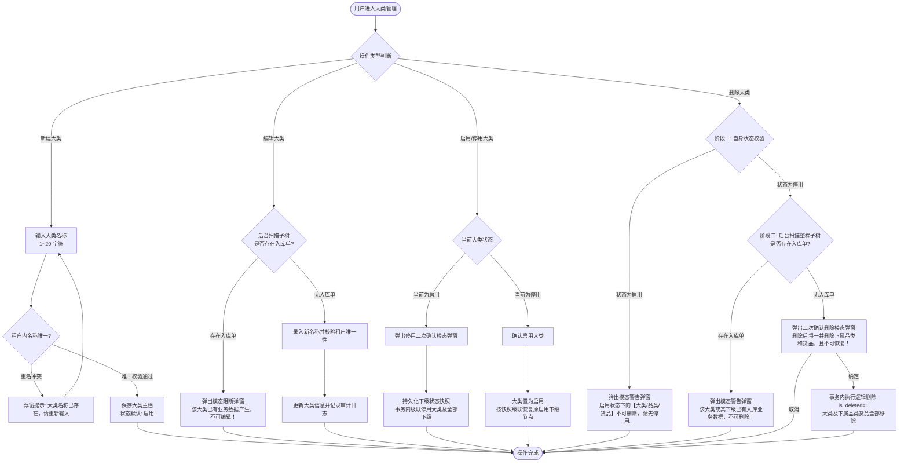
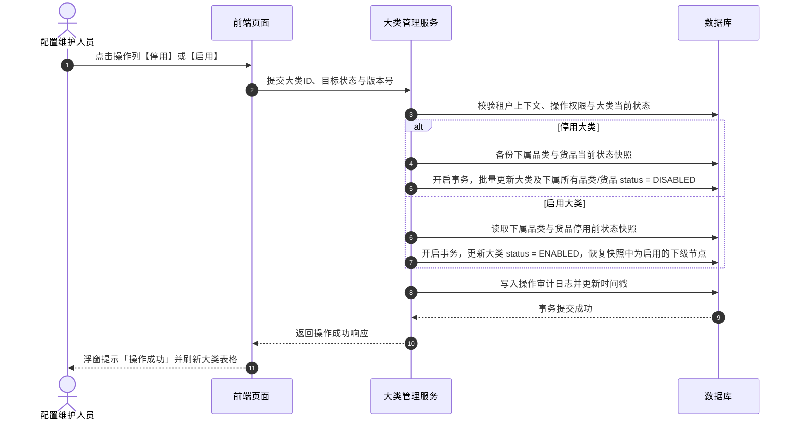
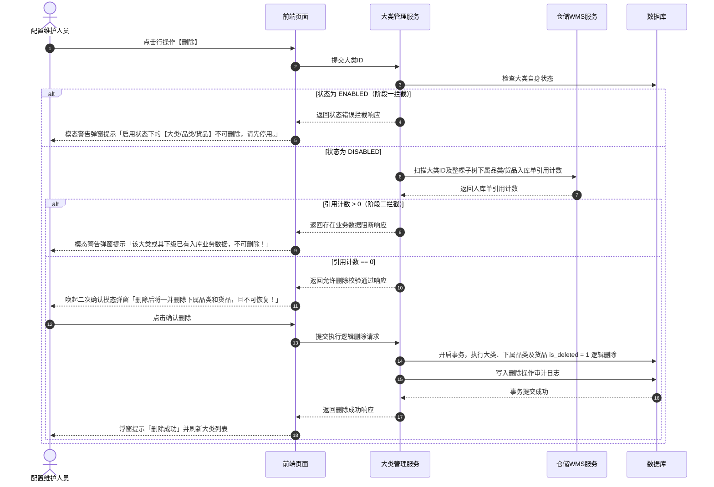

# 大类管理业务规则规格

> **文档定位**：货品大类（12-货品规格管理-大类管理）状态机模型、业务动作约束、父子级联启停规则、入库业务强校验、两阶段删除控制以及并发幂等机制的唯一定义真源（SSOT）。
> **参考文档**：[大类管理主PRD.md](./大类管理主PRD.md)、[大类管理字段清单.md](./大类管理字段清单.md)  
> **版本**：V2.0 基准版 | 更新时间：2026-09-16 | 责任人：森云科技（Senyun Technology）

---

## 一、模块与单据定位

| 项目 | 内容 |
| :--- | :--- |
| **层级定位** | **【第 1 层 - 货品大类主档】**（货品主数据与规格体系顶层分类节点） |
| **核心职责** | 维护大宗存货与货品的基础大类（如：黑色金属、有色金属、粮油农产品、化工原材料、建筑建材等），作为品类和货品归集的顶层实体；管控全树级联启停与两阶段删除边界。 |
| **实体映射** | `sys_goods_category`（大类实体表） |
| **上下游关系** | **上游**：租户中心、权限与机构管理； **下游**：品类管理（1:N 映射关系）、货品管理（1:N 继承关系）、仓储管理系统（WMS）入库单以及质押品风控大类分类。 |
| **数据隔离约束** | 严格基于租户标识（`tenant_id`）进行数据物理隔离与唯一性校验，禁止跨租户数据可见与越权写入。 |

---

## 二、状态定义与计算模型

| 状态名称 | 字段与枚举 (`status`) | 是否允许人工切换 | 含义说明 | 级联影响范围 |
| :--- | :--- | :---: | :--- | :--- |
| **启用** | `ENABLED` | 是 | 大类当前处于正常可用状态 | 允许下级新增品类、货品；下级计算有效状态时满足父级启用前提。 |
| **停用** | `DISABLED` | 是 | 大类当前处于停用管控状态 | 事务内级联停用所有下属品类和货品；下游新增业务单据禁止选择该大类及下属货品；历史已有单据数据保持只读不受影响。 |
| **已删除** | `DELETED` (`is_deleted = 1`) | 否 | 逻辑删除标记，前台界面完全不可见 | 仅当大类处于停用状态且整棵子树完全无入库单数据时经二次确认后触发；不可物理恢复。 |

---

## 三、状态流转表（核心规则矩阵）

| 当前状态 | 触发动作 | 前置校验条件 | 结果状态 | 二次确认与交互组件 | 后置级联影响 | 失败阻断提示与控件 |
| :--- | :--- | :--- | :--- | :--- | :--- | :--- |
| **未创建** | 新建保存 | ① 大类名称必填（1~20 字符） ② 租户内大类名称唯一 | `ENABLED` | 新建模态弹窗（Modal） | 自动留痕创建人与创建时间，生成大类记录，默认启用 | 浮窗提示（Toast）阻断： 「大类名称已存在，请重新输入」 |
| **启用 / 停用** | 编辑保存 | ① 大类名称必填且租户内唯一 ② **入库数据强校验**：整棵子树无入库单数据 | 保持原状态 | 编辑模态弹窗（Modal） | 更新大类名称、最近更新人与更新时间戳 | 模态警告弹窗（Alert Dialog）阻断： 「该大类已有业务数据产生，不可编辑！」 |
| **启用** | 停用 | 具备配置维护或管理员权限 | `DISABLED` | 二次确认模态弹窗： 「停用后后续新增品类无法选择，但历史已产生数据不受影响」 | ① 当前大类置为停用 ② **保存下级当前状态快照** ③ 事务内级联停用该大类下所有品类和货品 ④ 刷新最近更新时间 | 浮窗提示（Toast）： 「停用失败，请稍后重试」 |
| **停用** | 启用 | 具备配置维护或管理员权限 | `ENABLED` | 二次确认模态弹窗（标准确认） | ① 当前大类置为启用 ② **按快照精准恢复下级状态**：仅恢复停用前处于“启用”的品类与货品，绝不强制激活原本处于“停用”的下级 ③ 刷新最近更新时间 | 浮窗提示（Toast）： 「启用失败，请稍后重试」 |
| **启用** | 删除 | 无 | 阻断 | 点击行操作【删除】按钮 | 严禁删除，大类保持启用 | 模态警告弹窗（Alert Dialog）阻断： 「启用状态下的【大类/品类/货品】不可删除，请先停用。」 |
| **停用** | 删除 | **子树无入库单强校验**：扫描大类及全部下属品类、货品，均不存在入库单数据 | `is_deleted = 1` | 风险警告模态弹窗： 「删除后将一并删除下属品类和货品，且不可恢复！」 | 事务内将该大类及整棵子树的品类、货品全部执行逻辑删除，列表与下拉选择器均不再可见 | 模态警告弹窗（Alert Dialog）阻断： 「该大类或其下级已有入库业务数据，不可删除！」 |

---

## 四、核心业务规则

### 【租户隔离与名称唯一性规则】(CAT-F01)
- 大类名称长度限制在 1~20 个字符，前后自动去除空格（Trim）；
- 同一租户下大类名称严格唯一（不区分大小写精确比对）；不同租户间互不干扰；
- 数据库底层必须建立 `(tenant_id, category_name, is_deleted)` 唯一索引兜底，防并发冲突绕过校验。

### 【父级停用全树级联下发规则】(CAT-F02)
- 当大类执行停用操作时，系统后台必须在数据库本地事务开启的同时，捕获该大类下属品类和货品的**当前自身状态快照**（Snapshot）；
- 级联将该大类及其下所有品类、货品的状态批量更新为 `DISABLED`；
- 必须保证原子事务强一致性，若其中任一子节点更新失败，整体事务立即回滚，严禁出现“父级停用而部分子级仍为启用”的数据裂痕。

### 【父级启用快照恢复规则】(CAT-F03)
- 当停用的大类被重新启用时，系统不得盲目将所有下属节点一刀切置为启用；
- 系统必须解析停用时刻持久化的状态快照，仅将原本处于启用状态的品类和货品恢复为 `ENABLED`；原本主动停用的品类或货品继续保持 `DISABLED` 状态。

### 【编辑操作入库单拦截规则】(CAT-F04)
- 编辑大类名称时，服务端必须实时执行底层仓储入库单数据关联扫描：
  - 检索逻辑：`SELECT COUNT(1) FROM wms_inbound_order_detail WHERE category_id = :categoryId AND is_deleted = 0`；
  - 若引用计数 $> 0$，立即阻断保存并返回特定业务错误码，前端唤起统一阻断模态弹窗；
  - 严禁仅依赖前端缓存状态进行判断，防止数据脏读。

### 【两阶段删除强校验与级联逻辑删除规则】(CAT-F05)
- **阶段一（自身状态校验）**：大类状态为 `ENABLED` 时直接拦截，必须先停用；
- **阶段二（入库单引用扫描）**：大类状态为 `DISABLED` 时，系统扫描整棵子树（包含大类、品类、货品）是否被任何仓储管理系统（WMS）入库单引用：
  - 若存在任何入库业务数据（计数 $> 0$），强制阻断删除；
  - 若完全无入库单数据（计数 $= 0$），经用户在风险模态弹窗中二次确认后，在同一数据库事务内对该大类、下属所有品类、下属所有货品执行逻辑删除（`is_deleted = 1`）；
- 系统不支持逻辑删除恢复，需在提示语中向用户明确说明不可恢复性。

### 【并发控制与乐观锁幂等规则】(CAT-F06)
- 大类的新建、编辑、启停、删除均需采用基于版本号（`version`）或更新时间戳的乐观锁并发控制机制；
- 若多位用户同时操作导致版本冲突，后提交者请求被拒绝并以浮窗提示（Toast）告知：「数据已被他人修改，请刷新后重试」；
- 客户端防重复提交机制保障网络重发时具备业务幂等性。

---

## 五、权限与安全规范

### 【角色与数据权限隔离规则】(CAT-P01)

| 角色代码 | 角色名称 | 查看大类列表 | 新建/编辑大类 | 启用/停用大类 | 删除大类 | 数据范围 |
| :--- | :--- | :---: | :---: | :---: | :---: | :--- |
| `R-SYS-ADMIN` | 系统管理员 | ✅ | ✅ | ✅ | ✅ | 当前所属租户全量数据 |
| `R-CFG-MGR` | 配置维护人员 | ✅ | ✅ | ✅ | ✅ | 当前所属租户全量数据 |
| `R-RISK-MGR` | 风控管理人员 | ✅ | ❌ | ❌ | ❌ | 当前所属租户全量（只读） |
| `R-BUSI-OPER` | 业务人员 / 只读用户 | ✅ | ❌ | ❌ | ❌ | 当前所属租户全量（只读） |

- **接口安全校验**：所有服务端应用程序编程接口（API）必须在网关层强校验租户上下文，严禁跨租户越权调用。

---

## 六、核心业务流程图

---

## 七、核心操作时序图

### 1. 大类状态级联启停时序

### 2. 大类两阶段删除控制时序

---

## 八、修订记录

| 日期 | 版本 | 变更摘要 | 变更人 |
| :--- | :---: | :--- | :--- |
| 2026-08-14 | V1.0 | 初版大类管理业务规则规格。 | 产品团队 |
| 2026-09-02 | V2.0 | 规范状态机、两阶段删除流程图与时序图。 | AI PM / 森云科技 |
| **2026-09-16** | **V2.0 规范化升级** | 1. 编号语义自解释：规则全面升级为 `【规则业务名称】(CAT-F01~06/P01)` 格式； 2. 交互术语全面汉化：Toast/Modal/Alert 全面汉化为浮窗提示、模态弹窗、模态警告弹窗； 3. 强化与主PRD、字段清单三件套真源强对齐。 | 森云科技规范化升级工作组 |
