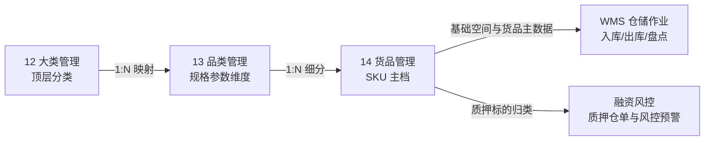

# 大类管理主PRD

> **模块定位**：货品规格管理第 1 节点，作为商品主档顶层分类实体，维护大类名称与启停状态，向品类与货品提供继承依据，严格控制整树启停级联与无入库单两阶段删除。  
> **版本**：V2.0 | 更新时间：2026-09-02 | 责任人：森云科技（Senyun Technology）  
> **编写依据**：[大类管理字段清单.md](./大类管理字段清单.md) 是本模块所有字段格式、枚举与页面展示的唯一基准；[大类管理业务规则规格.md](./大类管理业务规则规格.md) 是本模块状态机、两阶段删除与级联控制的唯一定义来源。

---

## 1. 业务背景

大类管理是 SYZC 供应链金融存货监管系统的货品主档顶层分类入口。通过大类（如：黑色金属、有色金属、粮油农产品、化工原料、建筑建材）的建立，为下游品类细分、货品 SKU 建模及风控押品归类提供统一的分类基准与全树管控入口。

---

## 2. 功能范围

| 包含功能 (In Scope) | 不包含功能 (Out of Scope) |
| :--- | :--- |
| - 大类列表查询与名称/状态组合筛选； - 新建大类（名称必填且租户内唯一）； - 编辑大类（入库单引用强拦截）； - 大类启用/停用与全树级联（事务控制 + 快照恢复）； - 大类删除（阶段一启用拦截 + 阶段二整树入库单扫描）； - 操作留痕与全路径审计追溯。 | - 品类与货品具体参数维度的维护（由 13品类、14货品模块承载）； - 业务单据（入库单、仓单、质押单）的开具与审批； - 跨租户大类共享与分发； - 已逻辑删除大类的恢复功能。 |

---

## 3. 模块定位与系统链路

---

## 4. 业务场景

| 场景ID | 场景名称 | 场景类型 | 业务说明与核心约束 |
| :--- | :--- | :--- | :--- |
| **S01** | 新建大类 | 主流程 | 录入大类名称，校验租户内唯一性，默认初始状态为“启用” |
| **S02** | 编辑大类 | 主流程 | 修改大类名称；若该大类下已有关联货品产生入库单，强阻断编辑并弹窗提示 |
| **S03** | 停用大类 | 控制流程 | 确认后保存下级当前状态快照，在同一事务内级联停用所有下属品类和货品 |
| **S04** | 启用大类 | 控制流程 | 确认后启用大类，并依据快照仅恢复停用前处于启用状态的下级品类与货品 |
| **S05** | 删除大类 | 阻断/终态 | 阶段一启用强拦截；阶段二扫描整树入库单数据，无入库单二次确认后逻辑删除 |

---

## 5. 状态机与动作能力矩阵

> 状态流转详细规则、前置校验与阻断提示详见 [大类管理业务规则规格.md §三 状态流转表](./大类管理业务规则规格.md#三状态流转表核心规则矩阵)。

| 动作名称 | 启用状态 (`ENABLED`) | 停用状态 (`DISABLED`) | 已删除 (`is_deleted=1`) |
| :--- | :---: | :---: | :---: |
| **查看列表 / 筛选** | ✅ | ✅ | ❌ |
| **新建大类** | ✅ | ✅ | ❌ |
| **编辑大类** | ✅（需子树无入库数据） | ✅（需子树无入库数据） | ❌ |
| **停用大类** | ✅（触发全树级联停用） | ❌ | ❌ |
| **启用大类** | ❌ | ✅（触发快照恢复） | ❌ |
| **删除大类** | ❌（阶段一阻断拦截） | ✅（阶段二整树无入库单允许） | ❌ |

---

## 6. 页面与字段规则

页面全量字段定义、取值范围、必填性与展示格式完全继承自 [大类管理字段清单.md](./大类管理字段清单.md)：
- **列表展示字段**：`序号`、`大类名称`、`状态`、`创建人`、`创建时间`、`更新时间`、`操作`；
- **筛选条件**：`大类名称`（文本模糊匹配）、`状态`（下拉单选：全部/启用/停用）；
- **操作弹窗**：新建大类弹窗、编辑大类弹窗、停用二次确认弹窗、删除二次确认弹窗。

---

## 7. 核心业务规则索引

| 规则编码 | 规则名称 | 核心口径摘要 | 唯一定义来源 |
| :--- | :--- | :--- | :--- |
| **R-CAT-01** | 租户隔离与名称唯一性 | 名称 1~20 字符；同一租户内唯一；底层数据库唯一索引保障 | [业务规则规格 R01](./大类管理业务规则规格.md#rcat01租户隔离与名称唯一性) |
| **R-CAT-02** | 父级停用级联下发 | 保存下级状态快照；同一事务内批量级联停用大类、品类及货品 | [业务规则规格 R02](./大类管理业务规则规格.md#rcat02父级停用级联下发规则) |
| **R-CAT-03** | 父级启用快照恢复 | 恢复大类启用；按快照仅恢复原启用子节点，不激活原停用节点 | [业务规则规格 R03](./大类管理业务规则规格.md#rcat03父级启用快照恢复规则) |
| **R-CAT-04** | 编辑操作入库单拦截 | 实时扫描整树入库单引用；存在入库单阻断保存并弹窗提示 | [业务规则规格 R04](./大类管理业务规则规格.md#rcat04编辑操作入库单拦截规则) |
| **R-CAT-05** | 两阶段删除强校验 | 阶段一启用拦截；阶段二扫描整树入库单，无记录二次确认后逻辑删除 | [业务规则规格 R05](./大类管理业务规则规格.md#rcat05删除两阶段强校验与级联逻辑删除) |
| **R-CAT-06** | 并发控制与幂等性 | 采用乐观锁机制 (`version`)；防重复提交与并发冲突保护 | [业务规则规格 R06](./大类管理业务规则规格.md#rcat06并发控制与幂等性) |

---

## 8. 权限与风控约束

- **数据权限**：基于 `tenant_id` 强隔离；
- **操作权限**：系统管理员与配置维护人员具备新建、编辑、启停用与删除权限；风控管理与业务人员仅具备只读权限。

---

## 9. 边界与异常处理

- **并发修改冲突**：两人同时编辑同一大类，后提交者提示「数据已被他人修改，请刷新后重试」；
- **级联事务失败**：启停用或删除级联更新子节点中途报错，全事务自动回滚，保持数据一致性；
- **空状态呈现**：筛选无结果时展示标准空状态插画与提示语。

---

## 10. 验收重点

| 编号 | 验收项 | 输入条件与操作步骤 | 预期结果 |
| :--- | :--- | :--- | :--- |
| **V-CAT-01** | 新建重名拦截 | 录入当前租户已存在的大类名称 | 保存失败，Toast 提示「大类名称已存在，请重新输入」 |
| **V-CAT-02** | 编辑入库拦截 | 该大类下已有入库单货品，点击编辑保存 | 阻断保存，弹出阻断弹窗「该大类已有业务数据产生，不可编辑！」 |
| **V-CAT-03** | 停用级联下发 | 启用大类点击停用并确认 | 大类及下属品类、货品状态全部变为停用，事务内成功 |
| **V-CAT-04** | 启用快照恢复 | 包含原本主动停用货品的大类重新启用 | 原启用品类/货品恢复为启用，原停用货品仍保持停用 |
| **V-CAT-05** | 启用删除拦截 | 处于启用状态的大类点击删除 | 阻断操作，提示「启用状态下的【大类/品类/货品】不可删除，请先停用。」 |
| **V-CAT-06** | 停用删除业务拦截 | 子树中任一货品存在入库单，点击删除 | 阻断操作，提示「该大类或其下级已有入库业务数据，不可删除！」 |
| **V-CAT-07** | 无入库数据删除成功 | 停用大类且全子树无入库单，二次确认删除 | 事务内大类及子树品类、货品执行逻辑删除，列表不再展示 |

---

## 修订记录

| 日期 | 版本 | 变更摘要 | 变更人 |
| :--- | :---: | :--- | :--- |
| 2026-08-14 | V1.0 | 初版大类管理主 PRD | 产品团队 |
| 2026-09-02 | **V2.0** | **V3.0 标杆架构重构基准版**：去除重复规则正文，规范 10 章结构，将字段唯一定义收拢至字段清单、业务逻辑收拢至业务规则规格 | AI PM / 森云科技 |
