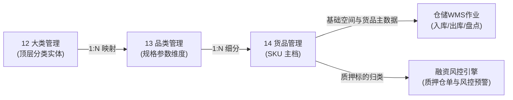

# 大类管理主PRD

> **模块定位**：货品规格管理第 1 节点，作为商品主档顶层分类实体，维护大类名称与启停状态，向品类与货品提供分类继承依据，严格控制整树启停级联下发与无入库单两阶段删除安全校验。  
> **版本**：V2.0 基准版 | 更新时间：2026-09-16 | 责任人：森云科技（Senyun Technology）  
> **编写依据**：[大类管理字段清单.md](./大类管理字段清单.md) 是本模块所有字段编码、格式、枚举与页面展示的唯一定义真源；[大类管理业务规则规格.md](./大类管理业务规则规格.md) 是本模块状态机、两阶段删除与级联控制的唯一定义来源。

---

## 1. 业务背景

大类管理是 SYZC 供应链金融存货监管系统货品主档规格体系的顶层分类入口。通过大类（如：黑色金属、有色金属、粮油农产品、化工原料、建筑建材等）的规范建立，为下游品类细分、货品唯一样本单位（SKU）建模及风控押品归类提供统一的分类基准与全树管控入口。

---

## 2. 功能范围

| 包含功能 (In Scope) | 不包含功能 (Out of Scope) |
| :--- | :--- |
| - 大类列表查询与名称/状态组合筛选； - 新建大类（名称必填且租户内唯一）； - 编辑大类（入库单引用强拦截）； - 大类启用/停用与全树级联（事务控制 + 快照恢复）； - 大类删除（阶段一启用拦截 + 阶段二整树入库单扫描）； - 操作留痕与全路径审计追溯。 | - 品类与货品具体参数维度的维护（由 13 品类管理、14 货品管理承载）； - 业务单据（入库单、仓单、质押单）的开具与审批流转； - 跨租户大类数据共享与同步； - 已逻辑删除大类的回收与撤销。 |

---

## 3. 模块定位与系统链路

---

## 4. 业务场景

| 场景序号与编码 | 场景名称 | 场景类型 | 核心业务流程与约束说明 | 关联规则索引 |
| :--- | :--- | :--- | :--- | :--- |
| **场景 1 (CAT-S01)** | 【新建大类主流程】 | 正常主流程 | 在新建模态弹窗中录入大类名称，校验租户内唯一性，保存后默认初始状态为“启用”并生成审计日志。 | 【租户隔离与名称唯一性规则】(CAT-F01) |
| **场景 2 (CAT-S02)** | 【编辑大类业务拦截与更新】 | 异常拦截/主流程 | 在编辑模态弹窗中修改大类名称；若该大类下已有关联货品产生仓储入库单，触发模态警告弹窗强阻断；无入库单时保存并校验重名。 | 【编辑操作入库单拦截规则】(CAT-F04) 【租户隔离与名称唯一性规则】(CAT-F01) |
| **场景 3 (CAT-S03)** | 【停用大类与全树级联下发】 | 管控流程 | 启用状态下点击【停用】，弹出二次确认模态弹窗；确认后持久化下级状态快照，同一事务内级联停用所有下属品类与货品。 | 【父级停用全树级联下发规则】(CAT-F02) |
| **场景 4 (CAT-S04)** | 【启用大类与子树快照恢复】 | 管控流程 | 停用状态下点击【启用】，弹出确认提示；确认后大类置为启用，并读取快照精准恢复停用前处于启用的品类与货品，不激活原本停用节点。 | 【父级启用快照恢复规则】(CAT-F03) |
| **场景 5 (CAT-S05)** | 【删除大类两阶段强校验】 | 异常拦截/终态流程 | 阶段一校验自身状态（启用状态直接阻断并提示先停用）；阶段二扫描整树入库单引用（存在入库单阻断提示；无入库单二次确认后事务内逻辑删除大类及整棵子树）。 | 【两阶段删除强校验与级联逻辑删除规则】(CAT-F05) |

---

## 5. 状态机与动作能力矩阵

> 状态流转详细规则、前置校验与阻断提示详见 [大类管理业务规则规格.md §三 状态流转表](./大类管理业务规则规格.md#三状态流转表核心规则矩阵)。

| 动作名称 | 启用状态 (`ENABLED`) | 停用状态 (`DISABLED`) | 已删除 (`is_deleted=1`) |
| :--- | :---: | :---: | :---: |
| **查看列表 / 组合筛选** | ✅ | ✅ | ❌ |
| **新建大类** | ✅ | ✅ | ❌ |
| **编辑大类** | ✅（需整棵子树无入库数据） | ✅（需整棵子树无入库数据） | ❌ |
| **停用大类** | ✅（触发全树级联停用） | ❌ | ❌ |
| **启用大类** | ❌ | ✅（触发快照恢复机制） | ❌ |
| **删除大类** | ❌（阶段一阻断拦截） | ✅（阶段二整树无入库单允许） | ❌ |

---

## 6. 页面功能与交互说明

### 6.1 页面布局与骨架
1. **顶部面包屑与标题**：`配置管理 / 货品规格管理 / 大类管理`；
2. **头部操作区**：位于页面右上角，主操作按钮【+ 新建大类】；
3. **筛选查询区**：
   - 大类名称：单行文本输入框，支持前后空格过滤与模糊匹配；
   - 状态：下拉单选框，支持「全部」、「启用」、「停用」过滤；
   - 操作按钮：【查询】与【重置】；
4. **数据表格展示区**：采用自适应表格，支持空态展示插画；
5. **模态弹窗组件**：
   - 新建模态弹窗 / 编辑模态弹窗：包含大类名称单行文本输入框、字数计数器（0/20）；
   - 二次确认与警告模态弹窗：用于停用警示、启用确认及两阶段删除拦截反馈。

---

## 7. 核心业务规则索引与追溯表

| 规则编码 | 规则业务名称 | 核心业务口径与约束 | 唯一定义来源 |
| :--- | :--- | :--- | :--- |
| **CAT-F01** | 【租户隔离与名称唯一性规则】 | 大类名称 1~20 字符；同一租户内严格唯一；底层数据库唯一索引保障 | [业务规则规格 CAT-F01](./大类管理业务规则规格.md#租户隔离与名称唯一性规则cat-f01) |
| **CAT-F02** | 【父级停用全树级联下发规则】 | 停用时备份下级状态快照；同一本地事务内批量级联停用大类、品类及货品 | [业务规则规格 CAT-F02](./大类管理业务规则规格.md#父级停用全树级联下发规则cat-f02) |
| **CAT-F03** | 【父级启用快照恢复规则】 | 重新启用大类；依据快照仅恢复原启用子节点，绝不激活原主动停用节点 | [业务规则规格 CAT-F03](./大类管理业务规则规格.md#父级启用快照恢复规则cat-f03) |
| **CAT-F04** | 【编辑操作入库单拦截规则】 | 编辑保存时实时扫描整树入库单引用；存在任何入库数据阻断并弹窗提示 | [业务规则规格 CAT-F04](./大类管理业务规则规格.md#编辑操作入库单拦截规则cat-f04) |
| **CAT-F05** | 【两阶段删除强校验与级联逻辑删除规则】 | 阶段一启用状态拦截；阶段二扫描整树入库单，无记录二次确认后整树逻辑删除 | [业务规则规格 CAT-F05](./大类管理业务规则规格.md#两阶段删除强校验与级联逻辑删除规则cat-f05) |
| **CAT-F06** | 【并发控制与乐观锁幂等规则】 | 采用乐观锁机制 (`version`)；防重复提交与多用户并发冲突保护 | [业务规则规格 CAT-F06](./大类管理业务规则规格.md#并发控制与乐观锁幂等规则cat-f06) |
| **CAT-P01** | 【角色与数据权限隔离规则】 | 区分管理员/维护人/风控只读角色；强隔离跨租户数据上下文 | [业务规则规格 CAT-P01](./大类管理业务规则规格.md#角色与数据权限隔离规则cat-p01) |

---

## 8. 权限与风控约束

- **数据隔离**：基于 `tenant_id` 强隔离；
- **操作权限**：系统管理员与配置维护人员具备新建、编辑、启用/停用与删除操作权限；风控管理与业务人员仅具备查看与筛选权限。

---

## 9. 异常边界处理

- **并发冲突防护**：两名用户同时编辑同一大类，后提交者被拒绝并提示「数据已被他人修改，请刷新后重试」；
- **级联事务失败保护**：启停用或删除级联更新子节点中途若遇异常，数据库事务全部回滚，保持数据零裂痕；
- **网络中断重试**：幂等标识保障重复点击不会产生重复记录。

---

## 10. 验收用例与测试标准

| 验收用例编码 | 验收项业务名称 | 前置条件与测试步骤 | 预期结果与阻断交互 |
| :--- | :--- | :--- | :--- |
| **CAT-V01** | 【新建重名校验测试】 | 在新建模态弹窗中录入当前租户已存在的大类名称，点击保存 | 保存失败，浮窗提示（Toast）告知「大类名称已存在，请重新输入」 |
| **CAT-V02** | 【编辑入库业务拦截测试】 | 选中已存在入库单货品的大类，点击编辑并尝试保存新名称 | 阻断保存，弹出模态警告弹窗告知「该大类已有业务数据产生，不可编辑！」 |
| **CAT-V03** | 【大类停用级联下发测试】 | 对启用状态大类点击【停用】并在模态弹窗中确认 | 大类变为停用，且其下属所有品类、货品状态全部级联变为停用 |
| **CAT-V04** | 【大类启用快照恢复测试】 | 包含原本主动停用货品的大类执行重新启用操作 | 大类变为启用，停用前为启用的子节点恢复为启用，原本停用的节点保持停用 |
| **CAT-V05** | 【启用状态删除阻断测试】 | 对处于启用状态的大类直接点击行操作【删除】 | 阶段一阻断，弹出模态警告弹窗「启用状态下的【大类/品类/货品】不可删除，请先停用。」 |
| **CAT-V06** | 【停用状态入库阻断测试】 | 大类已停用，但子树中任一货品存在入库单记录，点击【删除】 | 阶段二阻断，弹出模态警告弹窗「该大类或其下级已有入库业务数据，不可删除！」 |
| **CAT-V07** | 【无入库数据删除成功测试】 | 大类已停用且整棵子树均无入库单，点击【删除】并在模态弹窗中二次确认 | 事务内大类及子树品类、货品执行逻辑删除，列表与选择器不再可见 |

---

## 修订记录

| 日期 | 版本 | 变更摘要 | 变更人 |
| :--- | :---: | :--- | :--- |
| 2026-08-14 | V1.0 | 初版大类管理主 PRD | 产品团队 |
| 2026-09-02 | V2.0 | 规范 10 章结构，收拢字段至清单、收拢规则至规格 | AI PM / 森云科技 |
| **2026-09-16** | **V2.0 规范化升级** | 1. 编号语义自解释：场景命名为 `场景 N【业务场景名称】(CAT-S01~S05)`，用例命名为 `【用例业务名称】(CAT-V01~V07)`； 2. 交互术语全面汉化：Toast/Modal/Alert 全面汉化为浮窗提示、模态弹窗、模态警告弹窗； 3. 强化与三件套真源强对齐。 | 森云科技规范化升级工作组 |
