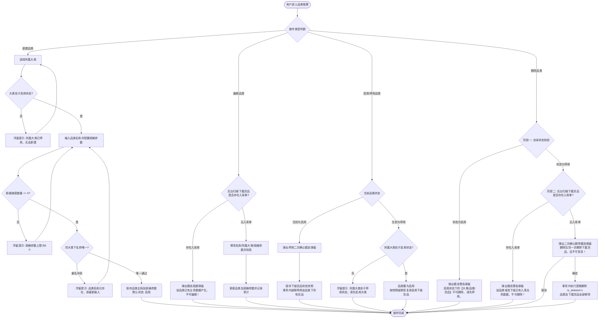
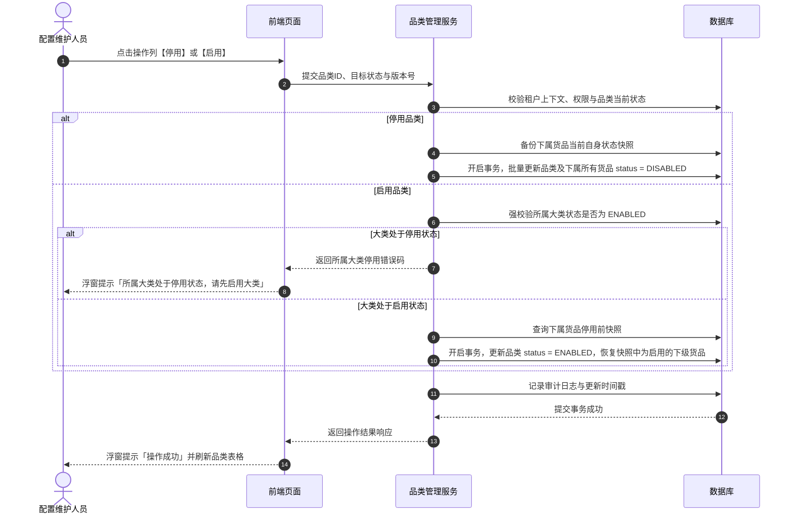
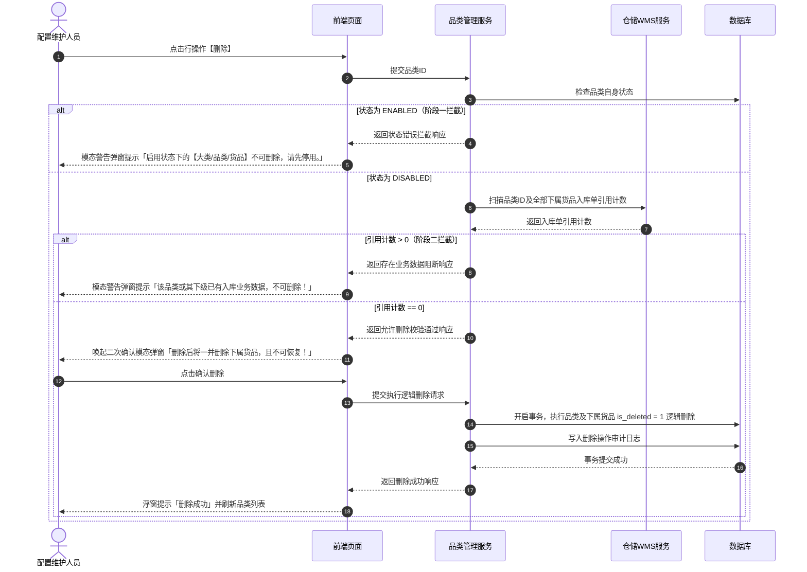

# 品类管理业务规则规格

> **文档定位**：货品品类（13-货品规格管理-品类管理）状态机模型、动态规格参数维度控制（1~5 个）、上级大类启用依赖、仓储入库业务强拦截、父子级联启停以及两阶段删除安全机制的唯一定义真源（SSOT）。  
> **参考文档**：[品类管理主PRD.md](./品类管理主PRD.md)、[品类管理字段清单.md](./品类管理字段清单.md)、[大类管理业务规则规格.md](../12-货品规格管理-大类管理/大类管理业务规则规格.md)  
> **版本**：V2.0 基准版 | 更新时间：2026-09-16 | 责任人：森云科技（Senyun Technology）

---

## 一、模块与单据定位

| 项目 | 内容 |
| :--- | :--- |
| **层级定位** | **【第 2 层 - 货品品类主档】**（货品规格管理中层分类与规格元数据定义核心节点） |
| **核心职责** | 维护从属于大类的具体品类（如：螺纹钢、热轧卷板、电解铜、白砂糖、玉米等），并定义该品类细分为货品（SKU）时的动态规格参数维度（最多 5 个）；承上启下传递有效管控状态。 |
| **实体映射** | `sys_goods_subcategory`（品类实体表，外键关联 `category_id`） |
| **上下游关系** | **上游**：继承自大类管理（[12 大类管理](../12-货品规格管理-大类管理/大类管理业务规则规格.md)），严格依赖所属大类的启用状态； **下游**：货品管理（[14 货品管理](../14-货品规格管理-货品管理/货品管理业务规则规格.md)，1:N 映射关系），向下游提供规格参数模板；仓储入库单与加工管理品类分类。 |
| **数据约束** | 同一大类下品类名称严格唯一；动态规格参数维度数量满足 $1 \le N \le 5$。 |

---

## 二、状态定义与计算模型

| 状态名称 | 字段与枚举 (`status`) | 是否允许人工切换 | 含义说明 | 级联影响范围 |
| :--- | :--- | :---: | :--- | :--- |
| **启用** | `ENABLED` | 是 | 品类自身处于正常可用状态 | 允许下级新增货品；在父级大类为启用时，下级货品计算为“有效启用”状态。 |
| **停用** | `DISABLED` | 是 | 品类自身处于停用管控状态 | 事务内级联停用该品类下所有货品；下级货品有效状态变为“无效停用”，禁止新增业务单据选择该品类下属货品；历史单据数据不受影响。 |
| **已删除** | `DELETED` (`is_deleted = 1`) | 否 | 逻辑删除标记，前台界面完全不可见 | 仅当品类处于停用状态且下属货品完全无入库单数据时经二次确认后触发；不可物理恢复。 |

---

## 三、状态流转表（核心规则矩阵）

| 当前状态 | 触发动作 | 前置校验条件 | 结果状态 | 二次确认与交互组件 | 后置级联影响 | 失败阻断提示与控件 |
| :--- | :--- | :--- | :--- | :--- | :--- | :--- |
| **未创建** | 新建保存 | ① 品类名称必填（1~20 字符）且同一大类下唯一 ② 所属大类必须处于“启用”状态 ③ 动态规格参数维度 $1 \le N \le 5$ | `ENABLED` | 新建模态弹窗（Modal） | 自动留痕创建人与创建时间，生成品类主档与规格参数定义，默认启用 | 浮窗提示（Toast）阻断： 「品类名称已存在 / 所属大类已停用 / 规格参数上限为5个」 |
| **启用 / 停用** | 编辑保存 | ① 品类名称、所属大类、规格参数校验通过 ② **入库数据强校验**：该品类下无任何入库单数据 | 保持原状态 | 编辑模态弹窗（Modal） | 更新品类名称、所属大类、规格参数维度与更新时间戳 | 模态警告弹窗（Alert Dialog）阻断： 「该品类已有业务数据产生，不可编辑！」 |
| **启用** | 停用 | 具备配置维护或管理员权限 | `DISABLED` | 二次确认模态弹窗： 「停用后后续新增货品无法选择，但历史已产生数据不受影响」 | ① 当前品类置为停用 ② **保存下级货品当前自身状态快照** ③ 事务内级联停用该品类下所有货品 ④ 刷新最近更新时间 | 浮窗提示（Toast）： 「停用失败，请稍后重试」 |
| **停用** | 启用 | ① 具备操作权限 ② **父级状态强校验**：所属大类必须处于“启用”状态 | `ENABLED` | 二次确认模态弹窗（标准确认） | ① 当前品类置为启用 ② **按快照精准恢复下级货品状态**：仅恢复停用前处于“启用”的货品 ③ 刷新最近更新时间 | 浮窗提示（Toast）阻断： 「所属大类处于停用状态，请先启用大类」 |
| **启用** | 删除 | 无 | 阻断 | 点击行操作【删除】按钮 | 严禁删除，品类保持启用 | 模态警告弹窗（Alert Dialog）阻断： 「启用状态下的【大类/品类/货品】不可删除，请先停用。」 |
| **停用** | 删除 | **下属无入库单强校验**：扫描该品类下所有货品，均不存在入库单数据 | `is_deleted = 1` | 风险警告模态弹窗： 「删除后将一并删除下属货品，且不可恢复！」 | 事务内将该品类及全部下属货品执行逻辑删除，前台列表与选择器中移除 | 模态警告弹窗（Alert Dialog）阻断： 「该品类或其下级已有入库业务数据，不可删除！」 |

---

## 四、核心业务规则

### 【所属大类从属与品类名称唯一性规则】(SUB-F01)
- 新建或编辑品类时，所属大类仅能从当前租户处于 `ENABLED`（启用）状态的大类下拉列表中选取；
- 同一大类下，品类名称在去除首尾空格后严格唯一；不同大类下的品类名称允许重名；
- 数据库底层必须建立 `(tenant_id, category_id, subcategory_name, is_deleted)` 唯一索引兜底防重。

### 【动态规格参数维度上限控制规则】(SUB-F02)
- 每个品类支持配置其下属货品（SKU）的规格参数维度（如：产地、材质、品质等级、规格型号等）；
- 品类规格参数维度上限严格限定为 **5 个**（$1 \le N \le 5$）；
- 前端交互控件在规格维度数量达到 5 个时，置灰禁用【+ 添加规格参数】按钮并展示悬浮气泡提示（Tooltip）；服务端接收请求时强校验，超过 5 个直接抛出业务异常并拦截保存。

### 【上级大类启用状态强依赖规则】(SUB-F03)
- 品类执行启用操作或新建提交时，服务端必须重新检索所属大类的实时有效状态；
- 若所属大类已被停用，必须强制拦截并以浮窗提示（Toast）告知：「所属大类处于停用状态，请先启用大类」，严禁跨级孤立激活。

### 【编辑操作下属入库单拦截规则】(SUB-F04)
- 编辑品类属性（品类名称、所属大类、规格参数维度）时，服务端实时校验其下属货品的入库单引用情况：
  - 扫描逻辑：`SELECT COUNT(1) FROM wms_inbound_order_detail WHERE subcategory_id = :subcategoryId AND is_deleted = 0`；
  - 一旦任一下属货品存在仓储入库单业务数据（引用计数 $> 0$），全量阻断保存并弹出模态警告弹窗：「该品类已有业务数据产生，不可编辑！」；
  - 严禁仅依赖前端缓存状态判定，防止并发脏写。

### 【级联停用与两阶段删除控制规则】(SUB-F05)
- **级联停用**：品类停用时，在同一事务内级联将其下所有货品置为停用，并持久化保留下属货品停用前的自身状态快照；
- **两阶段删除**：
  - **阶段一（自身状态校验）**：品类处于启用状态时直接阻断并提示先停用；
  - **阶段二（入库单扫描）**：品类处于停用状态时，后台扫描所有下属货品是否存在入库单数据。若无入库单，经用户在风险警告模态弹窗中二次确认后，在同一数据库事务内将该品类及全部下属货品执行逻辑删除（`is_deleted = 1`）。

### 【并发控制与参数事务一致性规则】(SUB-F06)
- 基于乐观锁机制（`version` 字段），防止多名管理员并发修改同一品类或并发调整规格参数维度造成数据冲突；
- 规格参数维度的增删改与品类主表数据更新必须处于同一本地数据库事务中，确保主子表原子一致。

---

## 五、权限与安全规范

### 【角色与数据权限隔离规则】(SUB-P01)

| 角色代码 | 角色名称 | 查看品类列表 | 新建/编辑品类 | 启用品类 | 停用品类 | 删除品类 | 数据范围 |
| :--- | :--- | :---: | :---: | :---: | :---: | :---: | :--- |
| `R-SYS-ADMIN` | 系统管理员 | ✅ | ✅ | ✅ | ✅ | ✅ | 当前所属租户全量数据 |
| `R-CFG-MGR` | 配置维护人员 | ✅ | ✅ | ✅ | ✅ | ✅ | 当前所属租户全量数据 |
| `R-RISK-MGR` | 风控管理人员 | ✅ | ❌ | ❌ | ❌ | ❌ | 当前所属租户全量（只读） |
| `R-BUSI-OPER` | 业务人员 / 只读用户 | ✅ | ❌ | ❌ | ❌ | ❌ | 当前所属租户全量（只读） |

- **接口安全校验**：所有服务端应用程序编程接口（API）强校验租户上下文，严禁跨租户越权访问与修改。

---

## 六、核心业务流程图

---

## 七、核心操作时序图

### 1. 品类状态级联启停时序

### 2. 品类两阶段删除控制时序

---

## 八、修订记录

| 日期 | 版本 | 变更摘要 | 变更人 |
| :--- | :---: | :--- | :--- |
| 2026-08-14 | V1.0 | 初版品类管理业务规则规格。 | 产品团队 |
| 2026-09-02 | V2.0 | 规范状态机、两阶段删除流程图与时序图。 | AI PM / 森云科技 |
| **2026-09-16** | **V2.0 规范化升级** | 1. 编号语义自解释：规则全面升级为 `【规则业务名称】(SUB-F01~06/P01)` 格式； 2. 交互术语全面汉化：Toast/Modal/Alert 全面汉化为浮窗提示、模态弹窗、模态警告弹窗； 3. 强化与主PRD、字段清单三件套真源强对齐。 | 森云科技规范化升级工作组 |
