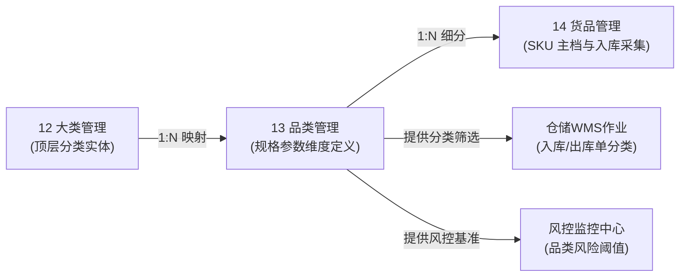

# 品类管理主PRD

> **模块定位**：货品规格管理第 2 节点，作为分类中层与动态规格元数据定义层，维护品类名称、所属大类与最多 5 个规格参数维度，实现父级停用级联下发与无入库单两阶段安全删除校验。  
> **版本**：V2.0 基准版 | 更新时间：2026-09-16 | 责任人：森云科技（Senyun Technology）  
> **编写依据**：[品类管理字段清单.md](./品类管理字段清单.md) 是本模块所有字段编码、格式、枚举与页面展示的唯一定义真源；[品类管理业务规则规格.md](./品类管理业务规则规格.md) 是本模块状态机、两阶段删除与级联控制的唯一定义来源。

---

## 1. 业务背景

品类管理建立在货品大类之上，是大宗商品规格标准化的关键承载节点。通过为每个品类定义规格维度（如：螺纹钢定义“材质、规格、产地”；白砂糖定义“等级、包装、产地”），规范下游货品（SKU）的属性录入，确保在库监管、仓单确权与抵质押风控具备一致的商品维度与风控模型。

---

## 2. 功能范围

| 包含功能 (In Scope) | 不包含功能 (Out of Scope) |
| :--- | :--- |
| - 品类列表查询与所属大类/名称/状态多维筛选； - 新建品类（支持动态定义最多 5 个规格参数维度）； - 编辑品类与规格（入库引用强拦截）； - 品类启用（强校验所属大类启用状态）； - 品类停用（事务内级联停用下属货品并保存快照）； - 品类删除（阶段一启用拦截 + 阶段二下属货品入库单扫描）； - 操作留痕与全路径审计追溯。 | - 具体货品（SKU）规格值与计量单位维护（由 14 货品管理承载）； - 仓储入库采集信息配置与参考单价维护； - 入库、出库、加工与质押实际单据办理； - 跨大类批量品类数据迁移。 |

---

## 3. 模块定位与系统链路

---

## 4. 业务场景

| 场景序号与编码 | 场景名称 | 场景类型 | 核心业务流程与约束说明 | 关联规则索引 |
| :--- | :--- | :--- | :--- | :--- |
| **场景 1 (SUB-S01)** | 【新建品类与规格定义主流程】 | 正常主流程 | 在新建模态弹窗中选择已启用的所属大类，录入品类名称（同大类唯一），动态配置 1~5 个规格参数维度，保存后默认启用。 | 【所属大类从属与品类名称唯一性规则】(SUB-F01) 【动态规格参数维度上限控制规则】(SUB-F02) |
| **场景 2 (SUB-S02)** | 【编辑品类与规格业务拦截】 | 异常拦截/主流程 | 在编辑模态弹窗中修改品类名称、所属大类或增删规格维度；若已产生仓储入库单，触发模态警告弹窗强阻断；无入库单时正常保存。 | 【编辑操作下属入库单拦截规则】(SUB-F04) 【所属大类从属与品类名称唯一性规则】(SUB-F01) |
| **场景 3 (SUB-S03)** | 【启用品类与大类状态强校验】 | 管控流程 | 停用状态下点击【启用】，服务端实时强校验所属大类有效状态：大类已停用则阻断并浮窗提示；大类处于启用时允许启用并级联恢复下属货品。 | 【上级大类启用状态强依赖规则】(SUB-F03) |
| **场景 4 (SUB-S04)** | 【停用品类与下属货品级联停用】 | 管控流程 | 启用状态下点击【停用】，弹出二次确认模态弹窗；确认后保存下级货品自身状态快照，在同一本地事务内级联停用该品类下所有货品。 | 【级联停用与两阶段删除控制规则】(SUB-F05) |
| **场景 5 (SUB-S05)** | 【删除品类两阶段安全校验】 | 异常拦截/终态流程 | 阶段一校验自身状态（启用状态直接阻断并提示先停用）；阶段二扫描下属货品入库单（存在入库单阻断提示；无入库单二次确认后逻辑删除品类及下属货品）。 | 【级联停用与两阶段删除控制规则】(SUB-F05) |

---

## 5. 状态机与动作能力矩阵

> 状态流转详细规则、前置校验与阻断提示详见 [品类管理业务规则规格.md §三 状态流转表](./品类管理业务规则规格.md#三状态流转表核心规则矩阵)。

| 动作名称 | 启用状态 (`ENABLED`) | 停用状态 (`DISABLED`) | 已删除 (`is_deleted=1`) |
| :--- | :---: | :---: | :---: |
| **查看列表 / 组合筛选** | ✅ | ✅ | ❌ |
| **新建品类** | ✅ | ✅ | ❌ |
| **编辑品类** | ✅（需下属无入库数据） | ✅（需下属无入库数据） | ❌ |
| **停用品类** | ✅（触发级联停用下级货品） | ❌ | ❌ |
| **启用品类** | ❌ | ✅（需所属大类处于启用） | ❌ |
| **删除品类** | ❌（阶段一阻断拦截） | ✅（阶段二下属无入库单允许） | ❌ |

---

## 6. 页面功能与交互说明

### 6.1 页面布局与骨架
1. **顶部面包屑与标题**：`配置管理 / 货品规格管理 / 品类管理`；
2. **头部操作区**：位于页面右上角，主操作按钮【+ 新建品类】；
3. **筛选查询区**：
   - 品类名称：单行文本输入框，支持模糊匹配；
   - 所属大类：下拉单选框，支持拼音模糊检索，仅加载当前租户处于启用状态的大类；
   - 状态：下拉单选框，支持「全部」、「启用」、「停用」选项；
   - 操作按钮：【查询】与【重置】；
4. **数据表格展示区**：包含动态规格参数维度的标签化展示；
5. **模态弹窗组件**：
   - 新建模态弹窗 / 编辑模态弹窗：包含品类名称单行文本输入框、所属大类下拉单选框、动态规格参数维度配置列表（支持新增行、删除行，达 5 个时添加按钮置灰禁用）；
   - 二次确认与警告模态弹窗：用于停用提醒、启用确认、大类停用阻断及入库业务拦截警示。

---

## 7. 核心业务规则索引与追溯表

| 规则编码 | 规则业务名称 | 核心业务口径与约束 | 唯一定义来源 |
| :--- | :--- | :--- | :--- |
| **SUB-F01** | 【所属大类从属与品类名称唯一性规则】 | 所属大类仅可选启用大类；同一大类下品类名称严格唯一（1~20 字符） | [业务规则规格 SUB-F01](./品类管理业务规则规格.md#所属大类从属与品类名称唯一性规则sub-f01) |
| **SUB-F02** | 【动态规格参数维度上限控制规则】 | 品类规格参数维度数量上限严格为 5 个；达到 5 个置灰前端按钮，服务端强校验拦截 | [业务规则规格 SUB-F02](./品类管理业务规则规格.md#动态规格参数维度上限控制规则sub-f02) |
| **SUB-F03** | 【上级大类启用状态强依赖规则】 | 启用品类前强校验所属大类状态；所属大类处于停用状态直接阻断并提示 | [业务规则规格 SUB-F03](./品类管理业务规则规格.md#上级大类启用状态强依赖规则sub-f03) |
| **SUB-F04** | 【编辑操作下属入库单拦截规则】 | 编辑前实时扫描下属货品入库单；存在任何入库业务数据全量阻断保存并弹窗提示 | [业务规则规格 SUB-F04](./品类管理业务规则规格.md#编辑操作下属入库单拦截规则sub-f04) |
| **SUB-F05** | 【级联停用与两阶段删除控制规则】 | 停用级联下属货品并存快照；删除两阶段强控（阶段一启用拦截，阶段二无入库单允许删除） | [业务规则规格 SUB-F05](./品类管理业务规则规格.md#级联停用与两阶段删除控制规则sub-f05) |
| **SUB-F06** | 【并发控制与参数事务一致性规则】 | 采用乐观锁机制 (`version`)；规格参数与品类主表处于同一本地事务原子更新 | [业务规则规格 SUB-F06](./品类管理业务规则规格.md#并发控制与参数事务一致性规则sub-f06) |
| **SUB-P01** | 【角色与数据权限隔离规则】 | 区分管理员/维护人/风控只读角色；强隔离跨租户数据上下文 | [业务规则规格 SUB-P01](./品类管理业务规则规格.md#角色与数据权限隔离规则sub-p01) |

---

## 8. 权限与风控约束

- **数据隔离**：基于 `tenant_id` 强隔离；
- **操作权限**：系统管理员与配置维护人员具备新建、编辑、启用/停用与删除权限；风控管理与业务人员仅具备查看与组合筛选权限。

---

## 9. 异常边界处理

- **规格维度超限拦截**：尝试绕过前端提交超过 5 个规格参数维度，服务端抛出业务异常阻断保存；
- **大类停用级联拦截**：所属大类停用期间尝试启用品类，浮窗提示「所属大类处于停用状态，请先启用大类」；
- **并发修改冲突保护**：两人同时编辑同一品类，后提交者提示「数据已被他人修改，请刷新后重试」。

---

## 10. 验收用例与测试标准

| 验收用例编码 | 验收项业务名称 | 前置条件与测试步骤 | 预期结果与阻断交互 |
| :--- | :--- | :--- | :--- |
| **SUB-V01** | 【规格维度上限控制测试】 | 在新建模态弹窗中依次添加规格维度至 5 个 | 界面【+ 添加规格参数】按钮置灰禁用，浮窗提示上限 5 个；服务端拒绝超限提交 |
| **SUB-V02** | 【同大类重名拦截测试】 | 选中某一大类，录入该大类下已存在的品类名称尝试保存 | 保存失败，浮窗提示（Toast）告知「品类名称已存在，请重新输入」 |
| **SUB-V03** | 【上级大类停用启用阻断测试】 | 所属大类处于停用状态，在品类列表中点击【启用】按钮 | 阻断操作，浮窗提示（Toast）告知「所属大类处于停用状态，请先启用大类」 |
| **SUB-V04** | 【编辑下属入库拦截测试】 | 选中已存在入库单货品的品类，点击编辑并尝试保存修改 | 阻断保存，弹出模态警告弹窗告知「该品类已有业务数据产生，不可编辑！」 |
| **SUB-V05** | 【品类停用级联下发测试】 | 对启用状态品类点击【停用】并在模态弹窗中确认 | 品类变为停用，其下属所有货品状态在事务内全部级联变为停用 |
| **SUB-V06** | 【启用状态删除阻断测试】 | 对处于启用状态的品类直接点击行操作【删除】 | 阶段一阻断，弹出模态警告弹窗「启用状态下的【大类/品类/货品】不可删除，请先停用。」 |
| **SUB-V07** | 【停用状态入库阻断测试】 | 品类已停用，但下属任一货品存在入库单记录，点击【删除】 | 阶段二阻断，弹出模态警告弹窗「该品类或其下级已有入库业务数据，不可删除！」 |
| **SUB-V08** | 【无入库数据删除成功测试】 | 品类已停用且所有下属货品均无入库单，点击【删除】并二次确认 | 事务内品类及下属货品执行逻辑删除，列表与下拉选择器中不再展示 |

---

## 修订记录

| 日期 | 版本 | 变更摘要 | 变更人 |
| :--- | :---: | :--- | :--- |
| 2026-08-14 | V1.0 | 初版品类管理主 PRD | 产品团队 |
| 2026-09-02 | V2.0 | 规范 10 章结构，收拢字段至清单、收拢规则至规格 | AI PM / 森云科技 |
| **2026-09-16** | **V2.0 规范化升级** | 1. 编号语义自解释：场景命名为 `场景 N【业务场景名称】(SUB-S01~S05)`，用例命名为 `【用例业务名称】(SUB-V01~V08)`； 2. 交互术语全面汉化：Toast/Modal/Alert 全面汉化为浮窗提示、模态弹窗、模态警告弹窗； 3. 强化与三件套真源强对齐。 | 森云科技规范化升级工作组 |
