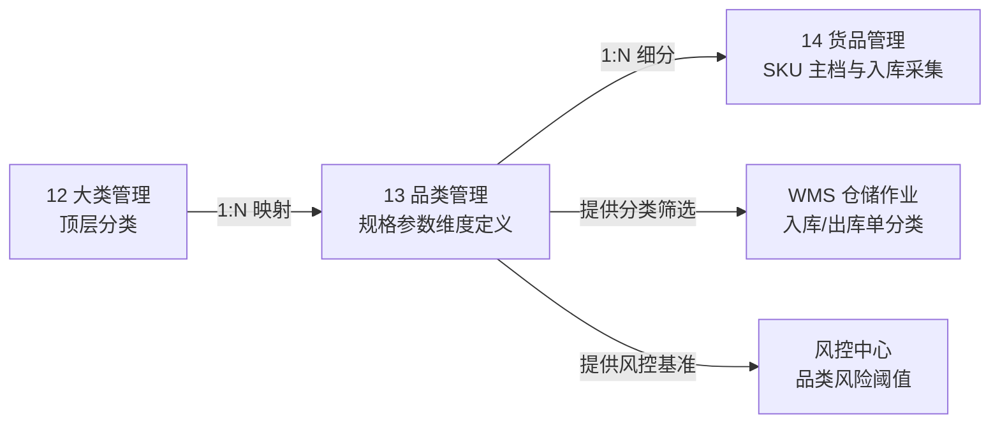

# 品类管理主PRD

> **模块定位**：货品规格管理第 2 节点，作为分类中层与动态规格元数据定义层，维护品类名称、所属大类与最多 5 个规格参数维度，实现父级停用级联控制与无入库单两阶段安全删除。  
> **版本**：V2.0 | 更新时间：2026-09-02 | 责任人：森云科技（Senyun Technology）  
> **编写依据**：[品类管理字段清单.md](./品类管理字段清单.md) 是本模块所有字段格式、枚举与页面展示的唯一基准；[品类管理业务规则规格.md](./品类管理业务规则规格.md) 是本模块状态机、两阶段删除与级联控制的唯一定义来源。

---

## 1. 业务背景

品类管理建立在货品大类之上，是大宗商品规格标准化的关键承载节点。通过为每个品类定义规格维度（如：螺纹钢定义“材质、规格、产地”；白砂糖定义“等级、包装、产地”），规范下游货品（SKU）的属性录入，确保在库监管、仓单确权与抵质押风控具备一致的商品维度。

---

## 2. 功能范围

| 包含功能 (In Scope) | 不包含功能 (Out of Scope) |
| :--- | :--- |
| - 品类列表查询与所属大类/名称/状态多维筛选； - 新建品类（支持动态定义最多 5 个规格参数维度）； - 编辑品类与规格（入库引用强拦截）； - 品类启用（强校验所属大类启用状态）； - 品类停用（事务内级联停用下属货品并保存快照）； - 品类删除（阶段一启用拦截 + 阶段二下属货品入库单扫描）； - 操作留痕与全路径审计追溯。 | - 具体货品（SKU）规格值与计量单位维护（由 14货品模块承载）； - 入库收集信息配置与单价维护； - 入库、出库、加工与质押业务办理； - 跨大类批量品类迁移。 |

---

## 3. 模块定位与系统链路

---

## 4. 业务场景

| 场景ID | 场景名称 | 场景类型 | 业务说明与核心约束 |
| :--- | :--- | :--- | :--- |
| **S01** | 新建品类与规格定义 | 主流程 | 选择已启用大类，录入品类名称（同大类唯一），动态配置 1~5 个规格参数维度 |
| **S02** | 编辑品类与规格 | 主流程 | 修改品类名称、所属大类或增删规格维度；若已产生入库单强阻断并弹窗提示 |
| **S03** | 启用品类 | 控制流程 | 强校验所属大类状态：大类停用则阻断；大类启用时允许启用并级联恢复下属货品 |
| **S04** | 停用品类 | 控制流程 | 确认后保存下级货品状态快照，在同一事务内级联停用该品类下所有货品 |
| **S05** | 删除品类 | 阻断/终态 | 阶段一启用强拦截；阶段二扫描下属货品入库单，无入库单二次确认后逻辑删除 |

---

## 5. 状态机与动作能力矩阵

> 状态流转详细规则、前置校验与阻断提示详见 [品类管理业务规则规格.md §三 状态流转表](./品类管理业务规则规格.md#三状态流转表核心规则矩阵)。

| 动作名称 | 启用状态 (`ENABLED`) | 停用状态 (`DISABLED`) | 已删除 (`is_deleted=1`) |
| :--- | :---: | :---: | :---: |
| **查看列表 / 筛选** | ✅ | ✅ | ❌ |
| **新建品类** | ✅ | ✅ | ❌ |
| **编辑品类** | ✅（需下属无入库数据） | ✅（需下属无入库数据） | ❌ |
| **停用品类** | ✅（触发级联停用下级） | ❌ | ❌ |
| **启用品类** | ❌ | ✅（需所属大类启用） | ❌ |
| **删除品类** | ❌（阶段一阻断拦截） | ✅（阶段二下属无入库单允许） | ❌ |

---

## 6. 页面与字段规则

页面全量字段定义、取值范围、必填性与展示格式完全继承自 [品类管理字段清单.md](./品类管理字段清单.md)：
- **列表展示字段**：`序号`、`品类名称`、`所属大类`、`货品规格参数`、`状态`、`创建人`、`创建时间`、`更新时间`、`操作`；
- **筛选条件**：`品类名称`（文本模糊匹配）、`所属大类`（下拉单选，仅加载启用大类）、`状态`（下拉单选：全部/启用/停用）；
- **操作弹窗**：新建品类弹窗、编辑品类弹窗、停用二次确认弹窗、删除二次确认弹窗。

---

## 7. 核心业务规则索引

| 规则编码 | 规则名称 | 核心口径摘要 | 唯一定义来源 |
| :--- | :--- | :--- | :--- |
| **R-SUB-01** | 大类从属与品类唯一性 | 所属大类仅可选启用大类；同一大类下品类名称唯一（1~20字） | [业务规则规格 R01](./品类管理业务规则规格.md#r01大类从属与品类唯一性) |
| **R-SUB-02** | 规格参数维度上限控制 | 品类规格参数维度上限为 5 个；达到 5 个置灰按钮，后端强拦截第 6 个 | [业务规则规格 R02](./品类管理业务规则规格.md#r02动态规格参数维度上限控制最多5个) |
| **R-SUB-03** | 上级大类状态实时校验 | 启用品类前强校验所属大类状态；大类停用阻断启用 | [业务规则规格 R03](./品类管理业务规则规格.md#r03上级大类状态实时校验) |
| **R-SUB-04** | 编辑操作入库单拦截 | 实时扫描下属货品入库单；存在入库单阻断保存并弹窗提示 | [业务规则规格 R04](./品类管理业务规则规格.md#r04编辑操作入库单拦截规则) |
| **R-SUB-05** | 级联停用与两阶段删除 | 停用级联下属货品并存快照；删除两阶段强控（阶段一启用拦截，阶段二入库单阻断） | [业务规则规格 R05](./品类管理业务规则规格.md#r05级联停用与两阶段删除) |
| **R-SUB-06** | 并发控制与数据一致性 | 采用乐观锁机制 (`version`)；规格参数与品类主表同事务更新 | [业务规则规格 R06](./品类管理业务规则规格.md#r06并发控制与数据一致性) |

---

## 8. 权限与风控约束

- **数据权限**：基于 `tenant_id` 强隔离；
- **操作权限**：系统管理员与配置维护人员具备新建、编辑、启停用与删除权限；风控管理与业务人员仅具备只读权限。

---

## 9. 边界与异常处理

- **规格维度超限拦截**：尝试通过接口提交超过 5 个规格参数维度，后端抛出业务异常阻断保存；
- **大类停用级联拦截**：大类停用期间尝试启用品类，Toast 提示「所属大类处于停用状态，请先启用大类」；
- **并发修改冲突**：两人同时编辑同一品类，后提交者提示「数据已被他人修改，请刷新后重试」。

---

## 10. 验收重点

| 编号 | 验收项 | 输入条件与操作步骤 | 预期结果 |
| :--- | :--- | :--- | :--- |
| **V-SUB-01** | 规格维度上限 | 品类配置已添加 5 个规格维度 | 添加入口置灰或隐藏，服务端拒绝提交第 6 个 |
| **V-SUB-02** | 同大类重名拦截 | 同一大类下录入已存在的品类名称 | 保存失败，Toast 提示「品类名称已存在，请重新输入」 |
| **V-SUB-03** | 大类停用启用阻断 | 所属大类处于停用状态，点击启用品类 | 阻断操作，Toast 提示「所属大类处于停用状态，请先启用大类」 |
| **V-SUB-04** | 编辑入库拦截 | 该品类下已有入库单货品，点击编辑保存 | 阻断保存，弹出阻断弹窗「该品类已有业务数据产生，不可编辑！」 |
| **V-SUB-05** | 停用级联下发 | 启用品类点击停用并确认 | 品类及下属货品状态全部变为停用，事务内成功 |
| **V-SUB-06** | 启用删除拦截 | 处于启用状态的品类点击删除 | 阻断操作，提示「启用状态下的【大类/品类/货品】不可删除，请先停用。」 |
| **V-SUB-07** | 停用删除业务拦截 | 下属任一货品存在入库单，点击删除 | 阻断操作，提示「该品类或其下级已有入库业务数据，不可删除！」 |
| **V-SUB-08** | 无入库数据删除成功 | 停用品类且下属货品无入库单，二次确认删除 | 事务内品类及下属货品执行逻辑删除，列表不再展示 |

---

## 修订记录

| 日期 | 版本 | 变更摘要 | 变更人 |
| :--- | :---: | :--- | :--- |
| 2026-08-14 | V1.0 | 初版品类管理主 PRD | 产品团队 |
| 2026-09-02 | **V2.0** | **V3.0 标杆架构重构基准版**：去除重复规则正文，规范 10 章结构，将字段唯一定义收拢至字段清单、业务逻辑收拢至业务规则规格 | AI PM / 森云科技 |
