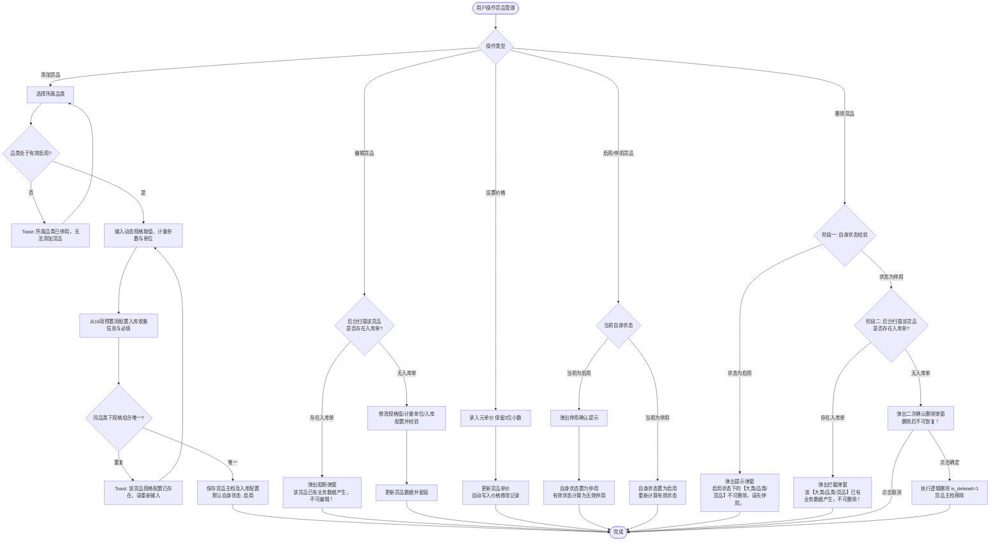
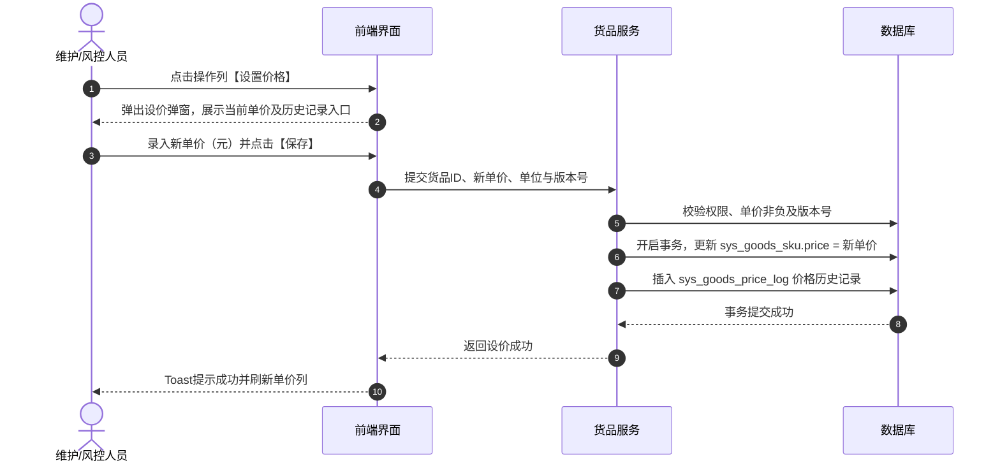
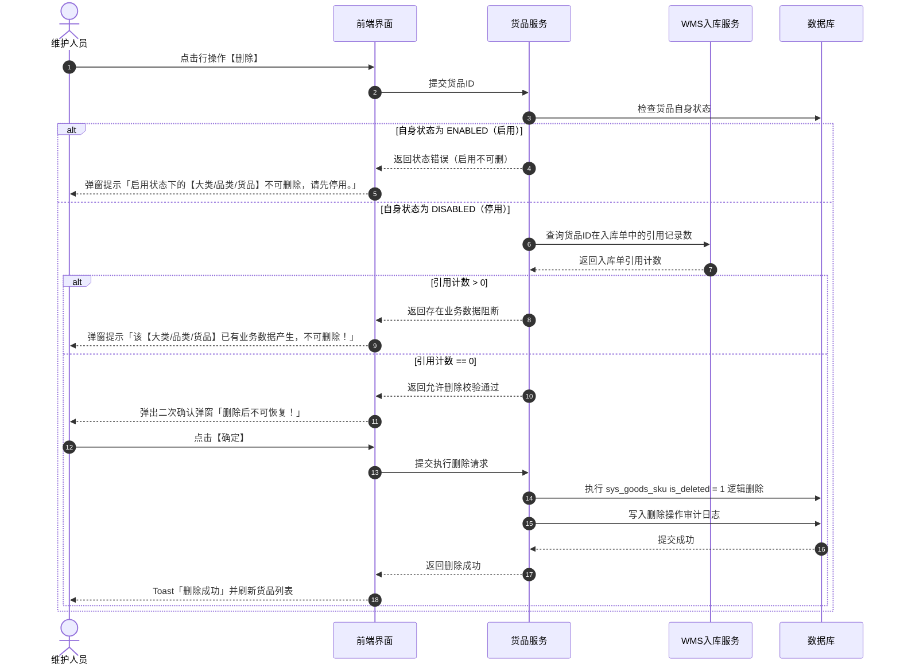

# 货品管理 业务规则规格

> **文档定位**：货品管理（14-货品规格管理-货品管理 / SKU 主档）状态机、有效启用计算公式、动态规格组合唯一性、入库收集信息预置项配置与联动强校验、价格管理与展示精度、下游单价提示规则及删除两阶段控制的唯一定义来源。  
> **参考文档**：[货品管理主PRD.md](./货品管理主PRD.md)、[货品管理字段清单.md](./货品管理字段清单.md)、[大类管理业务规则规格.md](../12-货品规格管理-大类管理/大类管理业务规则规格.md)、[品类管理业务规则规格.md](../13-货品规格管理-品类管理/品类管理业务规则规格.md)  
> **版本**：V2.0 | 更新时间：2026-09-02 | 责任人：森云科技（Senyun Technology）

---

## 一、模块与单据定位

| 项目 | 内容 |
| :--- | :--- |
| **层级定位** | **【第3层-货品/SKU主档】**（货品规格管理最小业务交易单元） |
| **核心职责** | 维护从属于品类的具体货品/SKU，包含动态规格参数取值、计量参数与单位、入库收集信息配置、基准参考单价与价格历史；向入库、库存、仓单、抵质押、融资与加工业务提供主档数据支持。 |
| **实体映射** | `sys_goods_sku`（货品主表）、`sys_goods_price_log`（价格变更日志表） |
| **上下游关系** | **上游**：继承品类管理（[13 品类管理](../13-货品规格管理-品类管理/品类管理业务规则规格.md)）及大类管理（[12 大类管理](../12-货品规格管理-大类管理/大类管理业务规则规格.md)）； **下游**：入库单（动态生成收集字段）、加工管理（产出货品与估值）、仓单与抵质押（质押标的与风控价值核算）、融资管理（押品准入校验）。 |
| **数据约束** | 同一租户同品类下，`动态规格组合 + 计量参数 + 单位` 严格唯一。 |

---

## 二、状态定义与计算公式

### 2.1 状态定义

| 状态维度 | 状态值 | 是否可直接修改 | 含义说明 | 下游影响 |
| :--- | :--- | :---: | :--- | :--- |
| **自身状态 (`status`)** | 启用 (`ENABLED`)、停用 (`DISABLED`) | 是 | 货品自身维度的启停用状态 | 列表操作列维护自身状态；新建默认启用 |
| **有效状态 (计算得出)** | 有效启用、无效停用 | 否 | 由系统根据自身及上级状态实时计算得出的综合可用状态 | **仅“有效启用”货品允许在入库单、仓单、加工、抵质押与融资新建流程中被选择** |
| **删除状态 (`is_deleted`)** | 未删除 (`0`)、已删除 (`1`) | 否 | 逻辑删除标记，已删除数据前台不可见 | 仅停用且无入库单时允许删除；不可恢复 |

### 2.2 有效启用状态计算公式

$$\text{货品有效状态} = \begin{cases} 
\text{有效启用}, & \text{当且仅当 } \text{自身状态} = \text{ENABLED} \land \text{所属品类状态} = \text{ENABLED} \land \text{所属大类状态} = \text{ENABLED} \\
\text{无效停用}, & \text{其它任何情况（自身停用或任一上级停用）}
\end{cases}$$

---

## 三、核心业务规则（R01 ~ R10）

### R-SKU-01：货品 SKU 唯一性校验
- 同一租户同品类下，货品的识别唯一键为：`动态规格参数组合（标准化JSON） + 计量参数 + 单位`；
- 保存时服务端将动态规格参数按字段编码正序标准化后比对，若数据库已存在相同组合，阻断保存并提示「该货品规格配置已存在，请重新输入」。

### R-SKU-02：计量参数与单位分离维护
- 计量参数（如 `重量`、`数量`）与计量单位（如 `吨`、`包`、`件`）独立维护；
- 货品列表按 `计量参数(单位)` 组合列展示（如 `重量(吨)`）；
- 作为下游入库、出库、移库及质押结算的标准数量单位依据。

### R-SKU-03：入库收集信息配置规则
- 货品新增/编辑页支持从系统预置项中勾选需要采集的信息，并逐项配置是否【必填】：
  1. **货品基础类**：包装方式（下拉）、产地（省市区联动）、批次号（文本）、生产企业（文本）、危险品等级（下拉）；
  2. **生产质检类**：质量等级（下拉）、生产日期（日期）、过期时间（日期）、保质期（周期）、检验日期（日期）、检验机构（文本）、检验报告编号（文本）；
  3. **仓储要求类**：存储方式（下拉）、温度要求（区间 ℃）、湿度要求（区间 %RH）、水分含量（0~100%）、杂质率（0~100%）。
- **非必填允许**：未勾选任何项时允许保存货品，入库单不展示额外采集字段；勾选必填的字段入库单提交时服务端强校验。

### R-SKU-04：入库单联动与强校验规则
- 入库单选择货品后，系统根据该货品当前配置版本动态生成入库采集字段；
- 入库单提交时，服务端强校验：
  - 必填字段非空校验；
  - 日期逻辑校验：若同时填写生产日期、保质期与过期时间，强校验 `过期时间 = 生产日期 + 保质期`；
  - 数值区间校验：温度/湿度最小值 $\le$ 最大值；水分含量/杂质率处于 $0 \sim 100$；
  - 下拉枚举防篡改校验：只允许预置合规枚举值。

### R-SKU-05：参考单价维护与展示精度
- **录入与存储**：通过【设置价格】弹窗录入，统一按**元**录入和存储，保留 2 位小数，必须为非负数值；
- **展示精度**：
  - 元展示：保留 6 位小数并使用千分位（如 `1,234.560000 元/吨`）；
  - 万元展示：保留 10 位小数（如 `0.1234560000 万元/吨`）；
- **设价留痕**：每次修改单价，后台自动向 `sys_goods_price_log` 写入一条日志（序号、元单价、单位、操作人、操作时间戳）。

### R-SKU-06：未设置单价的下游统一提示规则
- 若货品未设置单价（即单价为空/`--`），在下游业务模块（如【加工管理】、【抵质押业务单据】、【融资申请】等）中引用该货品时：
- 系统在对应价格展示位置/表格单元格中统一提示：`系统未设置的单价`，提示业务人员前往货品管理补齐设价。

### R-SKU-07：价格变更与存量业务计算口径
- 货品单价为基准参考价格；价格变更后，存量业务单据根据各业务模块口径读取最新价格重新核算估值；历史价格仅在价格日志中供风控审计追溯。

### R-SKU-08：编辑操作入库单强拦截
- 货品属性修改（规格值、计量单位、入库收集配置）时，服务端实时校验入库单引用：
- 若该货品已在 `wms_inbound_order_detail` 中被引用，直接阻断保存并唤起阻断弹窗「该货品已有业务数据产生，不可编辑！」。

### R-SKU-09：两阶段安全删除
- **阶段一（状态校验）**：货品自身为 `ENABLED` 状态时，直接弹出提示弹窗「启用状态下的【大类/品类/货品】不可删除，请先停用。」并阻断；
- **阶段二（入库单扫描）**：货品自身为 `DISABLED` 状态时，系统后台扫描该货品是否产生入库单：
  - 存在入库数据：弹出拦截弹窗「该【大类/品类/货品】已有业务数据产生，不可删除！」；
  - 无入库数据：弹出二次确认弹窗「删除后不可恢复！」，确认后执行逻辑删除（`is_deleted = 1`）。

### R-SKU-10：并发乐观锁与幂等
- 货品主档与入库收集配置更新采用乐观锁（`version` 字段）；
- 设价与删除接口做幂等防护，防止网络重发导致重复写入审计日志或重复处理。

---

## 四、权限与风控约束

| 角色 | 查看货品列表/预览 | 新建/编辑货品 | 启用/停用货品 | 设置价格 | 查看价格记录 | 删除货品 | 数据范围 |
| :--- | :---: | :---: | :---: | :---: | :---: | :---: | :--- |
| **系统管理员** | ✅ | ✅ | ✅ | ✅ | ✅ | ✅ | 当前租户全量 |
| **配置维护人员** | ✅ | ✅ | ✅ | ✅ | ✅ | ✅ | 当前租户全量 |
| **风控管理人员** | ✅ | ❌ | ❌ | ✅ | ✅ | ❌ | 当前租户全量 |
| **业务人员/只读用户** | ✅ | ❌ | ❌ | ❌ | ❌ | ❌ | 当前租户全量（只读） |

---

## 五、核心业务流程图

---

## 六、操作时序图

### 1. 货品设价与历史记录时序

### 2. 货品两阶段删除时序

---

## 七、修订记录

| 日期 | 版本 | 变更摘要 | 变更人 |
| :--- | :---: | :--- | :--- |
| 2026-08-14 | V1.0 | 初版货品管理业务规则规格 | 产品团队 |
| 2026-09-02 | **V2.0** | **V3.0 标杆架构基准版**：规范状态机、有效启用公式、16项预置收集项校验规则、设价精度与两阶段删除，作为全模块规则唯一数据源 | AI PM / 森云科技 |
