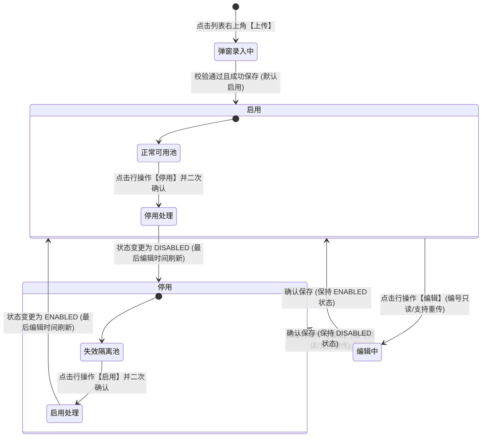

# 合同模板管理业务规则规格

> **文档定位**：配置管理 / 合同模板管理模块状态机模型、PDF AcroForm 表单域（文本域/签名域）自动解析机制、域名称必填校验、模板编号全局唯一性防重、合同模板重新上传刷新、启用/停用生命周期与存量业务隔离策略以及 Acrobat 工具下载跳转的**唯一定义来源**。主 PRD 与字段清单只引用本文件规则名称与编号，不重复定义规则本体。
>
> **模块类型**：配置主档 / 电子合同底本引擎（模板维护、表单域自动解析、业务动态映射装配及生命周期管控）
>
> **参考文档**：[《合同模板管理主PRD》](./合同模板管理主PRD.md)、[《合同模板管理字段清单》](./合同模板管理字段清单.md)、[《00-功能与数据权限清单》](../../../01-项目背景/d-功能:权限清单/功能与数据权限清单.csv)
>
> **版本**：V1.5 | **更新时间**：2026-09-22 | **责任人**：森云科技（Senyun Technology）

---

## 一、单据与能力定位

| 项目 | 内容 |
| :--- | :--- |
| **模块层级** | **【配置管理层 - 合同模板管理】**（全系统电子合同、监管协议与仓储质押单据法律底本基石） |
| **核心职责** | 统一管理系统抵质押、动产监管、仓储仓单、融资授信与销售业务涉及的 PDF 电子合同底本；自动化解析 PDF 表单文本域与签名域，配置业务动态填充映射与签署主体定位；控制合同模板的启用与停用生命周期。 |
| **数据来源** | **本地制作与外部工具导入**：业务经办人员或法务人员在本地利用 Adobe Acrobat 等专业 PDF 工具制作带 AcroForm 表单域（文本域与签名域）的 PDF 模板文件，在系统弹窗中上传并录入基础识别属性。 |
| **上游依赖** | **外部 PDF 生成工具**：点击右上角【合同模板生成工具下载】快捷跳转 Adobe 官方 Acrobat 下载专区，在本地完成表单域设计与命名。 |
| **下游影响** | 1. **业务流程管理**（[16 作业环节](../16-业务流程管理-作业环节（设置模板）)、[17 作业流程](../17-业务流程管理-作业流程（引用模板）)）：在作业环节节点中绑定签约模板； 2. **抵质押流程发起审批**（[18 抵质押流程发起审批](../18-业务流程管理-抵质押流程发起审批)）：基于模板文本域自动填充借款人、在押货品、评估价值等数据生成真实合同； 3. **电子签章平台对接**：基于模板签名域位置与签署角色，驱动资金方、监管仓与借款企业多方顺序或并行电子签章。 |
| **配置台账边界** | **【唯一生效引用池】**：仅处于“启用”状态的合同模板允许被下游业务流程及新建单据引用；处于“停用”状态的模板在下游下拉框中严格过滤隐藏；**存量已签署或审批中的合同单据严格隔离，效力不受模板停用影响**。 |

---

## 二、状态机与流转定义

### 2.1 状态定义

| 状态名称 | 状态编码 (`status`) | 业务含义 | 是否终态 | 列表操作能力 | 下游业务引用效力说明 |
| :--- | :--- | :--- | :---: | :--- | :--- |
| **启用** | `ENABLED` | 合同模板处于正常可用生效状态 | 否 | 【预览】、【编辑】、【停用】 | **生效状态**。允许在下游业务流程（如抵质押申请、仓单生成、融资签约、作业流程配置）中被检索与选择。新建上传保存成功后**默认初始状态为启用**。 |
| **停用** | `DISABLED` | 合同模板处于停用失效隔离状态 | 否 | 【预览】、【编辑】、【启用】 | **失效管控状态**。**严禁**在任何新建业务流程或新订单中被检索与选择；**已引用该模板的历史存量合同不受影响**。 |

### 2.2 状态流转图

---

## 三、核心业务规则

### 【模板编号全局唯一且编辑只读规则】(R01)
1. **全局唯一校验**：
   - 模板编号在同一租户（`tenant_id`）内具备唯一性标识效力，长度 1~50 字符，支持字母、数字、短横线 `-`、下划线 `_`；
   - 用户在【合同模板上传】弹窗录入模板编号后，点击【确认】时，系统在同一事务中强校验其唯一性。若已存在相同模板编号，阻断保存并提示：「模板编号已存在，请重新输入！」。
2. **编辑状态不可变（只读置灰）**：
   - 合同模板创建落库后，模板编号作为与下游业务系统、电子签章平台协议绑定的主标识；
   - 在【合同模板编辑】弹窗中，**模板编号输入框必须置灰禁用（Disabled），禁止任何形式的手工修改**，从根本上防止业务关联断裂。

### 【PDF 格式限制与文件有效性强校验规则】(R02)
1. **格式与大小限制**：
   - 上传文件仅允许标准 PDF 格式（MIME-Type: `application/pdf`，文件扩展名 `.pdf`）；若用户尝试上传 `.doc`、`.docx`、`.jpg` 等其他格式文件，前端直接拦截并提示：「注:文件仅支持pdf上传」；
   - 单个 PDF 文件大小限制为 $\le 20\text{MB}$，页数建议不超过 100 页。
2. **文件完整性与安全解析**：
   - 文件上传至服务端后，系统通过 PDF 引擎检查文件是否损坏、是否被强加密或设置了防解析密码；若文件无法解析，弹出错误提示：「PDF文件解析失败或受密码保护，请上传未加密的有效PDF文件」。

### 【PDF 表单域自动解析与键值提取规则】(R03)
1. **AcroForm 域自动化提取**：
   - PDF 文件成功上传后，系统后端自动遍历其 AcroForm 对象，提取全部表单域控件：
     - **文本域（Text Field / Tx）**：自动提取文本框控件的名称（Name），作为 `文本域键值`；
     - **签名域（Signature Field / Sig）**：自动提取签名控件的名称（Name），作为 `签名域键值`。
2. **无表单域的友好展示**：
   - 若上传的 PDF 中**未设置文本域**，文本域配置区块不展示键值输入行，居中展示静态文案：`该模板未设置文本域`；
   - 若上传的 PDF 中**未设置签名域**，签名域配置区块不展示键值输入行，居中展示静态文案：`该模板未设置签名域`。
3. **键值只读防篡改**：
   - 提取出的【文本域键值】与【签名域键值】代表 PDF 底层物理排版坐标与代码映射点，在上传与编辑弹窗中**一律置灰只读展示**，用户不可编辑。

### 【文本域名称与签名域名称必填映射规则】(R04)
1. **域名称必填校验**：
   - 对于所有成功解析出的文本域与签名域，每一项均对应一个【文本域名称】或【签名域名称】输入框；
   - **该项属于必填项**：若用户未填写任何一个域名称直接点击弹窗【确认】按钮，前端触发强校验高亮，对应输入框边框变红并提示报错（红字提示：「请输入文本域名称」）；
   - 服务端同步进行二次非空强校验，存在空名称时拒绝落库。
2. **业务语义规范**：
   - **文本域名称**：录入用于业务表单动态映射的字段说明（例如：`借款人名称`、`融资金额`、`质押物清单`、`监管仓位号` 等）；
   - **签名域名称**：录入用于签署流程中指定签章主体的角色或位置（例如：`银行盖章`、`监管仓盖章`、`借款企业公章`、`法人代表签字` 等）。

### 【合同模板重新上传与表单域刷新重置规则】(R05)
1. **编辑时重传支持**：
   - 在【合同模板编辑】弹窗中，支持点击【点击上传】重新选择并上传新的 PDF 文件。
2. **表单域差异对比与刷新机制**：
   - 重新上传新 PDF 文件后，系统立即重新执行解析提取；
   - 若原 PDF 中同名键值在新 PDF 中依然存在，**自动继承并保留已填写的域名称**；
   - 若新 PDF 包含新增键值，新增项初始化为空，强制用户录入域名称；
   - 若原 PDF 中的某些键值在新 PDF 中已删除，对应项自动作废移除；
   - 若新 PDF 完全无表单域，自动恢复为“该模板未设置文本域 / 该模板未设置签名域”的空态文案。

### 【启用停用二次确认与存量业务隔离规则】(R06)
1. **默认初始状态**：
   - 首次上传并成功保存的合同模板，**系统默认将其初始状态设为“启用” (`ENABLED`)**。
2. **二次确认机制**：
   - **停用操作**：状态为“启用”时，点击行操作【停用】，弹出二次确认模态弹窗：
     > **确认停用**  
     > 是否确认停用该合同模板？停用后该模板将无法在新建业务流程中被引用。  
     > 【取消】 【确认】
   - **启用操作**：状态为“停用”时，点击行操作【启用】，弹出二次确认模态弹窗：
     > **确认启用**  
     > 是否确认启用该合同模板？  
     > 【取消】 【确认】
   - 点击【确认】后，在数据库中更新 `status` 并将 `updated_at` 刷新为当前系统时间戳，页面弹出操作成功提示（Toast）。
3. **存量业务完全隔离与保护**：
   - **新建业务阻断**：处于 `停用` 状态的模板，下游系统（抵质押申请、仓单生成、作业环节配置等）在下拉选择合同模板时**自动过滤不展示**，严禁新建业务引用停用模板；
   - **存量单据不受影响**：已引用该模板且处于执行中、审批中、已签署履约中的历史合同单据与流程实例，**严格保持既有合同数据与法律效力不变**，不因模板停用而报错或中断。

### 【合同模板多类型枚举与分类管理规则】(R07)
1. **固定枚举池**：
   - 系统支持三大合同类型：
     - `仓库合同`（`WAREHOUSE`）：用于仓储监管协议、仓单质押协议、存货入库合同等；
     - `融资合同`（`FINANCING`）：用于授信协议、最高额动产质押借款合同、资金监管协议等；
     - `销售合同`（`SALES`）：用于货权转让合同、购销合同等。
2. **强一致性维护**：
   - 新增与编辑时，合同类型均为必填下拉单选，不可为空；
   - 列表页与筛选区保持完全相同的枚举词表；若历史老数据类型为空，列表表格中统一呈现 `--` 占位符。

### 【并发修改乐观锁与防重防抖规则】(R08)
1. **乐观锁版本控制**：
   - 模板主表引入 `version` 乐观锁字段；编辑保存或变更启停用状态时带入版本号，若发生版本冲突阻断并提示：「数据已被他人修改，请刷新列表后重试！」。
2. **防重防抖保护**：
   - 弹窗提交【确认】按钮触发后进入 Loading 状态，禁用重复点击；
   - 接口层面部署 Token 幂等机制，防止弱网环境下由于网络重试产生脏数据。

### 【合同模板生成工具跳转下载规则】(R09)
1. **外部工具跳转机制**：
   - 列表页右上角提供【合同模板生成工具下载】快捷入口；
   - 点击该按钮后，前端在**浏览器新标签页（`target="_blank"`）**中直接跳转至 Adobe 官方 Acrobat PDF 制作工具下载专区（`https://www.adobe.com/acrobat.html` 或森云指定的官方镜像/安装指南链接）；
2. **规范化引导**：
   - 供业务经办人、法务或技术人员下载安装专业 PDF 编辑软件，用于在标准 PDF 文档中预埋“文本域（Text Field）”和“数字签名域（Digital Signature Field）”，从源头保证上传解析的准确率。

### 【角色权限与租户数据隔离规则】(R10)
1. **多租户数据强隔离**：
   - 合同模板严格依据当前登录用户的 `tenant_id` 进行逻辑隔离，不同企业、银行与仓库之间互不相通；
2. **RBAC 权限矩阵**：
   - **系统管理员 / 配置管理员**：具备工具跳转、模板上传、编辑、启停用、预览及全量检索权限；
   - **法务 / 风控人员**：具备列表查看、筛选与预览权限；
   - **普通业务人员（业务经办/仓管）**：本页面仅只读或无本页面菜单权限，仅在下游业务单据中拥有对应模板的选择与签署权限。

---

## 四、动作能力与流转控制矩阵

| 触发动作 | 操作入口 | 适用角色 | 前置业务校验条件 | 结果状态 | 联动后置影响 | 失败阻断提示 |
| :--- | :--- | :--- | :--- | :--- | :--- | :--- |
| **上传合同模板** | 列表右上角【上传】按钮 | 系统管理员 / 配置维护员 | ① 模板编号租户内全局唯一； ② 模板文件仅限标准 `.pdf` 格式且 $\le 20\text{MB}$； ③ 解析出的所有文本域与签名域必须完整录入名称（遵循 R04）。 | 启用 (`ENABLED`) | ① 向 `sys_contract_template` 写入主档并向 `sys_contract_template_field` 写入表单域清单； ② 状态默认为启用，下游作业流程新建立即允许引用； ③ 列表第 1 行渲染新增项。 | 「提交失败：模板编号已存在，请重新输入！」 「请输入文本域名称」 「注:文件仅支持pdf上传」 |
| **编辑合同模板** | 列表操作列【编辑】按钮 | 系统管理员 / 配置维护员 | ① 模板编号置灰禁用禁止修改（遵循 R01）； ② 合同名称与类型必填； ③ 若重新上传文件，强校验新表单域完整性（遵循 R05）。 | 维持原有状态 (`ENABLED` 或 `DISABLED`) | ① 更新模板主信息与表单域映射； ② 刷新最后编辑时间为当前时间戳； ③ 存量执行中单据不受影响。 | 「保存失败：数据已被他人修改，请刷新重试」 「请输入文本域名称」 |
| **在线预览查看** | 列表操作列【预览】按钮 | 全体具备查看权限人员 | 模板文件有效存储于私有 OSS | 状态不发生变迁 | 弹出模态居中 PDF 查看器，提供缩放与翻页，表单域只读冻结 | 「预览失败：PDF 文件损坏或不存在」 |
| **停用模板** | 列表操作列【停用】按钮 | 系统管理员 / 配置维护员 | 模板当前处于启用状态 (`ENABLED`)；二次确认弹窗核验通过 | 停用 (`DISABLED`) | ① 状态更新为停用，最后编辑时间刷新； ② 行操作按钮变为【启用】； ③ 下游新建流程立即过滤隐藏该模板； ④ 存量在办/已签署单据继续有效。 | 二次确认点击【取消】则不发生状态流转 |
| **启用模板** | 列表操作列【启用】按钮 | 系统管理员 / 配置维护员 | 模板当前处于停用状态 (`DISABLED`)；二次确认弹窗核验通过 | 启用 (`ENABLED`) | ① 状态更新为启用，最后编辑时间刷新； ② 行操作按钮变为【停用】； ③ 下游新建流程恢复该模板的可选状态。 | 二次确认点击【取消】则不发生状态流转 |
| **下载生成工具** | 列表右上角【合同模板生成工具下载】 | 全体人员 | 无前置校验条件 | 状态不发生变迁 | 浏览器新标签页跳转至 Adobe 官方 Acrobat 下载指引页面 | 浏览器拦截弹出窗口时提示允许弹窗 |

---

## 五、异常流与边界防错

1. **纯静态 PDF 上传兼容**：
   - 业务中部分协议为纯阅读文本（不含任何动态填充字段或电子签章位置）；
   - 规则允许上传无表单域的 PDF，此时文本域区块展示“该模板未设置文本域”，签名域区块展示“该模板未设置签名域”，允许正常确认保存。
2. **多用户并发编辑防覆盖**：
   - 基于数据库 `version` 乐观锁机制，若两位管理员同时打开编辑弹窗，后提交者提交时提示：「数据已被他人修改，请刷新列表后重试！」，防止配置被覆盖覆盖。
3. **超长字符与 XSS 脚本过滤**：
   - 合同名称限制 100 字符，模板编号限制 50 字符，域名称限制 50 字符；
   - 文本录入前后自动 Trim 去空格，并在入库前执行 HTML/JS 转义过滤，严禁脚本注入。

---

## 修订记录

| 日期 | 版本 | 变更摘要 | 变更人 |
| :--- | :---: | :--- | :--- |
| 2026-08-03 | V1.0 | 系统采集页面原始单据状态整理 | 整理工作组 |
| 2026-09-22 | V1.5 | 严格按照仓储基准版规范全面升级：对齐 R01~R10 规则编号体系；补齐单据与能力定位 6 维度表；标准化状态机与动作能力 7 列控制矩阵；明确存量业务隔离与初始默认启用机制。 | 森云科技（Senyun Technology） |
