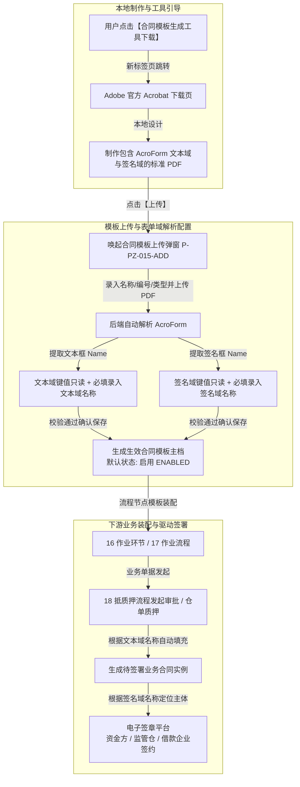

# 合同模板管理主PRD

> **模块定位**：配置管理第 15 节点（合同模板管理 / `P-PZ-015`），作为 SYZC 供应链金融存货监管系统全链路电子合同、监管协议与质押法律单据的底层底本引擎，支持标准 PDF 合同模板的维护、Acrobat 生成工具跳转引导、AcroForm 文本域与签名域自动化解析、业务动态映射配置、PDF 在线查看器弹窗预览以及启用/停用全生命周期管控。  
> **版本**：V1.5 | **更新时间**：2026-09-22 | **责任人**：森云科技（Senyun Technology）  
> **编写依据**：[合同模板管理字段清单.md](./合同模板管理字段清单.md) 是本模块所有字段定义、枚举与页面展示的唯一基准；[合同模板管理业务规则规格.md](./合同模板管理业务规则规格.md) 是本模块状态机、校验算法、表单域提取、编号唯一性、启停用二次确认与存量业务隔离规则的唯一定义来源。

---

## 1. 业务背景与业务痛点

### 1.1 业务背景
在供应链金融大宗商品存货监管与动产质押业务中，涉及商业银行（资金方）、保理公司、仓储监管企业（监管方）、核心企业及借款企业（出质人）等多方主体之间繁复的法律文本流转（如《动产质押监管协议》、《仓单质押借款合同》、《最高额抵质押协议》、《现货仓储入库确认书》等）。传统纸质盖章效率低下且难以溯源防伪。

合同模板管理模块建立了一套标准化的“PDF 底本导入 + AcroForm 表单域自动提取 + 业务数据动态映射 + 签章位置精确绑定”的数字化合同基础设施。通过将合同模板与作业环节、抵质押业务流程深度解耦与灵活装配，实现业务单据生成时自动填充在押品数据，并驱动多方电子签章平台完成自动化签署，全流程闭环存证。

### 1.2 核心业务痛点
1. **合同底本排版与数据脱节**：传统电子签约常采用固定表单，无法满足大宗商品监管协议复杂的法律条款排版、多栏式货品清单与法律附件规范；
2. **表单域制作门槛高与解析断裂**：业务人员难以直接编写代码定位签名坐标，缺乏标准化工具引导与 PDF 原生表单域自动化提取机制；
3. **签署主体定位混乱**：多方签约（银行、仓库、借款人）涉及多个盖章位置，缺乏可视化配置角色映射，容易引发错签、漏签法律风险；
4. **版本迭代引发存量合同纠纷**：合同模板更新或停用时，若直接修改或物理删除，极易破坏历史已签署单据的证据效力与司法存证完整性；
5. **多租户数据泄露隐患**：不同资金方、仓库企业使用的专业合同文本属于商业机密，必须建立严格的多租户强隔离屏障。

---

## 2. 功能范围

| 包含功能范围 (In Scope) | 不包含功能范围 (Out of Scope) |
| :--- | :--- |
| - **合同模板列表台账展示**：按上传时间倒序排列，支持分页与总条数统计； - **多维度组合筛选**：合同名称模糊检索、模板编号模糊检索、合同状态精确筛选（全部/启用/停用）、合同类型精确筛选（全部/仓库合同/融资合同/销售合同）； - **合同模板生成工具跳转下载**：右上角快捷入口，新标签页跳转 Adobe 官方 Acrobat PDF 制作工具下载专区，引导本地制作表单域； - **新增合同模板上传（弹窗）**：限定 `.pdf` 格式、录入编号与名称、选择类型、自动解析表单域、必填补充文本域与签名域名称，**保存后初始状态默认启用**； - **编辑合同模板（弹窗）**：模板编号只读禁用禁止修改、支持修改合同名称与类型、支持重新上传 PDF 并自动比对继承同名表单域配置； - **PDF 在线预览查看器（弹窗）**：当前页面居中模态弹窗渲染原样 PDF 模板，提供缩放、翻页与只读保护； - **模板启用/停用操作**：模态弹窗二次确认，**停用后严格阻断新建业务引用，存量在办/已签署合同单据效力不受影响**。 | - **PDF 文档内容的在线富文本排版编辑**：由本地 Adobe Acrobat 等专业软件完成； - **具体业务单据的数据动态装配与流转**：由业务流程管理与审批中心完成； - **第三方 CA 证书发放与时间戳服务**：由对接的电子签章平台底层完成； - **合同模板物理硬删除**：系统不支持物理删除，统一通过停用隔离实现生命周期管理。 |

---

## 3. 模块定位与系统链路

---

### 3.1 跨模块数据协同与履约生效机制

依据全系统数据互通规范，合同模板配置完成后，向下游业务单据与签署平台分发数据，驱动全业务链条无缝闭环：

| 协同板块 | 接收时机与触发入口 | 传递数据项与业务效力 |
| :--- | :--- | :--- |
| **【16-作业环节管理】** | 配置作业环节时绑定合同模板 | 仅展示状态为【启用】的合同模板；绑定后作为该作业环节必须签署的法定文本模板。 |
| **【17-作业流程管理】** | 装配流程模板时引用作业环节 | 校验引用的作业环节绑定的合同模板是否有效；若模板已被停用，提示更新流程模板。 |
| **【18-抵质押审批流程】** | 发起抵质押申请单并生成合同时 | 系统调取模板 PDF，将申请单中的货主、在押货品、评估货值、监管仓库等要素按【文本域名称】映射动态写入 PDF 对应文本域中。 |
| **【第三方电子签章平台】** | 合同各方执行在线电子签章时 | 系统将【签名域名称】（如银行、仓库、出质人）与签约主体账号精准绑定，直接在 PDF 签名域坐标生成数字签名与时间戳防伪凭证。 |

---

## 4. 业务场景与用户故事

| 场景编号与名称 | 触发角色 | 核心交互与风控约束 | 业务价值 |
| :--- | :--- | :--- | :--- |
| **场景 1【新增合同模板上传与表单域解析】(S01)** | 系统管理员 / 法务配置员 | 准备好带表单域的 PDF，点击【上传】，录入合同名称、模板编号（全局唯一校验）、选择合同类型；点击上传 PDF 模板；后台自动解析 AcroForm，提取文本域与签名域只读键值；逐项填报域映射名称（必填强校验）；点击确认保存，**系统默认将其初始状态设为启用**。 | 零代码快速接入标准合同底本，自动化打通文本填充与签章定位点。 |
| **场景 2【编辑合同模板与重新上传 PDF】(S02)** | 系统管理员 / 法务配置员 | 模板信息调整或法律条款修订时，点击行操作【编辑】；**模板编号置灰锁定不可修改**；可修改名称与类型；支持重新上传新版 PDF，系统重新解析并自动继承同名域配置，确认后完成更新并刷新最后编辑时间。 | 保证业务标识不漂移的前提下，支持合同底本版本平滑升级。 |
| **场景 3【合同模板在线弹窗预览】(S03)** | 法务 / 风控 / 业务人员 | 经办人或法务人员点击操作列【预览】，弹出【合同模板在线预览】模态弹窗，直接在当前页面查看 PDF 版式排版、条款内容与表单域分布，核验模板是否合规。 | 无需下载本地文件，当前界面直接核验排版版式与法律条款。 |
| **场景 4【合同模板启用与停用管控】(S04)** | 系统管理员 / 配置维护员 | 模板失效或有新版本替代时，点击【停用】并在弹窗中二次确认；停用后下游新建业务自动过滤隐藏该模板；重新恢复使用时点击【启用】并二次确认。**存量已引用或正在签署中的业务合同不受影响**。 | 严格隔离新建业务引用风险，同时绝对保护存量单据法律证据效力。 |
| **场景 5【合同模板生成工具跳转下载】(S05)** | 全体操作人员 | 用户初次制作模板或缺少表单域编辑软件时，点击右上角【合同模板生成工具下载】，浏览器新标签页打开 Adobe 官方 Acrobat 下载指引，指导本地制作表单域。 | 提供标准化外部工具支持，规范模板源头制作标准。 |

---

## 5. 状态机与动作能力矩阵

> 状态机流转详细规则详见 [合同模板管理业务规则规格.md §二 状态机与流转定义](./合同模板管理业务规则规格.md#二状态机与流转定义)。

| 动作名称 | 启用状态 (`ENABLED`) | 停用状态 (`DISABLED`) | 交互与能力说明 |
| :--- | :---: | :---: | :--- |
| **列表浏览与多维检索** | ✅ | ✅ | 列表默认展示全部状态模板 |
| **在线查看器预览** | ✅ | ✅ | 任何状态均允许法务或业务在线弹窗查看原文件 |
| **编辑基础属性** | ✅ | ✅ | 模板编号只读禁用，名称与类型可修改 |
| **重新上传 PDF 模板** | ✅ | ✅ | 支持重传，系统重新解析并继承同名表单域配置 |
| **执行停用操作** | ✅ | ❌ | 点击唤起二次确认弹窗，确认后变更为停用 |
| **执行启用操作** | ❌ | ✅ | 点击唤起二次确认弹窗，确认后变更为启用 |
| **下游新建业务选择** | ✅ | ❌ | 下游选择模板下拉框严格过滤停用模板 |
| **存量在办/已签署合同** | ✅（有效） | ✅（效力不受影响） | 严格保护存量业务法律存证与流程流转不受中断 |

---

## 6. 页面功能与交互说明

### 6.1 列表页功能与布局（`P-PZ-015`）
1. **页面头部**：
   - 页面左上角展示模块主标题：`合同模板管理`；
   - 页面右上角提供操作按钮组：
     - 【合同模板生成工具下载】：点击后新标签页跳转至 Adobe Acrobat 官方下载指引页面（遵循 R09）；
     - 【上传】：金黄色实心按钮，点击唤起【合同模板上传】模态弹窗。
2. **筛选区**：
   - 合同名称：单行文本输入框，支持模糊检索，`placeholder="请输入合同名称"`；
   - 模板编号：单行文本输入框，支持模糊检索，`placeholder="请输入模板编号"`；
   - 合同状态：下拉单选框，选项：`全部`（默认）、`启用`、`停用`；
   - 合同类型：下拉单选框，选项：`全部`（默认）、`仓库合同`、`融资合同`、`销售合同`；
   - 【查询】按钮：金黄色实心按钮，点击按筛选条件重新请求后端并刷新列表数据。
3. **数据表格展示区**：
   - 8 列标准展示：序号（居中）、模板编号（居左）、合同名称（居左）、合同类型（居中，未设显示 `--`）、合同状态（居中，启用/停用）、上传时间（居中）、最后编辑时间（居中）、操作（居中）；
   - 行操作列动态互斥：
     - 停用状态行：展示【预览】、【编辑】、【启用】；
     - 启用状态行：展示【预览】、【编辑】、【停用】。
4. **分页控制区**：
   - 位于表格底部，展示总条数（如 `共 12 条`）、页码切换按钮、前往页码跳转输入框。

### 6.2 合同模板上传弹窗（`P-PZ-015-ADD`）
1. **弹窗属性**：模态弹窗，标题 `合同模板上传`，右上角提供 `×` 关闭按钮；
2. **表单项与布局**：
   - `* 合同名称：` 单行文本输入框，必填，`placeholder="请输入合同名称"`；
   - `* 模板编号：` 单行文本输入框，必填，`placeholder="请输入模板编号"`，强校验租户内唯一性（遵循 R01）；
   - `* 合同类型：` 下拉单选框，必填，选项：`仓库合同` / `融资合同` / `销售合同`，`placeholder="请选择"`（遵循 R07）；
   - `* 模板文件：` 【点击上传】按钮，下方带提示文案：`注:文件仅支持pdf上传`；上传成功后展示文件名与绿色成功勾选图标（遵循 R02）；
   - **文本域配置区块**：
     - 若未解析到文本域，展示静态居中文案：`该模板未设置文本域`；
     - 若解析到文本域，逐行展示：只读置灰的【文本域键值】 + 必填输入的【文本域名称】；
   - **签名域配置区块**：
     - 若解析到签名域，逐行展示：只读置灰的【签名域键值】 + 必填输入的【签名域名称】；未填报点击确认时，边框红框高亮并提示报错（红字文案：「请输入文本域名称」）；
3. **底部操作**：【取消】（关闭弹窗并放弃填写）、【确认】（执行校验并提交落库，**保存后初始状态默认启用**）。

### 6.3 合同模板编辑弹窗（`P-PZ-015-EDIT`）
1. **弹窗属性**：模态弹窗，标题 `合同模板编辑`，右上角带 `×` 关闭；
2. **表单差异化控制**：
   - `* 模板编号：` **输入框置灰禁用（只读）**，展示已有编号，禁止编辑修改（遵循 R01）；
   - `* 合同名称：` 可正常编辑修改；
   - `* 合同类型：` 下拉可正常重新选择；
   - `* 模板文件：` 展示当前绑定的 PDF 文件名与绿色校验图标，支持重新【点击上传】替换文件；替换后重新提取表单域并保留同名配置（遵循 R05）；
   - 文本域配置与签名域配置：根据解析结果动态渲染，强制必填校验；
3. **底部操作**：【取消】、【确认】（保存更新，状态保持原有启用或停用不变，最后编辑时间自动刷新）。

### 6.4 在线预览查看器弹窗（`P-PZ-015-PREVIEW`）
- 点击行操作【预览】唤起，模态居中展示 PDF 阅读器；
- 提供缩放比例调节、翻页控制与关闭按钮；内容只读，表单域控件处于只读冻结状态。

### 6.5 二次确认弹窗
- 点击【停用】唤起：提示“是否确认停用该合同模板？停用后该模板将无法在新建业务流程中被引用。”；
- 点击【启用】唤起：提示“是否确认启用该合同模板？”。

---

## 7. 核心业务规则索引与追溯表

| 规则编码 | 规则业务名称 | 核心业务口径与约束 | 唯一定义来源 |
| :--- | :--- | :--- | :--- |
| **R01** | 【模板编号全局唯一且编辑只读规则】 | 同一租户下模板编号唯一；编辑时置灰禁用不可修改 | [业务规则规格 R01](./合同模板管理业务规则规格.md#模板编号全局唯一且编辑只读规则r01) |
| **R02** | 【PDF 格式限制与文件有效性强校验规则】 | 仅允许标准 `.pdf` 格式文件，单文件 $\le 20\text{MB}$，防损坏加密文件 | [业务规则规格 R02](./合同模板管理业务规则规格.md#pdf格式限制与文件有效性强校验规则r02) |
| **R03** | 【PDF 表单域自动解析与键值提取规则】 | 自动提取 AcroForm 文本域与签名域 Name 为只读键值，无域时显示空态文案 | [业务规则规格 R03](./合同模板管理业务规则规格.md#pdf表单域自动解析与键值提取规则r03) |
| **R04** | 【文本域名称与签名域名称必填映射规则】 | 所有提取出的表单域其业务名称均为必填项，未填报强拦截并红框提示 | [业务规则规格 R04](./合同模板管理业务规则规格.md#文本域名称与签名域名称必填映射规则r04) |
| **R05** | 【合同模板重新上传与表单域刷新重置规则】 | 编辑支持重传 PDF，重新解析并自动继承相同键值的名称配置 | [业务规则规格 R05](./合同模板管理业务规则规格.md#合同模板重新上传与表单域刷新重置规则r05) |
| **R06** | 【启用停用二次确认与存量业务隔离规则】 | 新建默认启用；启停用须二次确认；停用仅禁止新建引用，存量单据不受影响 | [业务规则规格 R06](./合同模板管理业务规则规格.md#启用停用二次确认与存量业务隔离规则r06) |
| **R07** | 【合同模板多类型枚举与分类管理规则】 | 固定枚举：仓库合同、融资合同、销售合同，支持全端统一筛选 | [业务规则规格 R07](./合同模板管理业务规则规格.md#合同模板多类型枚举与分类管理规则r07) |
| **R08** | 【并发修改乐观锁与防重防抖规则】 | 基于 version 乐观锁与接口防重防抖机制，杜绝脏数据覆盖 | [业务规则规格 R08](./合同模板管理业务规则规格.md#并发修改乐观锁与防重防抖规则r08) |
| **R09** | 【合同模板生成工具跳转下载规则】 | 点击右上角按钮，浏览器新标签页跳转至 Adobe 官方 Acrobat 下载指引 | [业务规则规格 R09](./合同模板管理业务规则规格.md#合同模板生成工具跳转下载规则r09) |
| **R10** | 【角色权限与租户数据隔离规则】 | 基于租户强隔离；管理员具备全量配置权限，法务风控只读预览 | [业务规则规格 R10](./合同模板管理业务规则规格.md#角色权限与租户数据隔离规则r10) |

---

## 8. 权限与风控约束

- **多租户数据强隔离**：以当前登录账号所在的 `tenant_id` 为边界执行过滤，严禁跨租户越权访问合同模板（遵循 R10）；
- **操作权限隔离**：系统管理员与配置维护员具备上传、编辑、启停用权限；普通业务与风控人员仅具备查询与预览权限；
- **法律存证防篡改**：合同一旦进入业务流签署，已签署完成的合同生成不可变 PDF 存证快照，模板后续在配置中心哪怕编辑重传或停用，也绝不破坏既有已生成法律单据的证据效力。

---

## 9. 异常边界处理

- **表单域存在但名称未填拦截**：提交时只要有一个域名称为空，阻止弹窗关闭并精准定位未填项红框提示；
- **重复模板编号拦截**：输入已存在的模板编号，提交时浮窗提示「模板编号已存在，请重新输入！」；
- **非 PDF 格式文件上传拦截**：文件选择时原生限制 `.pdf`，若绕过限制则前端直接弹出错误警告并清空上传文件。

---

## 10. 验收用例与测试标准

| 验收用例编码 | 验收项业务名称 | 前置条件与测试步骤 | 预期结果与阻断交互 |
| :--- | :--- | :--- | :--- |
| **TC-01** | 【模板工具下载跳转测试】 | 停留在合同模板管理列表页，点击右上角【合同模板生成工具下载】 | 浏览器新建标签页打开 Adobe 官方 Acrobat 下载页面，原页面不受影响 |
| **TC-02** | 【模板编号重复上传拦截测试】 | 唤起上传弹窗，输入列表中已存在的模板编号，补全其他项点击【确认】 | 保存失败，提示「模板编号已存在，请重新输入！」，弹窗不关闭 |
| **TC-03** | 【PDF 表单域解析与必填拦截测试】 | 上传包含表单域的 PDF，故意留空某一项签名域名称直接点击【确认】 | 保存被阻断，未填写的输入框边框变红并提示「请输入文本域名称」 |
| **TC-04** | 【新上传模板默认状态测试】 | 录入完整合规的合同模板信息及域名称，点击【确认】成功保存 | 弹窗关闭，列表刷新并在第一行显示新增模板，合同状态为「启用」 |
| **TC-05** | 【编辑弹窗编号只读测试】 | 对列表中任一模板点击【编辑】操作 | 弹出编辑弹窗，模板编号输入框置灰禁用，无法聚焦与修改文字 |
| **TC-06** | 【在线查看器预览测试】 | 点击列表中任一模板的【预览】操作 | 页面弹出 PDF 预览查看器，正确展示合同 PDF 版式内容，表单域处于只读状态 |
| **TC-07** | 【停用二次确认与新建隔离测试】 | 对启用模板点击【停用】，弹窗中二次确认；随后在作业流程新建中检索该模板 | 模板状态成功变更为「停用」；作业环节/流程新建下拉框中检索不到该模板 |
| **TC-08** | 【存量业务隔离保护测试】 | 某合同单据已引用模板 A，管理员将模板 A 设为停用 | 存量合同单据签署、查看与归档不受任何影响，单据内合同文本正常加载 |

---

## 修订记录

| 日期 | 版本 | 变更摘要 | 变更人 |
| :--- | :---: | :--- | :--- |
| 2026-08-03 | V1.0 | 系统采集页面原始功能归纳（P-PZ-015） | 系统整理工作组 |
| 2026-09-22 | V1.5 | 严格对齐仓储管理基准版 PRD 规范（10 章体系）：统一 R01~R10 规则编号体系；标准化场景 S01~S05 与测试用例 TC-01~TC-08；补齐跨模块协同与存量业务隔离保护规范。 | 森云科技（Senyun Technology） |
