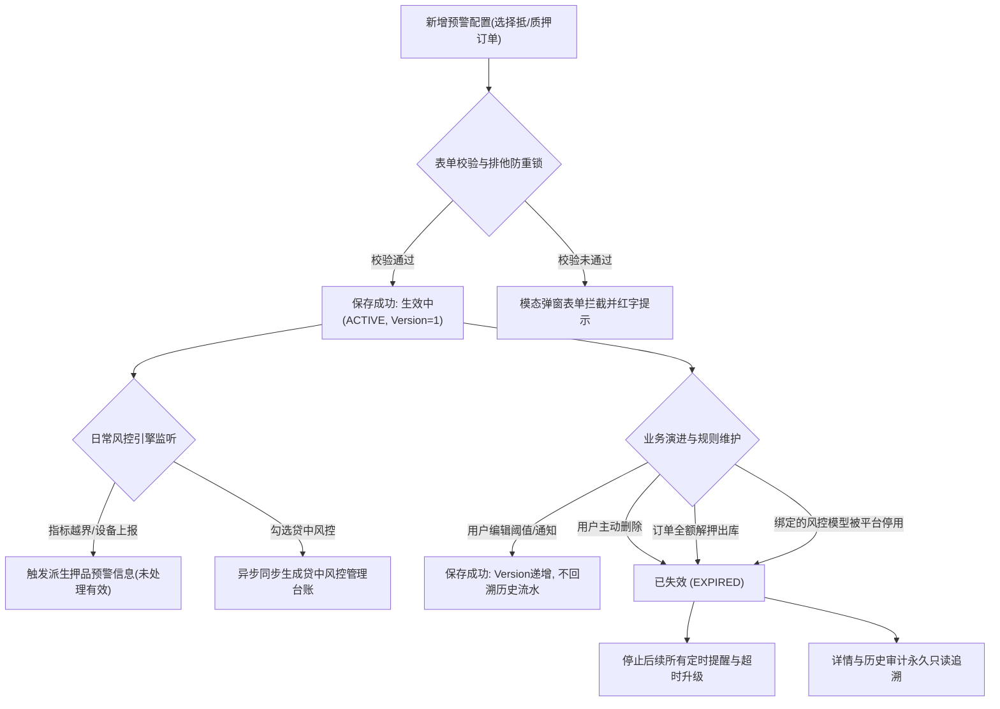

# 订单预警配置业务规则规格

> **版本**：V2.0 | 2026-09-16  
> **编写依据**：[订单预警配置主PRD](./订单预警配置主PRD.md)、[订单预警配置字段清单](./订单预警配置字段清单.md)、[押品预警信息业务规则规格](../../05-风控/06-风险信息-押品预警信息/押品预警信息业务规则规格.md)、[贷中风控管理业务规则规格](../../05-风控/08-风险信息-贷中风控管理/贷中风控管理业务规则规格.md)  
> **真源声明**：本规格书是订单预警配置生命周期、表单动态渲染、11类预警阈值校验、通知与升级策略、贷中风控管理同步、多源触发与自动失效的**唯一业务逻辑与技术规则真源（SSOT）**。所有涉及交互控件的表述已完成全面汉化规范。  
> **当前业务开关**：监管订单当前关闭。新增、编辑、删除和保存均只允许当前有效的抵/质押订单；历史监管规则仅允许按权限查询、查看详情和审计，不再触发新预警，历史兼容数据禁止物理删除。

---

## 1. 业务对象与能力边界

### 1.1 业务对象定义
订单预警配置是面向抵押或质押订单建立的**风险监听规则总包**。用户选择一笔在押的有效订单，为该订单配置特定的预警类型（涵盖价格下跌、质押率异常、物联网设备、门锁门禁、巡检异常、解押超时及贷中风控模型等 11 大类）、动态预警阈值、接收人员通知渠道及超时升级策略。

### 1.2 核心能力边界
1. **一单一配与大类聚合**：1 笔订单支持配置 1 条或多条规则包，但同一订单下同一预警子类型在租户内仅能存在 1 条生效中规则；
2. **编辑锁定原则**：编辑规则时，关联订单与预警大类/子类型锁定禁止修改，仅允许调整动态阈值参数、通知人员与升级策略；
3. **快照不回写原则**：规则变更保存后版本递增，不回溯改写存量未结案预警流水；
4. **终结失效机制**：订单完成全额解押出库，或关联的风控模型被智风控平台停用时，规则自动流转为 `已失效` (EXPIRED)，并停止后续所有提醒与升级。

---

## 2. 状态机与生命周期流转

### 2.1 规则状态定义

| 状态编码 | 页面展示名称 | 业务含义 | 适用操作与行为边界 |
| :--- | :--- | :--- | :--- |
| `ACTIVE` | **生效中** | 规则配置已保存生效，风控引擎实时监听并计算风险 | 支持【查看详情】、【编辑】、【删除】；支持触发新预警 |
| `EXPIRED` | **已失效** | 订单全额解押出库、关联模型停用或人工删除置为失效 | **禁止编辑**；仅支持【查看详情】、【删除】；停止新预警与升级 |

### 2.2 状态流转时序图（Mermaid）

---

## 3. 核心业务规则规格

### 3.1 权限与新增候选规则 (ORD-P 系列)

#### 【订单预警配置菜单访问与细粒度鉴权规则】(ORD-P01)
* **规则描述**：进入【订单预警配置】菜单必须具备 `R-RULE-ORDER-VIEW` 权限。行级【查看详情】需具备查看权限，【新增预警规则】需具备 `R-RULE-ORDER-ADD` 权限，【编辑】需具备 `R-RULE-ORDER-EDIT` 权限，【删除】需具备 `R-RULE-ORDER-DEL` 权限。
* **判定逻辑**：所有写操作接口服务端执行细粒度校验，无权限统一拦截并返回 `403 Forbidden`。

#### 【订单数据权限行级隔离过滤规则】(ORD-P02)
* **规则描述**：订单候选下拉列表、配置台账列表及规则详情查询，强制按当前登录账号管辖的机构与订单数据权限执行行级隔离。

#### 【权限失效动态屏蔽与服务端鉴权规则】(ORD-P03)
* **规则描述**：账号失去某笔订单数据权限后，该订单立即从新增选择器与列表中隐藏；服务端在新增、编辑、删除提交时强制重新校验，禁止仅凭前端缓存操作。

#### 【抵质押订单准入与监管订单关闭阻断规则】(ORD-P04)
* **规则描述**：当前业务开关关闭监管订单运营。新增订单号选择器只返回业务类型为 `抵押` 或 `质押` 且处于在押存续期的有效订单；若通过 API 提交监管订单，服务端统一拦截并报错：`“监管订单当前已关闭运营，禁止新增或编辑预警配置！”`。

#### 【历史监管配置只读禁止写操作规则】(ORD-P05)
* **规则描述**：存量历史监管订单配置允许在列表中按权限检索查看；操作列仅保留【查看详情】，**绝对隐藏或禁用【编辑】和【删除】按钮**，历史兼容数据禁止物理删除。

#### 【新增订单号候选范围与生命周期校验规则】(ORD-P11)
* **规则描述**：新增时选择订单号，下拉单选框仅返回当前账号有权管辖且状态为“抵/质押中”的订单；若订单已全额解押出库或已结清，系统自动排除。

#### 【订单子类型唯一性与防重复配置规则】(ORD-P12)
* **规则描述**：同一订单在同一预警子类型下，全系统**仅允许存在 1 条生效中 (`ACTIVE`) 规则**。提交时服务端按 `租户ID + 订单ID + 预警子类型 + ACTIVE` 强校验，重复配置直接阻断。

#### 【大类聚合配置与禁止拆单绕过唯一性规则】(ORD-P13)
* **规则描述**：同一笔订单允许在同一个规则包中勾选同一大类下的多个子类型（如物联设备同时选温湿度与烟感），但禁止通过拆分成多条规则包绕过子类型唯一性限制。

#### 【单据唯一标识关联与禁止序号索引规则】(ORD-P14)
* **规则描述**：所有保存、编辑、删除与查询接口必须使用全局唯一的 `rule_id` 与 `order_id`，禁止使用前端列表分页行序号作为请求参数。

---

### 3.2 表单配置与动态参数校验规则 (ORD-F 系列)

#### 【规则名称租户唯一与只读固化规则】(ORD-F01)
* **规则描述**：
  1. **新增页**：单行文本输入框，必填，限制 1~50 个汉字/字符，在同一租户内必须保持唯一，重复时提示：`“规则名称已存在，请重新输入”`；
  2. **编辑页**：规则名称锁定为纯文本只读展示，禁止编辑修改。

#### 【订单关联基础信息自动带出不可篡改规则】(ORD-F02)
* **规则描述**：选择订单号后，系统自动联动带出订单类型、货主名称、货主手机号及货物信息，前端以只读形式展现，禁止用户手动篡改。

#### 【预警类型单大类选择与动态参数必填校验规则】(ORD-F03)
* **规则描述**：预警大类为单选；选择某一预警大类后，页面动态渲染该大类对应的专属参数卡片；只有该大类下的动态参数参与表单条件必填校验。

#### 【编辑页预警类型锁定禁止变更规则】(ORD-F04)
* **规则描述**：规则创建保存后，其关联的订单号与预警类型**永久锁定禁止修改**；若业务需求发生根本改变，用户必须先删除旧规则，再重新创建新规则。

#### 【动态字段切换前端清理与版本变更规则】(ORD-F05)
* **规则描述**：在新增表单中若切换预警大类，前端自动清理上一大类的临时输入数据，防止无效脏数据提交至后端。

#### 【历史监管配置详情只读与保存阻断规则】(ORD-F06)
* **规则描述**：打开历史监管订单配置时，页面呈现全表单只读态，隐藏底部【保存】与【提交】按钮，服务端接收到历史监管单保存请求时强校验阻断。

---

### 3.3 11 类预警阈值与动态配置矩阵

#### 1. 解抵/质押超时配置
* **配置参数**：超时阈值天数（非负整数，天）；
* **业务规则**：以订单货物各批次/二维码实际质押生效时间起算，超过 `生效时间 + N*24小时` 且仍未完成解押出库时触发。

#### 2. 价格下跌配置
* **配置参数**：跌幅百分比（非负数字，支持 2 位小数，单位：%）；
* **业务规则**：公式为 `跌幅 = (基准货物总价值 - 最新货物估值) / 基准货物总价值 * 100%`，当跌幅计算值严格大于配置阈值时触发告警。

#### 3. 图像识别异常配置
* **配置参数**：复选框多选：行人入侵、车辆入侵、物品形态变化；
* **业务规则**：依赖库区绑定监控摄像头 AI 边缘计算，收到对应事件上报即触发告警。

#### 4. 盘点异常配置
* **配置参数**：开关控件（Switch），开启即启用；
* **业务规则**：盘点业务模块上报盘点实物数量与账面数量不一致时自动触发。

#### 5. 巡检异常配置
* **配置参数**：动态行列表，每行包含：巡检责任人（组织架构下拉单选）+ 独立巡检周期天数（正整数，天）；
* **业务规则**：巡检与盘点完全解耦；每个巡检人按各自独立周期计时，超出各自周期未在巡检模块提交记录时分别独立触发告警。

#### 6. 物联设备配置
* **配置参数**：烟感异常（复选框）、温度/湿度/二氧化碳/氧气（最低值与最高值输入框）；
* **业务规则**：最低值必须严格小于最高值；温度支持负数，其余指标必须 > 0；采集数值越界立即触发告警，采集值恢复到阈值范围内系统自动结案。

#### 7. 智能挂锁异常配置
* **配置参数**：开关控件（Switch），开启即启用；
* **业务规则**：门锁硬件上报拆壳、锁舌被卡、锁杆被剪、非法开箱、拆卡报警、密码错误、关锁异常、电量低于 20% 等事件时触发。

#### 8. 抵/质押率异常双阈值配置 (ORD-F21~F25)
* **【抵质押率平仓补仓双阈值区间互斥规则】(ORD-F21)**：平仓线、补仓线两组阈值必须同时配置，支持 2 位小数；
* **【平仓线高于补仓线与分线命中判定规则】(ORD-F22)**：**平仓线阈值必须严格高于补仓线阈值**；实际质押率高于平仓线时命中平仓线，处于补仓线与平仓线之间时命中补仓线；
* **【双线独立处置方式配置与分线解除规则】(ORD-F23)**：平仓线与补仓线各自独立配置解除方式（复选框多选：补仓、平仓、部分结清）；解除预警时仅展示命中线所配置的解除方式；
* **【抵质押率公式计算与指标缺失阻断规则】(ORD-F24)**：公式为 `抵质押率 = 贷款余额 / 货物当前价值`；三要素任一缺失不触发伪预警；
* **【命中线快照固化与报表追溯保全规则】(ORD-F25)**：触发预警时固化命中的线别、实际质押率、贷款余额与估值快照。

#### 9. 人脸门禁异常配置
* **配置参数**：复选框多选：门未关、密码错误；上报对应异常硬件事件时触发。

#### 10. GPS异常配置
* **配置参数**：复选框多选：进围栏、出围栏、超速、怠速滞留、路线偏离、非法拆除；上报对应车载事件触发。

#### 11. 贷中风控预警配置 (ORD-M01~M05)
* **【贷中风控启用自动同步管理台账规则】(ORD-M01)**：开关开启后，展示“风控模型”下拉单选框（取自智风控平台已上架产品）；保存成功后系统异步向 [贷中风控管理](../../05-风控/08-风险信息-贷中风控管理/贷中风控管理主PRD.md) 自动同步生成或激活一条管理台账；
* **【单订单贷中风控台账唯一幂等维护规则】(ORD-M02)**：单订单唯一定位一条贷中台账，重复保存执行幂等更新；
* **【基础信息快照初始化与编辑增量同步规则】(ORD-M03)**：编辑更新模型产品时仅同步关联模型，不重置贷中风控历史执行统计；
* **【配置失效管理台账自动不可执行规则】(ORD-M04)**：规则停用、失效或删除后，贷中风控管理台账自动计算为“不可执行”并展示告警图标；
* **【配置同步与规则保存同事务一致性规则】(ORD-M05)**：风控配置保存与贷中管理台账同步处于同一事务或保障最终一致性。

---

### 3.4 通知渠道与超时升级规则 (ORD-F31~F34)

#### 【站内信默认推送与多渠道下发规则】(ORD-F31)
* **规则描述**：系统站内信默认开启且不可取消；邮件通知与短信通知为可选复选框。勾选邮件通知后，发件人与抄送人员变为必填；预警对象（接收人）为必填下拉多选框。

#### 【超时升级开关与天数对象强校验规则】(ORD-F32)
* **规则描述**：
  1. 开关控件【升级预警】开启后，展开展示【升级预警天数】与【升级预警对象】；
  2. 升级预警天数：单行文本输入框，必填，限制为正整数（1~365 天）；
  3. 升级预警对象：下拉多选框，必填，指定未解除风险升级抄送的高级风控责任人。

#### 【接收人状态实时校验与停用账号跳过规则】(ORD-F33)
* **规则描述**：系统在实际下发短信或邮件前，实时复核接收人账号状态，若账号已停用或离职，自动跳过并记录发送审计日志。

#### 【通知对象变更不触发普通预警规则】(ORD-F34)
* **规则描述**：编辑修改通知对象或升级天数，仅影响未来新产生或后续流转的消息下发，不回溯重发存量预警通知。

---

### 3.5 触发监听与自动失效规则 (ORD-T / ORD-N 系列)

#### 【多源触发事件分布式防重幂等规则】(ORD-T01)
* **规则描述**：定时轮询任务或外部硬件回调接入时，采用 `租户ID + 订单ID + 规则ID + 事件唯一键` 构建分布式排他防重锁，5 秒内重复接入直接幂等忽略。

#### 【预警信息生成与定时提醒任务规则】(ORD-T02)
* **规则描述**：触发后立即生成一条状态为 `待处置 · 有效` 的押品预警信息，并在风险未解除前，按配置的周期向预警对象发送定时提醒。

#### 【全维度触发数据与配置版本快照固化规则】(ORD-T03)
* **规则描述**：预警生成瞬间，必须固化订单编号、货物批次、触发阈值、命中线、当时配置 Version 等快照，后续规则变更不影响存量快照。

#### 【自动结案与人工解除终止升级任务规则】(ORD-T04)
* **规则描述**：当预警流水完成核销解除变更为 `已结案 · 有效` 时，系统自动注销该预警流水的定时提醒与超时升级定时任务。

#### 【预警流水独立落账禁止短信合并规则】(ORD-T05)
* **规则描述**：预警信息必须逐条独立落账展示；短信下发层面允许按人员进行通道合并，但数据库预警流水绝对禁止合并去重。

#### 【配置变更旧版本不回写与置无效规则】(ORD-N01)
* **规则描述**：用户编辑规则保存后版本递增；存量未处理预警保持原版本快照；若某策略被明确关闭，系统异步将该策略下遗留的未结案预警更新为 `已作废` (INVALID)。

#### 【订单出库解押关联规则最高级失效规则】(ORD-N02)
* **规则描述**：当抵质押订单完成全额解押出库并归档时，风控系统订阅该领域事件，将该订单下关联的所有生效中预警规则自动更新为 `已失效` (EXPIRED)，同时停止该规则下所有预警的后续升级任务。

---

## 4. 字段级校验与业务约束矩阵

| 字段名称 | 校验规则 | 错误提示/异常行为 |
| :--- | :--- | :--- |
| **规则名称** (`rule_name`) | 单行文本输入框，1~50 字符，租户内唯一 | 重复提示：`“规则名称已存在，请重新输入”` |
| **订单号** (`order_no`) | 下拉单选框，仅限在押状态抵/质押订单 | 监管订单或已解押单据不出现在下拉列表中 |
| **价格下跌阈值** (`price_drop_rate`) | 浮点数，支持 2 位小数，必须 > 0 | 小于等于 0 提示：`“跌幅比例必须大于0%”` |
| **平仓线/补仓线** (`liquidation_rate` / `cover_rate`) | 浮点数，平仓线必须严格高于补仓线 | 平仓线低于补仓线提示：`“平仓线阈值必须高于补仓线阈值”` |
| **升级预警天数** (`upgrade_days`) | 正整数，范围 1~365 天 | 超限或非整数提示：`“请输入1~365的整数天数”` |
| **规则状态** (`rule_status`) | 系统维护二态：`生效中` (ACTIVE)、`已失效` (EXPIRED) | 已失效规则锁定禁止编辑 |

---

## 5. 修订记录

| 版本 | 修订日期 | 修订人 | 修订内容 |
| :---: | :---: | :---: | :--- |
| **V1.0** | 2026-08-18 | 产品团队 | 初版发布。 |
| **V1.2** | 2026-09-11 | 产品团队 | 关闭监管订单当前运营链路，强化历史监管配置只读归档；细化 11 类预警阈值规则。 |
| **V2.0** | 2026-09-16 | 产品团队 | 全面重构业务规则体系，升级为 `【规则业务名称】(编码)` 语义自解释编号（ORD-P01~14、ORD-F01~34、ORD-M01~05、ORD-T01~05、ORD-N01~02）；全面汉化所有交互控件术语；严格界定 11 类预警表单动态联动与全生命周期自动失效机制。 |
