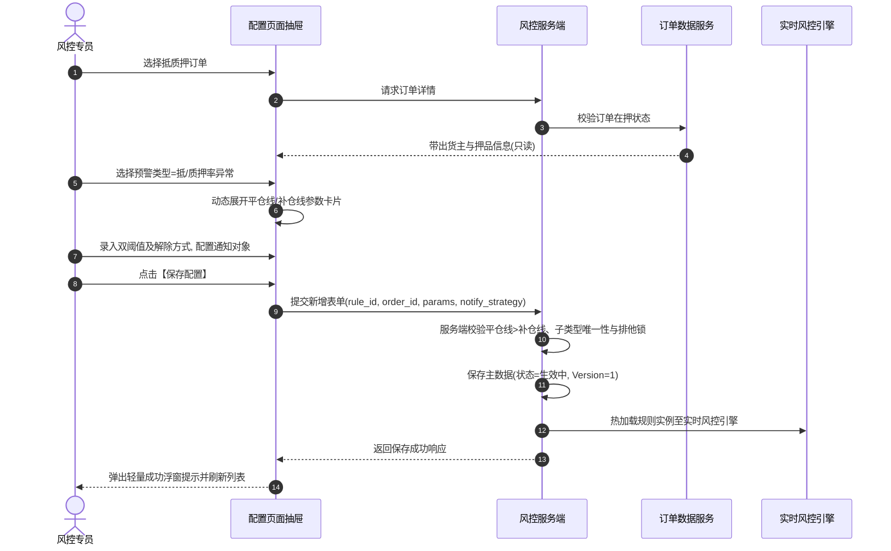

# 订单预警配置主需求文档 (PRD)

> **版本**：V2.0 | 2026-09-16  
> **读者**：研发工程师、测试工程师、风控产品经理、系统架构师  
> **编写依据**：[订单预警配置字段清单](./订单预警配置字段清单.md)、[订单预警配置业务规则规格](./订单预警配置业务规则规格.md)、[押品预警信息主PRD](../../05-风控/06-风险信息-押品预警信息/押品预警信息主PRD.md)、[贷中风控管理主PRD](../../05-风控/08-风险信息-贷中风控管理/贷中风控管理主PRD.md)  
> **真源声明**：本主 PRD 负责业务场景、页面交互布局、用户路径、操作行为与状态机协同。字段标准引自字段清单，底层状态机与校验规则以业务规则规格为唯一真源。所有交互控件术语均已规范汉化。  
> **当前业务开关**：监管订单当前关闭。新增订单选择器只返回当前可运营的抵/质押订单；监管订单历史配置仍可按权限查询、查看详情和审计，但不可新增、编辑、删除或保存，历史兼容规则不得物理删除，也不再作为当前规则触发新预警。

---

## 1. 业务背景与业务目标

### 1.1 业务背景
在供应链金融大宗商品动产质押业务中，质押周期较长、大宗市场价格瞬息万变、仓储线下作业频密。资金方与风控管理部门必须建立动态、多维度的风险防控网。  
**订单预警配置**作为订单级风控规则引擎的总入口，当前支持针对在押的有效抵/质押订单配置价格下跌、质押率异常、图像识别、物联网设备、智能挂锁、人脸门禁、巡检异常、解质押超时及贷中风控模型等 **11 大类预警规则**与动态通知升级策略。系统通过**表单联动渲染、阈值参数互斥校验、多渠道消息通知与全生命周期自动失效**，实现存货动产与授信资金的智能化风控穿透。

### 1.2 核心业务目标
1. **多维策略矩阵**：支持 11 类差异化预警策略的动态表单组装与参数校验；
2. **规则全生命周期**：实现从新增配置、版本生效、引擎监听、超时升级到订单解押自动失效的全闭环；
3. **跨系统协同联动**：配置保存自动触发贷中风控台账同步，触发越界自动派生押品预警工单。

---

## 2. 页面功能说明与交互布局

### 2.1 页面骨架与分区设计

订单预警配置页面包含列表主页与新增/编辑弹窗/抽屉工作区：

```
+----------------------------------------------------------------------------------------------------+
| 顶部标题栏：订单预警配置  [+ 新增预警规则]                                                          |
+----------------------------------------------------------------------------------------------------+
| 筛选工作区（支持展开/收起）：                                                                        |
| 订单号 [单行文本输入框]  订单类型 [下拉单选框 (抵押/质押/全部)]  预警类型 [下拉多选框 (11大类)]       |
| 货物名称 [单行文本输入框]  状态 [下拉单选框 (生效中/已失效)]                                        |
| [查询]  [重置]                                                                                     |
+----------------------------------------------------------------------------------------------------+
| 预警配置表格工作区：                                                                                |
| 序号 | 规则名称 | 订单号 | 订单类型 | 货主姓名 | 货主手机号 | 货物信息 | 预警类型 | 状态 | 行操作 |
|  1   | 铜锭价格下跌监控| DZY2026.. | 质押 | 某某实业 | 138****0001 | 电解铜.. | 价格下跌 |生效中|[详情][编辑][删除]|
|  2   | 历史监管规则A  | JG2025..  | 监管 | 某某商贸 | 139****0002 | 热轧卷.. | 盘点异常 |已失效|[详情]        |
+----------------------------------------------------------------------------------------------------+
| 底部固定栏：分页控件（每页条数选择、总条数统计、页码跳转）                                            |
+----------------------------------------------------------------------------------------------------+
```

### 2.2 核心交互控件规格与操作规范

1. **筛选工作区**：
   - **订单号**：单行文本输入框（Input），支持模糊匹配；
   - **订单类型**：下拉单选框（Select），选项：全部、抵押、质押、监管（历史兼容）；
   - **预警类型**：下拉多选框（Select），支持 11 大类多选精准过滤；
   - **状态**：下拉单选框（Select），选项：全部、生效中（ACTIVE）、已失效（EXPIRED）；
   - **操作按钮**：主色【查询】按钮、次色【重置】按钮。
2. **新增/编辑表单交互规格**：
   - **规则名称**：单行文本输入框，限制 1~50 字，新增必填且租户唯一，编辑页锁定为只读文本；
   - **关联订单号**：下拉单选框，新增时支持模糊搜索在押有效订单，选中后自动联动带出货主名称、手机号及货物信息只读展示；编辑页锁定不可更改；
   - **预警类型选择器**：分段单选控件/下拉单选框，单选 11 大类之一，选择后下方动态展开对应的专属参数卡片；
   - **通知与升级卡片**：
     - **通知渠道**：复选框，包含邮件通知、短信通知（系统站内信默认开启且锁定）；
     - **预警对象**：下拉多选框，必填，选择当前租户下启用账号；
     - **升级预警开关**：开关控件（Switch），开启后展开【升级预警天数】（单行文本输入框，正整数）与【升级预警对象】（下拉多选框）。

---

## 3. 核心业务场景与用户旅程

### 场景 1【复合筛选与生效规则检索】(ORD-S01)
* **主业务旅程**：风控经理进入工作台，输入订单编号或多选预警类型进行筛选。系统依据 `【订单数据权限行级隔离过滤规则】(ORD-P02)` 注入管辖范围，分页展现生效中与已失效的历史规则记录。

### 场景 2【新增抵质押率双阈值预警规则】(ORD-S02)
* **主业务旅程**：
  1. 风控专员点击顶部【+ 新增预警规则】，页面滑出新增配置抽屉；
  2. 输入规则名称（如 `电解铜抵押率风控规则`），在订单号下拉单选框中选择一笔处于抵押中的订单；
  3. 系统自动带出货主“某某铜业”及押品“电解铜 500 吨”；
  4. 预警大类选择【抵/质押率异常】；
  5. 页面动态渲染双阈值配置卡片，专员输入补仓线阈值（如 `70%`）并勾选解除方式【补仓、部分结清】；输入平仓线阈值（如 `85%`）并勾选解除方式【平仓、部分结清】；系统执行 `【平仓线高于补仓线与分线命中判定规则】(ORD-F22)` 强校验；
  6. 配置预警通知人员并开启【升级预警】（持续 3 天未解除升级通知风控总监）；
  7. 点击【保存】，服务端执行防重排他锁并保存为 `生效中` (Version=1)，列表刷新。



### 场景 3【启用贷中风控策略自动同步台账】(ORD-S03)
* **主业务旅程**：风控专员在新增或编辑某笔质押订单规则时，预警大类选择【贷中风控预警】，在下拉单选框中选择上架的“大宗供应链资信评分模型 A”。点击保存后，系统依据 `【贷中风控启用自动同步管理台账规则】(ORD-M01)`，在单个事务内保存规则，并自动在 [贷中风控管理](../../05-风控/08-风险信息-贷中风控管理/贷中风控管理主PRD.md) 中为该订单建立一条管理汇总台账。

### 场景 4【订单出库解押关联规则自动失效】(ORD-S04)
* **主业务旅程**：某笔抵押订单在业务端完成全额提前还款，办理解押出库审批归档。风控系统监听到该领域事件，依据 `【订单出库解押关联规则最高级失效规则】(ORD-N02)`，自动将该订单下所有预警规则置为 `已失效` (EXPIRED)，并立即注销未解除预警的后续升级定时任务。

### 场景 5【历史监管配置只读合规查询】(ORD-S05)
* **主业务旅程**：合规审计人员在列表筛选“订单类型=监管”，系统依据 `【历史监管配置只读禁止写操作规则】(ORD-P05)`，完整展示历史监管单据的预警参数与版本快照；操作列仅保留【详情】，绝对隐藏【编辑】与【删除】按钮。

---

## 4. 业务规则映射与追溯矩阵

| 规则编码 | 规则业务全称 | 规格章节 | 对应场景 | 交互表现与系统行为 |
| :--- | :--- | :--- | :--- | :--- |
| **ORD-P01** | 【订单预警配置菜单访问与细粒度鉴权规则】 | 业务规则 §3.1 | 全场景 | 无菜单权限重定向，操作列按钮按细粒度鉴权 |
| **ORD-P02** | 【订单数据权限行级隔离过滤规则】 | 业务规则 §3.1 | ORD-S01 | 查询接口强制注入管辖机构与订单可见范围 |
| **ORD-P03** | 【权限失效动态屏蔽与服务端鉴权规则】 | 业务规则 §3.1 | 全场景 | 丢失权限立即隐藏，接口端执行强防越权校验 |
| **ORD-P04** | 【抵质押订单准入与监管订单关闭阻断规则】 | 业务规则 §3.1 | ORD-S02 | 下拉框仅返回抵质押订单，接口阻断监管单新增 |
| **ORD-P05** | 【历史监管配置只读禁止写操作规则】 | 业务规则 §3.1 | ORD-S05 | 历史监管单操作列仅保留【详情】，禁止写操作 |
| **ORD-P11** | 【新增订单号候选范围与生命周期校验规则】 | 业务规则 §3.1 | ORD-S02 | 仅在押存续订单可选，已出库单据自动排除 |
| **ORD-P12** | 【订单子类型唯一性与防重复配置规则】 | 业务规则 §3.1 | ORD-S02 | 同一订单同子类型仅限 1 条生效中规则，重复阻断 |
| **ORD-P13** | 【大类聚合配置与禁止拆单绕过唯一性规则】 | 业务规则 §3.1 | ORD-S02 | 允许单大类多子类型，禁止拆单绕过唯一性 |
| **ORD-P14** | 【单据唯一标识关联与禁止序号索引规则】 | 业务规则 §3.1 | 全场景 | 使用 rule_id 与 order_id 作为持久化请求关联键 |
| **ORD-F01** | 【规则名称租户唯一与只读固化规则】 | 业务规则 §3.2 | ORD-S02 | 新增必填 1~50 字且租户唯一，编辑页只读锁定 |
| **ORD-F02** | 【订单关联基础信息自动带出不可篡改规则】 | 业务规则 §3.2 | ORD-S02 | 货主与押品信息由系统带出，前端只读不可修改 |
| **ORD-F03** | 【预警类型单大类选择与动态参数必填校验规则】 | 业务规则 §3.2 | ORD-S02 | 选择大类动态渲染卡片，执行对应条件必填校验 |
| **ORD-F04** | 【编辑页预警类型锁定禁止变更规则】 | 业务规则 §3.2 | ORD-S02 | 编辑时锁定订单与预警类型，仅允许调参调人员 |
| **ORD-F05** | 【动态字段切换前端清理与版本变更规则】 | 业务规则 §3.2 | ORD-S02 | 切换大类前端清理临时参数，防止脏数据入库 |
| **ORD-F06** | 【历史监管配置详情只读与保存阻断规则】 | 业务规则 §3.2 | ORD-S05 | 历史监管详情全只读，隐藏保存提交按钮 |
| **ORD-F21** | 【抵质押率平仓补仓双阈值区间互斥规则】 | 业务规则 §3.3 | ORD-S02 | 平仓线与补仓线双阈值必填，支持 2 位小数 |
| **ORD-F22** | 【平仓线高于补仓线与分线命中判定规则】 | 业务规则 §3.3 | ORD-S02 | 平仓线必须高于补仓线，低于补仓线时红字拦截 |
| **ORD-F23** | 【双线独立处置方式配置与分线解除规则】 | 业务规则 §3.3 | ORD-S02 | 平仓线与补仓线独立配置解除方式，分线命中展现 |
| **ORD-F24** | 【抵质押率公式计算与指标缺失阻断规则】 | 业务规则 §3.3 | 全场景 | 抵质押率=贷款余额/货值，缺少必要要素不触发 |
| **ORD-F25** | 【命中线快照固化与报表追溯保全规则】 | 业务规则 §3.3 | 全场景 | 触发瞬间固化线别、质押率及估值快照 |
| **ORD-F31** | 【站内信默认推送与多渠道下发规则】 | 业务规则 §3.4 | ORD-S02 | 站内信强制开启，邮件短信可选，接收人必选 |
| **ORD-F32** | 【超时升级开关与天数对象强校验规则】 | 业务规则 §3.4 | ORD-S02 | 开启后升级天数（1~365天）与升级对象强校验 |
| **ORD-F33** | 【接收人状态实时校验与停用账号跳过规则】 | 业务规则 §3.4 | 全场景 | 下发前实时复核账号状态，停用账号自动跳过 |
| **ORD-F34** | 【通知对象变更不触发普通预警规则】 | 业务规则 §3.4 | 全场景 | 调参仅影响后续通知，不回溯重发存量预警 |
| **ORD-M01** | 【贷中风控启用自动同步管理台账规则】 | 业务规则 §3.3 | ORD-S03 | 勾选贷中模型保存后自动同步贷中风控管理台账 |
| **ORD-M02** | 【单订单贷中风控台账唯一幂等维护规则】 | 业务规则 §3.3 | ORD-S03 | 单订单唯一台账，重复保存幂等更新不插重复行 |
| **ORD-M04** | 【配置失效管理台账自动不可执行规则】 | 业务规则 §3.3 | ORD-S04 | 预警规则失效后贷中台账自动变为不可执行 |
| **ORD-T01** | 【多源触发事件分布式防重幂等规则】 | 业务规则 §3.5 | 全场景 | 5 秒防抖锁，相同事件直接丢弃幂等放行 |
| **ORD-T04** | 【自动结案与人工解除终止升级任务规则】 | 业务规则 §3.5 | 全场景 | 预警解除后系统自动注销超时升级定时任务 |
| **ORD-N01** | 【配置变更旧版本不回写与置无效规则】 | 业务规则 §3.5 | 全场景 | 保存后版本递增，关闭策略异步作废存量未结案流水 |
| **ORD-N02** | 【订单出库解押关联规则最高级失效规则】 | 业务规则 §3.5 | ORD-S04 | 订单全额解押出库自动置关联规则为已失效 |

---

## 5. 验收标准与测试用例

| 用例编号 | 对应场景 | 关联规则 | 测试输入与前置条件 | 预期输出与验收标准 |
| :---: | :---: | :---: | :--- | :--- |
| **ORD-TC01** | ORD-S02 | ORD-F22 | 配置质押率异常预警，输入平仓线 `65%`，补仓线 `70%` | 表单提交被拦截，输入框红字报错：`“平仓线阈值必须高于补仓线阈值”` |
| **ORD-TC02** | ORD-S02 | ORD-P12 | 对订单 A 连续配置 2 条相同的大类“价格下跌”规则 | 第 2 次提交被服务端拒绝，弹出浮窗提示：`“该订单已存在生效中的价格下跌预警规则”` |
| **ORD-TC03** | ORD-S03 | ORD-M01 | 质押订单 B 勾选“贷中风控预警”并选择模型成功保存 | 贷中风控管理列表中即时新增订单 B 的台账，关联模型为所选产品 |
| **ORD-TC04** | ORD-S04 | ORD-N02 | 订单 C 在仓储端完成全额解押出库审批并归档 | 订单预警配置列表中订单 C 关联的所有规则状态自动更新为 `已失效`，操作列【编辑】置灰 |
| **ORD-TC05** | ORD-S05 | ORD-P05 | 筛选历史监管订单配置并查看操作列 | 操作列仅显示【详情】，不显示【编辑】和【删除】按钮 |
| **ORD-TC06** | ORD-S02 | ORD-F32 | 开启升级预警开关，升级预警天数输入 `0` 或留空 | 表单拦截提交，输入框红字提示：`“请输入1~365的整数天数”` |

---

## 6. 修订记录

| 版本 | 修订日期 | 修订人 | 修订内容 |
| :---: | :---: | :---: | :--- |
| **V1.0** | 2026-08-18 | 产品团队 | 初版发布。 |
| **V1.9** | 2026-09-11 | 产品团队 | 关闭监管订单当前运营链路，明确历史监管规则只读归档；细化 11 类动态参数。 |
| **V2.0** | 2026-09-16 | 产品团队 | 场景编号全面升级为自解释语义命名 `场景 N【...】(ORD-Sxx)`；交互控件术语全面汉化；建立与业务规则规格 `(ORD-P/F/M/T/N)` 的全量双向追溯表与验收测试矩阵。 |
