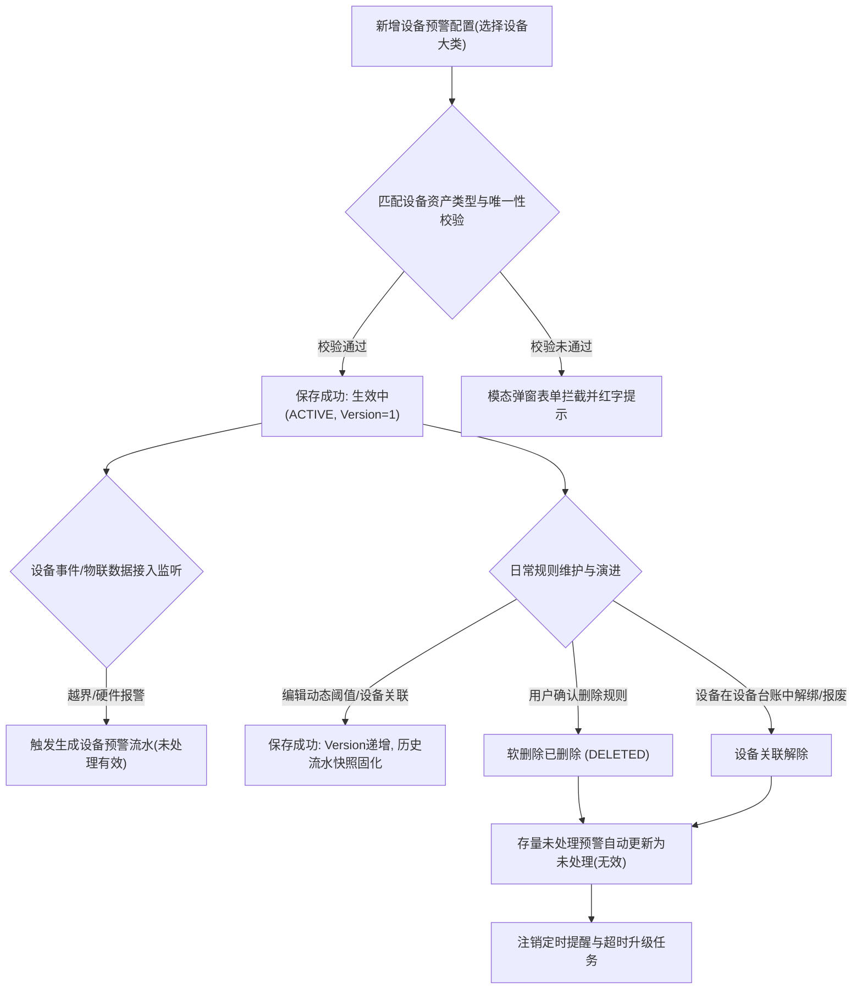

# 设备预警配置业务规则规格

> **版本**：V2.1 | 2026-09-20  
> **编写依据**：[设备预警配置主PRD](./设备预警配置主PRD.md)、[设备预警配置字段清单](./设备预警配置字段清单.md)、[设备预警信息业务规则规格](../../05-风控/05-风险信息-设备预警信息/设备预警信息业务规则规格.md)  
> **真源声明**：本规格书是设备预警配置生命周期、多设备关联唯一性、5类预警阈值校验、厂商防抖下沉、设备离线独立轮次、通知升级及删除联动失效的**唯一业务逻辑与技术规则真源（SSOT）**。所有涉及交互控件的表述已完成全面汉化规范。

---

## 1. 业务对象与能力边界

### 1.1 业务对象定义
设备预警配置面向平台纳入监管的硬件资产（视频监控摄像头、温湿度/烟感/气体传感器、智能挂锁、人脸门禁及 GPS 终端），建立设备维度的**硬件异常行为、环境指标越界及离线监控规则**。

### 1.2 与订单预警的双轨独立模型

| 维度 | 订单预警配置 | 设备预警配置 |
| :--- | :--- | :--- |
| **业务主体** | 有效在押的抵押/质押业务订单 | 监管仓库内登记的物理设备资产 |
| **前置条件** | 必须选择一笔合法在押订单 | 无需绑定订单；只要设备属于管辖仓库即可配置 |
| **唯一性粒度** | `订单 + 预警子类型 + 生效中` | `设备 + 预警子类型 + 生效中` |
| **生成流水** | 押品预警信息（订单维度，含补仓平仓业务处置） | 设备预警信息（物理资产维度，现场核验与自动结案） |
| **联动机制** | 订单全额解押出库驱动规则失效 | 设备解绑/报废驱动未处理告警置为无效 |

---

## 2. 状态机与生命周期流转

### 2.1 规则状态定义

| 状态编码 | 页面展示名称 | 业务含义 | 适用操作与行为边界 |
| :--- | :--- | :--- | :--- |
| `ACTIVE` | **生效中** | 规则已保存生效，三方物联中台与风控引擎实时监听并匹配 | 支持【查看详情】、【编辑】、【删除】；支持匹配事件触发告警 |
| `DELETED` | **已删除**（软删除） | 用户主动删除规则，数据作软删除标记，配置列表不展示 | 关联的存量未处理设备预警自动置为 `未处理（无效）`，停止升级 |

### 2.2 状态流转时序图（Mermaid）

---

## 3. 核心业务规则规格

### 3.1 权限与设备候选规则 (DEV-CFG-P 系列)

#### 【设备预警配置菜单访问与细粒度鉴权规则】(DEV-CFG-P01)
* **规则描述**：进入【设备预警配置】菜单必须具备 `R-RULE-DEVICE-VIEW` 权限。行级【查看详情】需具备查看权限，【新增规则】需具备 `R-RULE-DEVICE-ADD` 权限，【编辑】需具备 `R-RULE-DEVICE-EDIT` 权限，【删除】需具备 `R-RULE-DEVICE-DEL` 权限。

#### 【仓库数据权限过滤与无位置例外规则】(DEV-CFG-P02)
* **规则描述**：
  1. 列表展示：规则关联的设备中，只要有任意一台属于当前登录账号管辖仓库，该规则即在列表中可见；
  2. 候选选择：已绑定位置的设备严格按登录账号仓库权限过滤；尚未绑定具体仓库的新设备作为无归属例外，允许对具备配置权限的账号开放勾选。

#### 【设备可选范围与状态服务端强复核规则】(DEV-CFG-P03)
* **规则描述**：在新增或编辑保存时，服务端强制复核已勾选设备的在线状态、资产归属及是否已被逻辑删除，严禁通过客户端绕过仓库权限注入非法设备。

#### 【设备资产显示快照与逻辑删除防伪规则】(DEV-CFG-P04)
* **规则描述**：设备选择器统一展示系统内名称、设备唯一编码及物理安装位置；已被逻辑删除或权限撤销的设备绝对不伪造为当前可选设备。

---

### 3.2 表单配置与动态阈值校验规则 (DEV-CFG-F 系列)

#### 【规则名称租户唯一与模糊检索规则】(DEV-CFG-F01)
* **规则描述**：
  1. **新增填写**：单行文本输入框，1~50 个汉字/字符，在租户内必须保持唯一，重复时报错提示：`“规则名称已存在，请重新输入”`；
  2. **编辑锁定**：编辑页锁定规则名称为纯文本只读展示；
  3. **列表检索**：列表支持按规则名称进行前后模糊匹配查询。

#### 【预警类型编辑锁定与动态参数维护规则】(DEV-CFG-F02)
* **规则描述**：
  1. 预警大类（图像、物联、挂锁、门禁、GPS）单选，选择大类后展开该大类所属的预警子类型；
  2. **编辑锁定原则**：编辑规则时，预警大类与已勾选子类型置灰禁止修改；
  3. **参数维护权限**：已选子类型的动态参数（如温湿度最低/最高值阈值）允许编辑修改，并支持增删改维护关联设备列表。

#### 【预警大类匹配资产类型多设备关联规则】(DEV-CFG-F03)
* **规则描述**：选择设备资产时，系统严格按预警大类过滤可用设备类型（图像识别预警仅可选摄像头，物联预警仅可选传感器，挂锁预警仅可选智能挂锁，门禁预警仅可选门禁，GPS 预警仅可选 GPS 终端）；支持单条规则关联勾选多台同类型设备。

#### 【设备子类型唯一性与防重复配置规则】(DEV-CFG-F04)
* **规则描述**：在同一租户内，**同一物理设备在同一预警子类型下，仅允许存在 1 条生效中的配置规则**。
* **判定逻辑**：保存提交时，系统针对勾选的每台设备分别执行 `租户 + 设备ID + 子类型 + ACTIVE` 唯一性校验；若某设备已绑定同子类型的生效中规则，提交阻断并精准报错：`“设备[{设备名称}]在子类型[{子类型名称}]下已存在生效规则，不可重复配置”`。

#### 【物联数值型阈值区间与空值不触发规则】(DEV-CFG-F21)
* **规则描述**：
  1. 温度、湿度、二氧化碳、氧气等数值指标必须同时配置【最低值】与【最高值】，不可为空；
  2. 触发判定条件为严格越界：`采集值 < 最低值 OR 采集值 > 最高值`；当前采集值等于最低值或等于最高值时不触发；
  3. 设备上报空值（null）或无有效数据包时，不满足触发条件，严禁因采集空值伪造越界告警。

#### 【指标正负范围约束与边界值触发规则】(DEV-CFG-F22)
* **规则描述**：温度指标的最低值与最高值允许为负数（支持冷链库房）；湿度、CO2、氧气指标的阈值必须严格 > 0；任何指标的**最低值必须严格小于最高值**，否则表单校验拦截。

#### 【高频采集数据防抖与未处理去重规则】(DEV-CFG-F24)
* **规则描述**：传感器可能每 3~10 秒推送一次实时数据；当某设备某指标已存在处于 `待处置 · 有效` 的未结案预警时，系统仅刷新该预警的当前快照值与时间戳，**绝对不重复创建新的预警实例，杜绝消息轰炸**。

---

### 3.3 5 类设备预警配置与离线专项规则

#### 1. 监控图像识别预警
* **子类型**：行人入侵、车辆入侵、物品形态变化、**摄像头离线**；
* **触发机制**：图像识别依赖 AI 边缘算法事件；收到对应事件上报即触发告警。

#### 2. 设备物联预警
* **子类型**：温度异常、湿度异常、烟感异常、二氧化碳异常、氧气异常、**物联离线**；
* **解除机制**：温湿度/气体恢复至阈值区间内系统自动结案；烟感收到恢复事件自动结案；物联离线支持人工解除或上线自动结案。

#### 3. 智能挂锁预警
* **子类型**：拆壳、锁舌被卡、锁杆被剪、非法开箱、拆卡报警、密码错误、关锁异常、电量低于 20%、**门锁离线**；
* **解除机制**：物理异常由现场人员在 [设备预警信息](../../05-风控/05-风险信息-设备预警信息/设备预警信息主PRD.md) 进行人工核查解除。

#### 4. 人脸门禁预警
* **子类型**：门未关、密码错误、**门禁离线**；上报对应安全事件时触发。

#### 5. 设备 GPS 预警
* **子类型**：进围栏、出围栏、超速、怠速滞留、路线偏离、非法拆除、**GPS离线**；
* **解除机制**：进/出围栏、超速、怠速滞留、路线偏离、非法拆除因三方不提供恢复自动结案回调，须人工解除结案；仅 GPS 离线支持重新上线自动结案。

#### 6. 设备离线专项规则 (DEV-CFG-T21~T24)
* **【各大类设备离线独立归属与检测规则】(DEV-CFG-T21)**：各预警大类的【设备离线】严格针对其对应的设备硬件资产独立配置，摄像头对应图像离线、传感器对应物联离线、挂锁对应门锁离线、门禁对应门禁离线、GPS 对应 GPS 离线，互不干扰；
* **【厂商判定离线上线下沉与平台免配置规则】(DEV-CFG-T22)**：离线与上线判定完全由三方设备接入层或厂商接入中台完成，**平台不再配置防抖判定模式与持续心跳时长**，平台仅接收最终离线/上线事件报文；
* **【设备重新上线自动结案与离线轮次闭环规则】(DEV-CFG-T24)**：收到三方重新上线事件后，系统自动将离线预警更新为 `已结案 · 有效` (RESOLVED_VALID)，并停止升级任务；物联离线在同一离线轮次内仅保留一条记录，避免网络偶发抖动重复落账。

---

### 3.4 通知升级与变更失效规则 (DEV-CFG-N / DEV-CFG-C 系列)

#### 【站内信默认推送与多设备短信合并规则】(DEV-CFG-N01)
* **规则描述**：及时预警默认向配置的接收人下发站内信；邮件与短信为可选复选框。同一规则下若多台设备同时触发告警，针对同一接收人支持按批次合并下发短信，防止短时间内短信刷屏。

#### 【未执行升级任务防重复生成与串行规则】(DEV-CFG-N03)
* **规则描述**：未解除的设备预警按实例创建升级任务；若某设备在某预警类型下已有尚未执行的升级任务，系统不重复生成，保障升级通知串行有序。

#### 【短信合并免侵入站内预警实例规则】(DEV-CFG-N04)
* **规则描述**：短信通道合并仅作用于外部通信网关，**站内生成的设备预警信息流水绝对不合并**，每台设备的每次独立风险均完整落账。

#### 【配置变更旧版本不回写与快照固化规则】(DEV-CFG-C01)
* **规则描述**：规则编辑保存后 Version 递增，**不回写**存量未结案设备告警流水；后续事件严格按最新 Version 匹配。

#### 【删除规则未处理流水自动置无效规则】(DEV-CFG-C02)
* **规则描述**：当用户确认删除某条设备预警规则时，系统触发领域事件，将该规则名下所有处于 `待处置 · 有效` 的设备预警流水自动原子更新为 `已作废` (INVALID)，并立即清除所有待执行的升级任务。

#### 【设备解绑解关联未处理流水置无效规则】(DEV-CFG-C03)
* **规则描述**：当某台设备从规则关联列表中移除、从仓库解绑或在设备台账中报废时，系统自动将该设备关联的未处理有效预警置为 `已作废` (INVALID)，杜绝僵尸告警长期挂起。

---

## 4. 字段级校验与业务约束矩阵

| 字段名称 | 校验规则 | 错误提示/异常行为 |
| :--- | :--- | :--- |
| **规则名称** (`rule_name`) | 单行文本输入框，限制 1~50 字符，租户内唯一 | 重复提示：`“规则名称已存在，请重新输入”` |
| **预警类型** (`warn_type`) | 下拉单选框，5 大类之一，选择后动态展开子类型 | 编辑页锁定置灰禁止修改 |
| **关联设备** (`device_ids`) | 复选框列表，至少勾选 1 台匹配资产类型的设备 | 未选择设备提示：`“请至少选择一台关联监控设备”` |
| **物联指标上下限** | 最低值必须严格小于最高值，湿度/CO2/氧气必须 > 0 | 最低值>=最高值提示：`“最低值必须小于最高值”` |
| **升级预警天数** (`upgrade_days`) | 正整数，范围 1~365 天 | 超限或非整数提示：`“请输入1~365的整数天数”` |
| **状态** (`status`) | 系统维护二态：`生效中` (ACTIVE)、`已删除` (DELETED) | 列表默认仅展示生效中记录 |

---

## 5. 修订记录

| 版本 | 修订日期 | 修订人 | 修订内容 |
| :---: | :---: | :---: | :--- |
| **V1.0** | 2026-08-18 | 产品团队 | 初版发布。 |
| **V1.2** | 2026-08-18 | 产品团队 | 细化各大类设备离线专项、物联数值阈值区间与未处理分类去重。 |
| **V2.0** | 2026-09-16 | 产品团队 | 全面重构业务规则体系，升级为 `【规则业务名称】(编码)` 语义自解释编号（DEV-CFG-P01~04、DEV-CFG-F01~24、DEV-CFG-T01~24、DEV-CFG-N01~04、DEV-CFG-C01~03）；全面汉化交互控件；落实厂商防抖下沉、设备离线独立归属与删除联动失效闭环。 |
| **V2.1** | 2026-09-20 | 产品团队 | GPS 进/出围栏、超速、怠速滞留、路线偏离、非法拆除退出恢复自动结案：三方不提供恢复回调，须人工解除；仅 GPS 离线保留重新上线自动结案。 |
