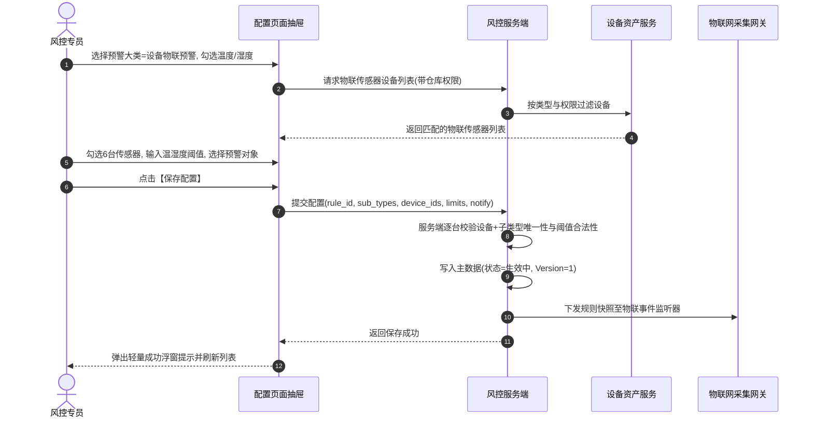

# 设备预警配置主需求文档 (PRD)

> **版本**：V2.0 | 2026-09-16  
> **读者**：研发工程师、测试工程师、物联网风控产品经理、系统架构师  
> **编写依据**：[设备预警配置字段清单](./设备预警配置字段清单.md)、[设备预警配置业务规则规格](./设备预警配置业务规则规格.md)、[设备预警信息主PRD](../../05-风控/05-风险信息-设备预警信息/设备预警信息主PRD.md)  
> **真源声明**：本主 PRD 负责业务场景、页面交互布局、用户路径、操作行为与状态机协同。字段标准引自字段清单，底层状态机与校验规则以业务规则规格为唯一真源。所有交互控件术语均已规范汉化。

---

## 1. 业务背景与业务目标

### 1.1 业务背景
在存货监管与数字仓储体系中，仓库现场部署有大量安防监控摄像头、温湿度/烟感环境传感器、人脸门禁通道、智能挂锁及车载 GPS 终端。  
**设备预警配置**面向平台纳管的所有硬件设备资产，提供设备维度的预警规则配置能力。与面向在押订单的订单预警不同，设备预警采用**以物理资产为核心的双轨独立模型**：只要设备归属于当前账号管辖仓库，即可按设备大类配置异常行为、环境指标超标及硬件离线规则。系统通过**大类资产动态匹配、厂商防抖下沉、离线独立轮次与未处理分类去重**，保障仓库现场物理安全的 7x24 小时精准监控。

### 1.2 核心业务目标
1. **资产分类纳管**：覆盖图像识别、环境物联、智能门锁、人脸门禁、GPS 轨迹 5 大类设备规则配置；
2. **防误报防轰炸**：采用厂商预过滤与防抖下沉机制，温湿度高频采集高灵敏监控但未处理告警不重复刷屏；
3. **闭环联动治理**：规则编辑与删除联动存量流水置为无效，物理设备解绑自动清理无效告警任务。

---

## 2. 页面功能说明与交互布局

### 2.1 页面骨架与分区设计

设备预警配置页面采用标准的 B 端后台管理工作台布局：

```
+----------------------------------------------------------------------------------------------------+
| 顶部标题栏：设备预警配置  [+ 新增设备预警规则]                                                      |
+----------------------------------------------------------------------------------------------------+
| 筛选工作区（支持展开/收起）：                                                                        |
| 规则名称 [单行文本输入框]  预警类型 [下拉多选框 (5大类)]                                             |
| [查询]  [重置]                                                                                     |
+----------------------------------------------------------------------------------------------------+
| 设备预警配置台账表格工作区：                                                                        |
| 序号 | 规则名称 | 预警类型 | 状态 | 创建人 | 创建时间 | 更新人 | 更新时间 | 操作                    |
|  1   | 1号库温湿度监控| 设备物联预警 |生效中| 张三   | 2026-08-.. | 李四   | 2026-09-.. |[详情][编辑][删除]|
|  2   | 库门智能挂锁防剪| 智能挂锁预警 |生效中| 王五   | 2026-08-.. | 王五   | 2026-08-.. |[详情][编辑][删除]|
+----------------------------------------------------------------------------------------------------+
| 底部固定栏：分页控件（每页条数选择、总条数统计、页码跳转）                                            |
+----------------------------------------------------------------------------------------------------+
```

### 2.2 核心交互控件规格与操作规范

1. **筛选工作区**：
   - **规则名称**：单行文本输入框（Input），支持模糊匹配，回车触发查询；
   - **预警类型**：下拉多选框（Select），支持多选：设备图像识别预警、设备物联预警、智能挂锁预警、人脸门禁预警、设备 GPS 预警；
   - **操作按钮**：主色【查询】按钮、次色【重置】按钮。
2. **新增/编辑表单交互规格**：
   - **规则名称**：单行文本输入框，限制 1~50 字，新增必填且租户唯一，编辑页锁定为只读文本；
   - **预警类型选择器**：下拉单选框，选择大类后，下方动态渲染子类型复选框及该大类专属动态参数；编辑页大类与子类型锁定不可修改；
   - **选择关联设备**：穿梭框/复选列表，展示【设备类型】+【系统内名称】+【设备编码】+【绑定位置】，支持多选，编辑页支持增删改设备列表；
   - **通知与升级卡片**：
     - **通知渠道**：复选框，包含邮件通知、短信通知（站内信默认开启且置灰锁定）；
     - **预警对象**：下拉多选框，必填，选择当前租户下启用账号；
     - **升级预警开关**：开关控件（Switch），开启后展开【升级预警天数】（单行文本输入框）与【升级预警对象】（下拉多选框）。

---

## 3. 核心业务场景与用户旅程

### 场景 1【复合筛选与规则列表浏览】(DEV-CFG-S01)
* **主业务旅程**：物联网风控主管进入工作台，输入规则名称并勾选“设备物联预警”，点击【查询】。系统依据 `【仓库数据权限过滤与无位置例外规则】(DEV-CFG-P02)` 注入管辖仓库权限，分页展现生效中的设备预警规则。

### 场景 2【新增库房温湿度越界告警规则】(DEV-CFG-S02)
* **主业务旅程**：
  1. 风控专员点击顶部【+ 新增设备预警规则】，滑出新增抽屉；
  2. 录入规则名称（如 `3号恒温恒湿库温湿度预警`）；
  3. 预警大类选择【设备物联预警】，勾选子类型【温度异常】与【湿度异常】；
  4. 页面动态展开阈值输入区，专员输入温度范围（`10℃` ~ `25℃`）、湿度范围（`40%` ~ `60%`）；
  5. 点击【选择设备】，系统按资产类型列出 3 号库所有温湿度传感器，专员勾选 6 台传感器；
  6. 配置预警通知人员并开启【升级预警】（持续 2 天未解除升级通知仓库主管）；
  7. 点击【保存】，系统执行 `【设备子类型唯一性与防重复配置规则】(DEV-CFG-F04)` 校验通过，规则保存为 `生效中` (Version=1)，列表刷新。



### 场景 3【编辑动态阈值与维护设备资产】(DEV-CFG-S03)
* **主业务旅程**：季节交替需调整库房控温标准，风控专员点击某规则的【编辑】按钮。抽屉打开后，系统依据 `【预警类型编辑锁定与动态参数维护规则】(DEV-CFG-F02)` 锁定大类与子类型，专员将温度最高值由 `25℃` 改为 `28℃`，并在关联设备中新增新安装的 2 台传感器。保存后 Version 递增，新事件按最新阈值生效，存量历史告警流水不受回溯影响。

### 场景 4【删除规则联动存量未处理告警失效】(DEV-CFG-S04)
* **主业务旅程**：某老旧库房改建，风控专员点击对应规则的【删除】操作，弹出二次确认模态弹窗。确认删除后，系统依据 `【删除规则未处理流水自动置无效规则】(DEV-CFG-C02)`，在软删除规则的同时，自动将该规则下所有处于 `待处置 · 有效` 的设备预警流水变更为 `已作废` (INVALID)，注销升级定时任务，防止产生无效升级干扰。

---

## 4. 业务规则映射与追溯矩阵

| 规则编码 | 规则业务全称 | 规格章节 | 对应场景 | 交互表现与系统行为 |
| :--- | :--- | :--- | :--- | :--- |
| **DEV-CFG-P01** | 【设备预警配置菜单访问与细粒度鉴权规则】 | 业务规则 §3.1 | 全场景 | 无菜单权限重定向，操作列按钮按细粒度鉴权 |
| **DEV-CFG-P02** | 【仓库数据权限过滤与无位置例外规则】 | 业务规则 §3.1 | DEV-CFG-S01 | 只要任一关联设备属于管辖仓库即在列表可见 |
| **DEV-CFG-P03** | 【设备可选范围与状态服务端强复核规则】 | 业务规则 §3.1 | DEV-CFG-S02 | 服务端复核在线与归属，防越权注入非法设备 |
| **DEV-CFG-P04** | 【设备资产显示快照与逻辑删除防伪规则】 | 业务规则 §3.1 | DEV-CFG-S02 | 统一展示名称与位置快照，已删除设备不可选 |
| **DEV-CFG-F01** | 【规则名称租户唯一与模糊检索规则】 | 业务规则 §3.2 | DEV-CFG-S02 | 新增 1~50 字且租户唯一，编辑页只读，支持模糊检索 |
| **DEV-CFG-F02** | 【预警类型编辑锁定与动态参数维护规则】 | 业务规则 §3.2 | DEV-CFG-S03 | 编辑锁定大类与子类型，允许调参及增删改设备 |
| **DEV-CFG-F03** | 【预警大类匹配资产类型多设备关联规则】 | 业务规则 §3.2 | DEV-CFG-S02 | 按大类严格匹配资产，支持单规则关联多台设备 |
| **DEV-CFG-F04** | 【设备子类型唯一性与防重复配置规则】 | 业务规则 §3.2 | DEV-CFG-S02 | 同一设备同一子类型仅限 1 条生效中规则，重复阻断 |
| **DEV-CFG-F21** | 【物联数值型阈值区间与空值不触发规则】 | 业务规则 §3.2 | DEV-CFG-S02 | 最低值与最高值必填，严格越界触发，空值不触发 |
| **DEV-CFG-F22** | 【指标正负范围约束与边界值触发规则】 | 业务规则 §3.2 | DEV-CFG-S02 | 温度支持负数，其余指标>0，最低值必须<最高值 |
| **DEV-CFG-F24** | 【高频采集数据防抖与未处理去重规则】 | 业务规则 §3.2 | 全场景 | 存在未结案告警时仅更新快照，不重复发短信轰炸 |
| **DEV-CFG-T01** | 【多源设备事件分布式防重幂等规则】 | 业务规则 §3.3 | 全场景 | 5 秒防抖锁，相同事件直接忽略幂等放行 |
| **DEV-CFG-T21** | 【各大类设备离线独立归属与检测规则】 | 业务规则 §3.3 | DEV-CFG-S02 | 各大类离线针对各自资产独立配置、检测与结案 |
| **DEV-CFG-T22** | 【厂商判定离线上线下沉与平台免配置规则】 | 业务规则 §3.3 | 全场景 | 离线判定下沉厂商，平台不配置防抖持续时长 |
| **DEV-CFG-T24** | 【设备重新上线自动结案与离线轮次闭环规则】 | 业务规则 §3.3 | 全场景 | 设备重新上线自动结案离线告警，物联按轮次管理 |
| **DEV-CFG-N01** | 【站内信默认推送与多设备短信合并规则】 | 业务规则 §3.4 | 全场景 | 站内信默认发，多设备同事件对同一人合并短信 |
| **DEV-CFG-N03** | 【未执行升级任务防重复生成与串行规则】 | 业务规则 §3.4 | 全场景 | 已有未执行升级任务不重复生成，保障串行有序 |
| **DEV-CFG-N04** | 【短信合并免侵入站内预警实例规则】 | 业务规则 §3.4 | 全场景 | 短信合并仅限通道层，站内预警流水逐单独立落账 |
| **DEV-CFG-C01** | 【配置变更旧版本不回写与快照固化规则】 | 业务规则 §3.4 | DEV-CFG-S03 | 编辑保存版本递增，不回写存量未处理告警流水 |
| **DEV-CFG-C02** | 【删除规则未处理流水自动置无效规则】 | 业务规则 §3.4 | DEV-CFG-S04 | 删除规则自动将存量未处理告警置为未处理无效 |
| **DEV-CFG-C03** | 【设备解绑解关联未处理流水置无效规则】 | 业务规则 §3.4 | DEV-CFG-S04 | 设备解绑或报废，关联未处理告警自动置为无效 |

---

## 5. 验收标准与测试用例

| 用例编号 | 对应场景 | 关联规则 | 测试输入与前置条件 | 预期输出与验收标准 |
| :---: | :---: | :---: | :--- | :--- |
| **DEV-CFG-TC01**| DEV-CFG-S02 | DEV-CFG-F22 | 配置湿度异常，输入最低值 `60%`，最高值 `50%` | 表单提交被拦截，输入框下方红字报错：`“最低值必须小于最高值”` |
| **DEV-CFG-TC02**| DEV-CFG-S02 | DEV-CFG-F04 | 对摄像头 A 配置行人入侵规则，再次勾选摄像头 A 配置行人入侵 | 提交时服务端拦截报错：`“设备[摄像头A]在子类型[行人入侵]下已存在生效规则，不可重复配置”` |
| **DEV-CFG-TC03**| DEV-CFG-S03 | DEV-CFG-F02 | 打开已生效的挂锁预警规则进行编辑 | 页面上【预警大类】与【已选子类型】置灰不可修改，阈值参数与关联设备列表允许修改 |
| **DEV-CFG-TC04**| DEV-CFG-S04 | DEV-CFG-C02 | 规则下存在 3 条处于“待处置·有效”的告警，用户确认删除该规则 | 规则状态变更为已删除；设备预警信息列表中该 3 条告警状态全部自动更新为 `已作废` (INVALID) |
| **DEV-CFG-TC05**| DEV-CFG-S02 | DEV-CFG-F03 | 预警大类选择“设备物联预警”，点击【选择设备】 | 设备列表仅列出物联温湿度/烟感传感器，不出现摄像头、挂锁或门禁设备 |

---

## 6. 修订记录

| 版本 | 修订日期 | 修订人 | 修订内容 |
| :---: | :---: | :---: | :--- |
| **V1.0** | 2026-08-18 | 产品团队 | 初版发布。 |
| **V1.8** | 2026-08-19 | 产品团队 | 补充各大类设备离线专项、多设备关联与分类去重机制。 |
| **V2.0** | 2026-09-16 | 产品团队 | 场景编号全面升级为自解释语义命名 `场景 N【...】(DEV-CFG-Sxx)`；交互控件术语全面汉化；建立与业务规则规格 `(DEV-CFG-P/F/T/N/C)` 的全量双向追溯表与验收测试矩阵。 |
