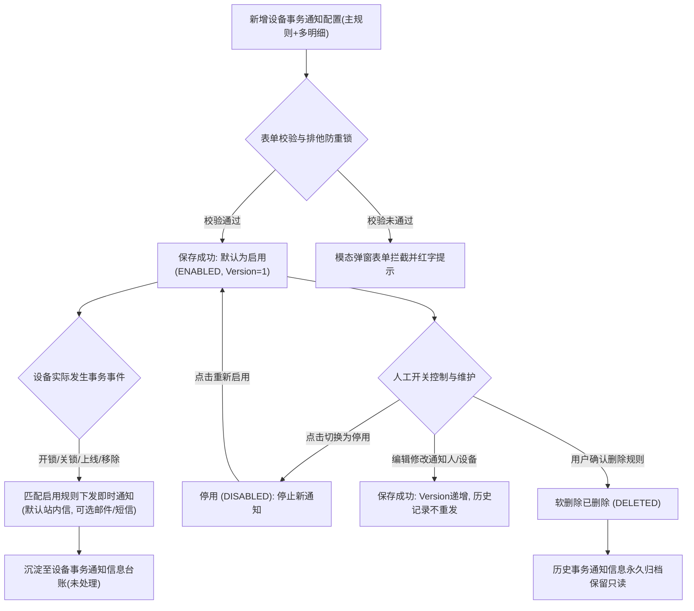

# 设备事务通知配置业务规则规格

> **版本**：V2.0 | 2026-09-16  
> **编写依据**：[设备事务通知配置主PRD](./设备事务通知配置主PRD.md)、[设备事务通知配置字段清单](./设备事务通知配置字段清单.md)、[设备事务通知信息业务规则规格](../../05-风控/07-风险信息-设备事务通知信息/设备事务通知信息业务规则规格.md)  
> **真源声明**：本规格书是设备事务通知配置数据模型、主明细装配架构、开锁/关锁在线过滤、新设备首次上线全局监听、设备移除领域事件触发、启用/停用主动控制及即时推送机制的**唯一业务逻辑与技术规则真源（SSOT）**。所有涉及交互控件的表述已完成全面汉化规范。

---

## 1. 业务对象与数据模型

### 1.1 业务对象定位
设备事务通知配置是针对仓库内物联设备（门禁终端、智能挂锁、监控摄像头、各类传感器及 GPS 设备）在日常运营中产生的**常规操作与运维事件**（如刷卡开锁、机械关锁、设备上线入网、设备主动报废移除等），建立的主动消息推送配置。

### 1.2 “主规则 + 事务类型明细”数据模型架构
1. **主规则（Header）**：定义规则业务名称、通知渠道（邮件/短信/默认站内信）、发件人账户、抄送人员、通知接收人员以及主规则启用/停用状态；
2. **事务明细（Details）**：1 条主规则下支持通过【+ 添加事务明细】配置多条事务明细，**每条明细内“事务类型”单选一项**，并绑定对应的设备资产或勾选【针对新设备】。
3. **租户内唯一性基准**：按 `租户ID + 事务类型 + 设备唯一标识 / (设备类型 + 仅针对新设备)` 强校验，同一有效组合只允许存在 1 条已启用的配置规则。

---

## 2. 状态机与生命周期流转

### 2.1 规则状态定义

| 状态编码 | 页面展示名称 | 业务含义 | 适用操作与行为边界 |
| :--- | :--- | :--- | :--- |
| `ENABLED` | **启用** | 规则处于激活生效状态，三方事件接入实时匹配并下发通知 | 支持【停用】、【编辑】、【删除】、【查看详情】 |
| `DISABLED`| **停用** | 规则被人工暂停，系统停止监听该规则并不再产生新通知 | 支持【启用】、【编辑】、【删除】、【查看详情】；历史通知完整保留 |
| `DELETED` | **已删除**（软删除） | 用户主动删除规则，配置列表自动隐藏该项 | 停止新通知下发；历史已产生的事务通知记录**绝对不随之删除** |

> **主动状态开关设计说明**：区别于订单/设备预警跟随物理标的或订单生命周期被动变为“已失效”的模型，设备事务通知规则属于日常管理人员随时掌控的消息推送总开关，支持随时手动在 `启用` 与 `停用` 之间灵活切换。

### 2.2 状态流转时序图（Mermaid）

---

## 3. 核心业务规则规格

### 3.1 权限与数据隔离规则 (NOTIFY-CFG-P 系列)

#### 【事务通知配置菜单访问与细粒度鉴权规则】(NOTIFY-CFG-P01)
* **规则描述**：进入【设备事务通知配置】菜单必须具备 `R-NOTIFY-CFG-VIEW` 权限。行级【查看详情】需具备查看权限，【新增规则】需具备 `R-NOTIFY-CFG-ADD` 权限，【编辑】需具备 `R-NOTIFY-CFG-EDIT` 权限，【删除】需具备 `R-NOTIFY-CFG-DEL` 权限，【启用/停用】状态切换需具备 `R-NOTIFY-CFG-TOGGLE` 权限。

#### 【规则设备关联多对多可见性过滤规则】(NOTIFY-CFG-P02)
* **规则描述**：
  1. 列表展示：若当前登录账号的管辖仓库列表与单条规则关联的任意一台设备所属仓库相匹配，该规则在配置列表中可见；
  2. 若单条规则关联的设备均尚未绑定具体仓库，在租户物理隔离前提下，对拥有该菜单查看权限的账号统一可见。

#### 【事务通知信息页触发位置隔离过滤规则】(NOTIFY-CFG-P03)
* **规则描述**：配置端按“规则绑定设备任一命中”展示，下游信息页则严格按“实际触发设备所属仓库数据权限”行级过滤，两者分层隔离，服务端独立鉴权。

#### 【配置接口服务端数据权限强鉴权规则】(NOTIFY-CFG-P04)
* **规则描述**：保存、编辑、删除、状态切换及设备拉取等接口，必须由服务端重新比对当前账号的数据权限与单据 Version，严禁以客户端传入的设备清单作为权限依据。

#### 【订单类型分页预留与可扩展枚举规则】(NOTIFY-CFG-P05)
* **规则描述**：当前版本不实施订单类型分页；未来扩展订单级事务时采用可扩展枚举，按同类型订单数据权限隔离。

---

### 3.2 事务明细配置与触发规则 (NOTIFY-CFG-F 系列)

#### 【主规则与多明细数据模型装配规则】(NOTIFY-CFG-F01)
* **规则描述**：单条主规则支持挂载多条事务类型明细。主规则设置通用通知人员与渠道；每条明细单选一个事务类型（开锁通知、关锁通知、设备上线、设备移除），并单独配置关联设备资产。

#### 【租户内事务明细唯一性与防重复配置规则】(NOTIFY-CFG-F02)
* **规则描述**：
  1. 同一主规则内，各明细之间不得重复配置完全相同的事务类型与设备组合；
  2. 在同一租户内，针对同一物理设备在同一事务类型下，仅允许存在 1 条处于 `启用` (ENABLED) 状态的配置规则；重复配置提交阻断。

#### 【规则名称租户唯一与编辑页只读规则】(NOTIFY-CFG-F03)
* **规则描述**：规则名称新增时必填（1~50 字符），租户内唯一；编辑页中规则名称锁定为纯文本只读展示。

#### 【启用停用人工控制与历史流水保留规则】(NOTIFY-CFG-F04)
* **规则描述**：新增保存后规则状态默认为 `启用`。用户可随时手动切换为 `停用`；停用仅停止匹配后续新事务，**绝对不删除历史已生成的任何通知记录**，停用规则支持再次编辑并重新启用。

#### 【开锁关锁仅限在线门锁门禁资产规则】(NOTIFY-CFG-F11)
* **规则描述**：当明细事务类型选择【开锁通知】或【关锁通知】时，设备候选列表仅列出设备资产类型为 `智能挂锁` 或 `人脸门禁`、且当前系统内状态为 `在线` 的设备；离线设备置灰禁用或不出现在候选列表中，且不支持“针对新设备”选项。

#### 【开锁关锁事件合法接入与启用规则匹配规则】(NOTIFY-CFG-F12)
* **规则描述**：智能挂锁或人脸门禁上报合法开闭锁报文时，系统实时检索针对该设备处于启用状态的开锁/关锁配置，命中后立即触发即时推送并落账。

#### 【设备上线已有资产在线离线多选规则】(NOTIFY-CFG-F21)
* **规则描述**：当明细选择【设备上线】且未勾选【针对新设备】时，用户在选择设备列表中可多选该设备类型下系统内当前处于 `在线` 或 `离线` 的设备；被逻辑删除的设备不出现在候选列表中。

#### 【仅针对新设备全局监听单类型唯一规则】(NOTIFY-CFG-F22)
* **规则描述**：
  1. 【针对新设备】复选框**仅在事务类型为“设备上线”时展示**；
  2. 勾选后，系统自动隐藏并禁用具体设备选择列表，表示该设备类型下未来所有新同步入网的设备自动继承本条通知规则；
  3. **唯一性约束**：在同一租户内，针对同一种设备资产类型（如监控摄像头），处于启用状态的“仅针对新设备”上线通知规则**仅限配置 1 条**。

#### 【新设备首次同步入网判定规则】(NOTIFY-CFG-F23)
* **规则描述**：新设备定义为系统内此前不存在或状态为已删除的设备资产；当该设备首次同步注册到系统且状态为上线时，系统匹配该设备类型启用的“仅针对新设备”规则发送即时通知。

#### 【已有设备离线跳变在线触发规则】(NOTIFY-CFG-F24)
* **规则描述**：系统内已有设备由“离线”状态跃迁为“在线”状态瞬间，系统匹配针对该具体设备配置的上线通知规则发送即时通知；正常运行过程中的持续在线心跳不重复触发。

#### 【设备移除必须指定已有设备禁止新设备规则】(NOTIFY-CFG-F31)
* **规则描述**：当明细选择【设备移除】时，**不支持“针对新设备”配置**；用户必须从当前系统内已有设备列表中明确勾选需要监控移除的物理设备。

#### 【设备管理移除成功领域事件联动规则】(NOTIFY-CFG-F32)
* **规则描述**：设备移除通知**仅且必须由设备管理模块用户主动触发【移除设备】且服务端执行成功后抛出的 `DEVICE_REMOVED_EVENT` 领域事件触发**；网络离线、设备注销、逻辑删除或移除审批失败，绝对不触发设备移除事务通知。

#### 【设备删除历史事务通知记录不级联删除规则】(NOTIFY-CFG-F33)
* **规则描述**：物理设备在设备档案中被删除或移除后，历史已经产生的所有事务通知流水与快照**绝对不被级联删除**，永久保留供司法审计追溯。

#### 【瞬态事件即时推送与免升级免公示规则】(NOTIFY-CFG-F41)
* **规则描述**：设备事务通知属于瞬态作业事件，触发后系统默认下发站内信，可选邮件或短信；**系统绝对不提供超时升级天数配置、不提供多轮催办任务、绝对不推送到风险公示模块**。

#### 【通知策略变更不回溯重发历史流水规则】(NOTIFY-CFG-F42)
* **规则描述**：修改通知人员、渠道或增删关联设备时，仅对后续新发生的事件生效，严禁回溯重发历史事务通知。

#### 【接收人状态实时校验与停用账号跳过规则】(NOTIFY-CFG-F43)
* **规则描述**：下发通知瞬间，系统实时校验接收人账号状态，停用或离职账号自动跳过并留存审计日志。

---

### 3.3 通知下发与防重幂等规则 (NOTIFY-CFG-N 系列)

#### 【启用配置匹配落账与停用停止推送规则】(NOTIFY-CFG-N01)
* **规则描述**：三方事务事件到达时，系统实时校验主规则与明细处于 `启用` (ENABLED) 状态才执行落账与推送；若规则处于 `停用` 状态，直接丢弃事件并记录系统通信日志。

#### 【多源事务事件分布式防重幂等规则】(NOTIFY-CFG-N02)
* **规则描述**：采用 `租户ID + 设备ID + 事务类型 + 来源事件ID` 构建分布式排他锁与数据库唯一索引，5 秒内重复接入的相同事件直接忽略，杜绝重复发送通知。

#### 【事务记录与预警实例独立存储规则】(NOTIFY-CFG-N03)
* **规则描述**：设备事务通知记录与设备预警信息属于不同的底层实体表；门禁开锁或设备上线等事务通知的产生与处理，**绝对不交叉改变设备预警风险实例的状态机**。

#### 【发送失败隔离记录与重试免生新流水规则】(NOTIFY-CFG-N05)
* **规则描述**：短信或邮件由于三方网关网络抖动发送失败时，记录失败原因与重试键；重试执行仅更新发送日志，严禁派生多余的事务通知流水。

---

## 4. 字段级校验与业务约束矩阵

| 字段名称 | 校验规则 | 错误提示/异常行为 |
| :--- | :--- | :--- |
| **事务通知规则名称** (`rule_name`) | 单行文本输入框，1~50 字符，租户内唯一 | 重复提示：`“规则名称已存在，请重新输入”` |
| **事务类型** (`event_type`) | 明细内单选枚举：开锁通知、关锁通知、设备上线、设备移除 | 必选一项 |
| **选择设备** (`device_ids`) | 复选框列表，开锁关锁仅限在线设备，设备移除必须选具体设备 | 未选择提示：`“请至少选择一台关联监控设备”` |
| **针对新设备** (`is_for_new_device`) | 复选框，仅在设备上线展示，每种设备类型租户限 1 条启用 | 重复启用提示：`“该设备类型下已存在启用的新设备上线规则”` |
| **通知对象** (`notify_users`) | 下拉多选框，至少选择 1 位租户下启用账号 | 未选提示：`“请选择通知对象”` |
| **规则状态** (`status`) | 枚举：启用 (ENABLED)、停用 (DISABLED) | 人工主动开关控制 |

---

## 5. 修订记录

| 版本 | 修订日期 | 修订人 | 修订内容 |
| :---: | :---: | :---: | :--- |
| **V1.0** | 2026-08-18 | 产品团队 | 初版发布。 |
| **V1.1** | 2026-08-18 | 产品团队 | 明确开锁/关锁在线限制、新设备与已有设备分流，界定即时通知免升级特性。 |
| **V2.0** | 2026-09-16 | 产品团队 | 全面重构业务规则体系，升级为 `【规则业务名称】(编码)` 语义自解释编号（NOTIFY-CFG-P01~05、NOTIFY-CFG-F01~43、NOTIFY-CFG-N01~05）；全面汉化交互控件；落实“主规则+多明细”数据模型、主动启用/停用开关与设备移除领域事件闭环。 |
