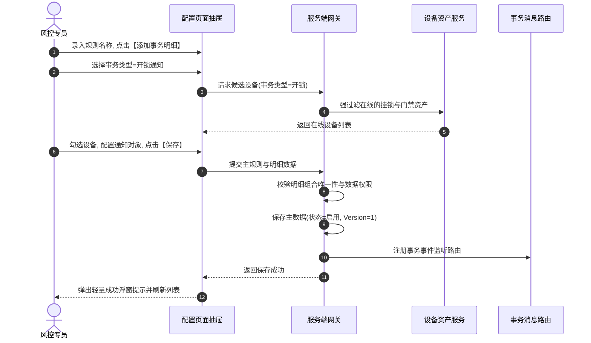

# 设备事务通知配置主需求文档 (PRD)

> **版本**：V2.0 | 2026-09-16  
> **读者**：研发工程师、测试工程师、物联网风控产品经理、系统架构师  
> **编写依据**：[设备事务通知配置字段清单](./设备事务通知配置字段清单.md)、[设备事务通知配置业务规则规格](./设备事务通知配置业务规则规格.md)、[设备事务通知信息主PRD](../../05-风控/07-风险信息-设备事务通知信息/设备事务通知信息主PRD.md)  
> **真源声明**：本主 PRD 负责业务场景、页面交互布局、用户路径、操作行为与状态机协同。字段标准引自字段清单，底层状态机与校验规则以业务规则规格为唯一真源。所有交互控件术语均已规范汉化。

---

## 1. 业务背景与业务目标

### 1.1 业务背景
在存货监管仓储的日常运营中，挂锁开关、门禁刷卡通行、新设备入网注册以及设备主动移除属于高频且即时发生的**日常作业与运维操作事件**。  
为了使仓储主管与安全监管人员第一时间感知仓内物理动态，系统设立**设备事务通知配置**。区别于设备安全风险预警的持续告警与升级催办机制，设备事务通知规则采用**人工主动控制的“启用/停用”总开关模型**，以及“一条主规则 + 多条事务明细”的灵活装配模式。触发后即时下发通知并生成明细台账，不设超时升级通知，不推送到风险公示模块。

### 1.2 核心业务目标
1. **即时态势感知**：实现开锁、关锁、设备上线、设备移除 4 类瞬时事件的即时推送；
2. **灵活装配模型**：支持单规则挂载多个事务明细，支持新设备首次同步全局监听；
3. **主动掌控开关**：提供随时手动启用/停用功能，维护期快速静默，不干扰历史台账。

---

## 2. 页面功能说明与交互布局

### 2.1 页面骨架与分区设计

设备事务通知配置页面包含列表台账与新增/编辑表单工作区：

```
+----------------------------------------------------------------------------------------------------+
| 顶部标题栏：设备事务通知配置  [+ 新增事务通知规则]                                                  |
+----------------------------------------------------------------------------------------------------+
| 筛选工作区（支持展开/收起）：                                                                        |
| 规则名称 [单行文本输入框]  事务类型 [下拉多选框 (4类)]  设备名称 [单行文本输入框]                     |
| 规则状态 [下拉单选框 (全部/启用/停用)]                                                              |
| [查询]  [重置]                                                                                     |
+----------------------------------------------------------------------------------------------------+
| 事务通知规则表格工作区：                                                                            |
| 序号 | 规则名称 | 事务类型 | 关联设备摘要 | 状态(开关) | 创建人 | 创建时间 | 更新人 | 更新时间 | 操作 |
|  1   | 1号库门锁通行 | 开锁/关锁 | 1号库主门挂锁等(2台)| [启用] | 张三 | 2026-.. | 李四 | 2026-.. |[详情][编辑][删除]|
|  2   | 新摄像头上线  | 设备上线 | 仅针对新设备(监控) | [停用] | 王五 | 2026-.. | 王五 | 2026-.. |[详情][编辑][删除]|
+----------------------------------------------------------------------------------------------------+
| 底部固定栏：分页控件（每页条数选择、总条数统计、页码跳转）                                            |
+----------------------------------------------------------------------------------------------------+
```

### 2.2 核心交互控件规格与操作规范

1. **筛选工作区**：
   - **规则名称**：单行文本输入框（Input），支持模糊匹配，回车触发查询；
   - **事务类型**：下拉多选框（Select），选项：开锁通知、关锁通知、设备上线、设备移除；
   - **设备名称**：单行文本输入框（Input），模糊匹配关联设备系统内名称；
   - **规则状态**：下拉单选框（Select），选项：全部、启用（ENABLED）、停用（DISABLED）；
   - **操作按钮**：主色【查询】按钮、次色【重置】按钮。
2. **新增/编辑表单交互规格**：
   - **规则名称**：单行文本输入框，1~50 字，新增必填且租户唯一，编辑页锁定为只读文本；
   - **事务明细卡片区**：支持点击【+ 添加事务明细】添加多张明细卡片；
     - 每张明细内【事务类型】为下拉单选框（4选1）；
     - **开锁/关锁**：设备列表仅列出状态为“在线”的挂锁与门禁；
     - **设备上线**：可勾选复选框【针对新设备】（选择适用设备类型，隐藏具体设备选择）；若未勾选，则多选具体已有设备；
     - **设备移除**：仅支持多选已有具体设备，无针对新设备选项；
   - **通知渠道与对象卡片**：
     - **通知渠道**：复选框，包含邮件通知、短信通知（站内信默认勾选且置灰锁定）；
     - **通知对象**：下拉多选框，必填，选择当前租户下启用人员。

---

## 3. 核心业务场景与用户旅程

### 场景 1【复合筛选与规则列表浏览】(NOTIFY-CFG-S01)
* **主业务旅程**：安防主管进入工作台，输入“门锁”并筛选“状态=启用”。系统依据 `【规则设备关联多对多可见性过滤规则】(NOTIFY-CFG-P02)` 注入管辖仓库权限，分页展现当前正在生效运行的门锁事务通知规则。

### 场景 2【新增门禁开闭锁即时通知规则】(NOTIFY-CFG-S02)
* **主业务旅程**：
  1. 风控专员点击顶部【+ 新增事务通知规则】，滑出新增抽屉；
  2. 录入规则名称（如 `1号库大门挂锁通行即时通知`）；
  3. 点击【+ 添加事务明细】，事务类型选择【开锁通知】，设备列表自动过滤出 1 号库大门在线的智能挂锁，专员勾选该挂锁；
  4. 再次点击【+ 添加事务明细】，事务类型选择【关锁通知】，勾选同一台挂锁；
  5. 在通知渠道中勾选【短信通知】，在通知对象下拉多选框中选择库区现场监管员张三与李四；
  6. 点击【保存】，系统依据 `【租户内事务明细唯一性与防重复配置规则】(NOTIFY-CFG-F02)` 校验通过，规则保存为 `启用` 状态，列表刷新。



### 场景 3【配置新摄像头上线全局自动监听】(NOTIFY-CFG-S03)
* **主业务旅程**：仓储技术员新增一条“新监控接入上线通知”规则，添加事务明细选择【设备上线】，勾选复选框【针对新设备】，选择适用资产类型为“监控摄像头”。保存后，系统依据 `【仅针对新设备全局监听单类型唯一规则】(NOTIFY-CFG-F22)` 生效配置；后续现场无论何时新安装入网任何同类型摄像头，首次同步上线时均会自动向通知对象发送站内信与短信。

### 场景 4【日常维护手动切换停用状态】(NOTIFY-CFG-S04)
* **主业务旅程**：库房大门进行机械检修，频繁开关锁。为避免产生大量骚扰通知，管理员在列表中点击该规则的操作列状态开关，将其切换为 `停用`。系统依据 `【启用停用人工控制与历史流水保留规则】(NOTIFY-CFG-F04)` 停止下发新通知，检修完毕后管理员再次点击开关即可无缝恢复启用。

### 场景 5【设备主动移除领域事件闭环推送】(NOTIFY-CFG-S05)
* **主业务旅程**：管理员在设备管理模块完成某故障摄像头的报废移除审批，设备微服务抛出 `DEVICE_REMOVED_EVENT` 领域事件。事务通知引擎捕获该事件并匹配对应移除配置，依据 `【设备管理移除成功领域事件联动规则】(NOTIFY-CFG-F32)` 立即向风控专员推送设备移除即时通知。

---

## 4. 业务规则映射与追溯矩阵

| 规则编码 | 规则业务全称 | 规格章节 | 对应场景 | 交互表现与系统行为 |
| :--- | :--- | :--- | :--- | :--- |
| **NOTIFY-CFG-P01** | 【事务通知配置菜单访问与细粒度鉴权规则】 | 业务规则 §3.1 | 全场景 | 无菜单权限重定向，操作列按钮按细粒度鉴权 |
| **NOTIFY-CFG-P02** | 【规则设备关联多对多可见性过滤规则】 | 业务规则 §3.1 | NOTIFY-CFG-S01 | 任一关联设备属于管辖仓库即可在列表呈现 |
| **NOTIFY-CFG-P04** | 【配置接口服务端数据权限强鉴权规则】 | 业务规则 §3.1 | 全场景 | 接口端强校验，严禁以客户端设备参数替代鉴权 |
| **NOTIFY-CFG-F01** | 【主规则与多明细数据模型装配规则】 | 业务规则 §3.2 | NOTIFY-CFG-S02 | 主规则设通知人，支持动态添加多条明细 |
| **NOTIFY-CFG-F02** | 【租户内事务明细唯一性与防重复配置规则】 | 业务规则 §3.2 | NOTIFY-CFG-S02 | 同一设备同一事务类型租户限 1 条启用规则 |
| **NOTIFY-CFG-F03** | 【规则名称租户唯一与编辑页只读规则】 | 业务规则 §3.2 | NOTIFY-CFG-S02 | 新增 1~50 字且租户唯一，编辑页只读固化 |
| **NOTIFY-CFG-F04** | 【启用停用人工控制与历史流水保留规则】 | 业务规则 §3.2 | NOTIFY-CFG-S04 | 支持手动随时启停，停用停止新通知保留历史 |
| **NOTIFY-CFG-F11** | 【开锁关锁仅限在线门锁门禁资产规则】 | 业务规则 §3.2 | NOTIFY-CFG-S02 | 开锁关锁候选仅列出在线挂锁门禁，离线不可选 |
| **NOTIFY-CFG-F21** | 【设备上线已有资产在线离线多选规则】 | 业务规则 §3.2 | NOTIFY-CFG-S02 | 设备上线未勾新设备时，在线离线设备均可选 |
| **NOTIFY-CFG-F22** | 【仅针对新设备全局监听单类型唯一规则】 | 业务规则 §3.2 | NOTIFY-CFG-S03 | 仅在设备上线展示，勾选后隐藏列表，单类型唯一 |
| **NOTIFY-CFG-F23** | 【新设备首次同步入网判定规则】 | 业务规则 §3.2 | NOTIFY-CFG-S03 | 新设备首次注册同步在线触发新设备规则 |
| **NOTIFY-CFG-F24** | 【已有设备离线跳变在线触发规则】 | 业务规则 §3.2 | NOTIFY-CFG-S03 | 已有设备由离线变为在线瞬间触发，持续在线不触发 |
| **NOTIFY-CFG-F31** | 【设备移除必须指定已有设备禁止新设备规则】 | 业务规则 §3.2 | NOTIFY-CFG-S05 | 设备移除不支持新设备，必须指定具体设备 |
| **NOTIFY-CFG-F32** | 【设备管理移除成功领域事件联动规则】 | 业务规则 §3.2 | NOTIFY-CFG-S05 | 仅设备管理主动移除成功事件触发通知 |
| **NOTIFY-CFG-F33** | 【设备删除历史事务通知记录不级联删除规则】 | 业务规则 §3.2 | 全场景 | 设备删除后历史事务通知记录完好保留 |
| **NOTIFY-CFG-F41** | 【瞬态事件即时推送与免升级免公示规则】 | 业务规则 §3.2 | 全场景 | 瞬态事件即时下发，不设超时升级不公示 |
| **NOTIFY-CFG-F42** | 【通知策略变更不回溯重发历史流水规则】 | 业务规则 §3.2 | 全场景 | 调参增删设备仅对后续事件生效，不回溯重发 |
| **NOTIFY-CFG-F43** | 【接收人状态实时校验与停用账号跳过规则】 | 业务规则 §3.2 | 全场景 | 下发前实时复核账号状态，停用账号自动跳过 |
| **NOTIFY-CFG-N01** | 【启用配置匹配落账与停用停止推送规则】 | 业务规则 §3.3 | NOTIFY-CFG-S04 | 仅启用规则匹配事件落账，停用规则直接丢弃 |
| **NOTIFY-CFG-N02** | 【多源事务事件分布式防重幂等规则】 | 业务规则 §3.3 | 全场景 | 5 秒防抖锁，相同事件直接忽略幂等放行 |
| **NOTIFY-CFG-N03** | 【事务记录与预警实例独立存储规则】 | 业务规则 §3.3 | 全场景 | 事务记录与预警实例分表，状态不交叉影响 |
| **NOTIFY-CFG-N05** | 【发送失败隔离记录与重试免生新流水规则】 | 业务规则 §3.3 | 全场景 | 短信发送失败记录日志，重试不派生新记录 |

---

## 5. 验收标准与测试用例

| 用例编号 | 对应场景 | 关联规则 | 测试输入与前置条件 | 预期输出与验收标准 |
| :---: | :---: | :---: | :--- | :--- |
| **NOTIFY-TC01** | NOTIFY-CFG-S02 | NOTIFY-CFG-F11 | 添加事务明细选择“开锁通知”，查看可选设备列表 | 列表仅出现状态为“在线”的挂锁与门禁，离线设备不展示，且不展示针对新设备选项 |
| **NOTIFY-TC02** | NOTIFY-CFG-S02 | NOTIFY-CFG-F02 | 对挂锁 A 配置了开锁通知，再次添加明细对挂锁 A 配置开锁通知 | 提交时服务端拦截报错：`“设备[挂锁A]在事务类型[开锁通知]下已存在生效规则，不可重复配置”` |
| **NOTIFY-TC03** | NOTIFY-CFG-S03 | NOTIFY-CFG-F22 | 勾选【针对新设备】（监控摄像头），系统已存在同类型新设备规则 | 提交时系统拦截并提示：`“该设备类型下已存在启用的新设备上线规则”` |
| **NOTIFY-TC04** | NOTIFY-CFG-S04 | NOTIFY-CFG-F04 | 将规则状态由“启用”切换为“停用”，现场挂锁开锁 | 系统不产生新的事务通知，下游事务通知信息列表不增加新流水；历史流水完好保留 |
| **NOTIFY-TC05** | NOTIFY-CFG-S05 | NOTIFY-CFG-F32 | 摄像头 B 网络掉线超时 | 系统仅根据设备预警配置生成设备离线预警，绝对不触发设备移除事务通知 |

---

## 6. 修订记录

| 版本 | 修订日期 | 修订人 | 修订内容 |
| :---: | :---: | :---: | :--- |
| **V1.0** | 2026-08-18 | 产品团队 | 初版发布。 |
| **V1.8** | 2026-08-19 | 产品团队 | 明确开锁关锁在线限制、新设备与已有设备分流及主明细装配模型。 |
| **V2.0** | 2026-09-16 | 产品团队 | 场景编号全面升级为自解释语义命名 `场景 N【...】(NOTIFY-CFG-Sxx)`；交互控件术语全面汉化；建立与业务规则规格 `(NOTIFY-CFG-P/F/N)` 的全量双向追溯表与验收测试矩阵。 |
