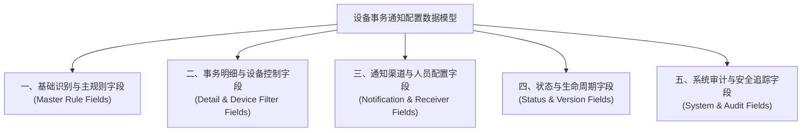
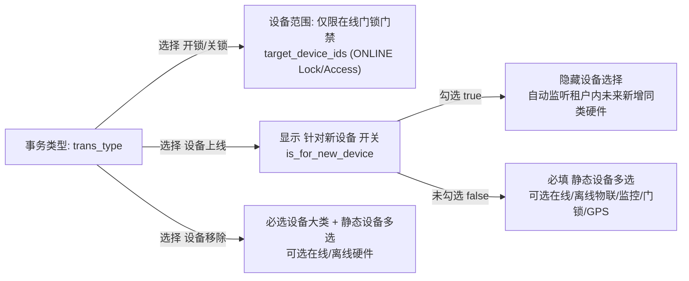

# 设备事务通知配置字段清单

> **文档定位**：设备事务通知配置页面所有业务字段、交互控件与系统字段的唯一定义真源（SSOT）。业务流程、业务规则规格、主PRD、原型及接口规范均引用本文件的业务字段与取值口径，杜绝在各处重复定义或出现二义性字段。
>
> **引用规则**：下游模块（如设备事务通知信息展示、消息推送中心、审计日志模块）引用本字段时，标注“继承自设备事务通知配置”；设备主数据、实时在线状态、硬件分类标准统一以设备管理所属模块定义为准。
>
> **修改原则**：字段定义、控件类型或枚举变更必须且仅限修改本文件，并同步升级版本号与修订记录。
>
> **版本**：V2.0 基准版 | 更新时间：2026-09-16
>
> **页面范围**：覆盖设备事务通知配置列表页（查询区/数据表格）、新增模态弹窗/抽屉、编辑模态弹窗/抽屉、详情抽屉等全生命周期字段。

---

## 0. 字段层级与核心设计说明

本字段清单严格按照“主规则 + 事务类型明细”的分层模型，将字段划分为五大维度：

1. **基础识别与主规则字段**：定义通知规则的主体标识、规则命名与列表全局摘要；
2. **事务明细与设备控制字段**：支撑一条主规则挂载多条事务明细，涵盖事务类型（开锁、关锁、上线、移除）、设备大类、新设备继承标记及目标设备多选过滤；
3. **通知渠道与人员配置字段**：定义事务触发后的触达通道（站内信默认必发、可选邮件与短信）及收件人、抄送人、发件账户；
4. **状态与生命周期字段**：记录规则的启用/停用开关状态及配置版本号；
5. **系统审计与安全追踪字段**：记录创建、修改、启停操作的操作人、时间戳与不可变数据镜像快照。

> **核心设计规范与术语约束**：
> 1. **状态管理模型**：事务通知规则状态为“启用 / 停用”，属于管理员人工主动控制的即时事件推送开关；区别于预警模块跟随业务对象生命周期被动流转的“生效中 / 已失效”模型。
> 2. **交互控件汉化**：全面汉化前端交互术语，严禁在文档内出现未经转化的裸英文（如使用“单行文本输入框”代替 Input、“下拉多选框”代替 Multi-Select、“模态弹窗”代替 Modal、“抽屉”代替 Drawer、“开关控件”代替 Switch、“浮窗提示”代替 Toast、“状态徽章”代替 Badge）。
> 3. **关联业务规则**：各字段约束严格对应 `【业务规则业务名称】(规则编码)` 规范。

---

## 一、基础识别与主规则字段

| 字段名称 | 字段来源 | 取值说明 | 必填性 | 新增页 | 编辑页 | 列表展示 | 筛选控件与匹配 | 详情展示 | 字段说明与关联规则 | 备注 |
| :--- | :--- | :--- | :--- | :--- | :--- | :--- | :--- | :--- | :--- | :--- |
| 序号 | 系统生成 | 整数（Integer）；从 1 开始正整数递增 | 系统自动 | 不适用 | 不涉及 | 是 | 不可筛选 | 是 | 当前列表页当前行的视觉行号，翻页后重新计算，不入库。；遵循【【列表展示规格规则】(NOTIFY-CFG-F12)】 | 纯文本展示 |
| 规则唯一标识 | 系统生成 | 字符（String）；全局唯一标识符（UUID / 雪花算法 ID） | 系统自动 | 是 | 是 | 否 | 不可筛选 | 是 | 主规则数据库主键，全局唯一，创建后不可修改。；遵循【【规则不可变主键规则】(NOTIFY-CFG-F01)】 | 纯文本展示 |
| 事务通知规则名称 | 用户录入 | 字符（String）；1~50 个字符；支持中文、英文字母、数字及下划线 | **必填** | 是 | 是 | 是 | 单行文本输入框；模糊匹配 | 是 | 租户内唯一。新增时手动录入，创建后编辑页**只读置灰**不可更改。；遵循【【规则名称租户唯一与只读固化规则】(NOTIFY-CFG-F02)】 | 单行文本输入框 |
| 事务类型摘要 | 用户选择 | 字符数组（Array）；包含：开锁通知、关锁通知、设备上线、设备移除 | 系统计算 | 是 | 是 | 是 | 不可筛选 | 是 | 列表中聚合并展示该主规则下配置的所有事务类型标签集合。；遵循【【主规则与多明细数据模型装配规则】(NOTIFY-CFG-F01)】 | 状态徽章（Tag） |
| 关联设备摘要 | 用户选择 | 字符（String）；格式：`{设备名称} 等共 N 台` 或 `新设备({设备类型})` | 系统计算 | 是 | 是 | 是 | 不可筛选 | 是 | 汇总该规则关联的设备概况。设备数 > 1 时展示数量并支持悬浮气泡提示查看完整清单。；遵循【【设备摘要多维聚合规则】(NOTIFY-CFG-F13)】 | 纯文本 / 悬浮气泡提示 |
| 设备名称（查询条件） | 用户录入 | 字符（String）；1~50 字符 | 选填 | 是 | 是 | 否 | 单行文本输入框；模糊匹配 | 是 | 查询条件专有字段，服务端根据设备名称穿透关联规则，不入库。；遵循【【设备名称模糊查询检索规则】(NOTIFY-CFG-F14)】 | 单行文本输入框 |

---

## 二、事务明细与设备控制字段

一条主规则支持挂载 1~N 条事务明细；每条明细均具备独立的触发动作与设备作用域。

| 字段名称 | 字段来源 | 取值说明 | 必填性 | 新增页 | 编辑页 | 列表展示 | 筛选控件与匹配 | 详情展示 | 字段说明与关联规则 | 备注 |
| :--- | :--- | :--- | :--- | :--- | :--- | :--- | :--- | :--- | :--- | :--- |
| 明细标识 | 系统生成 | 字符（String）；全局唯一标识符（UUID） | 系统自动 | 系统自动 | 系统自动 | 否 | 不可筛选 | 否 | 事务类型明细的内部唯一主键。；遵循【【主规则与多明细数据模型装配规则】(NOTIFY-CFG-F01)】 | 系统内部字段 |
| 事务类型 | 系统生成 | 字符枚举（String）；`UNLOCK` (开锁通知) `LOCK` (关锁通知) `DEVICE_ONLINE` (设备上线) `DEVICE_REMOVE` (设备移除) | **必填** | 可选择 | 只读置灰（支持整行删除明细） | 否 | 不可筛选 | 是 | 监控的硬件底层事件类型。每条明细单选一项，且在同规则或同租户下防重校验。；遵循【【事务类型有效性与防重规则】(NOTIFY-CFG-F03)】 | 下拉单选框 |
| 设备大类 | 系统生成 | 字符枚举（String）；`IOT_DEVICE` (物联网设备) `CCTV_MONITOR` (监控视频) `SMART_LOCK` (门锁门禁) `GPS_TRACKER` (GPS定位器) | 条件必填 | 条件必选 | 条件必选 | 否 | 不可筛选 | 是 | 当事务类型为“设备上线”或“设备移除”时，需指定设备所属技术大类。；遵循【【设备大类联动与作用域规则】(NOTIFY-CFG-F06)】 | 下拉单选框 |
| 针对新设备 | 系统生成 | 布尔（Boolean）；`true` (是，全局动态生效) `false` (否，指定静态设备) | 选填（默认 `false`） | 条件可编辑 | 条件可编辑 | 否 | 不可筛选 | 是 | **仅当事务类型为“设备上线”时展示**。勾选后自动隐藏设备多选框；同租户同设备大类全局仅允许 1 条启用。；遵循【【设备上线针对新设备全局唯一规则】(NOTIFY-CFG-F05)】 | 复选框（Checkbox） |
| 选择关联设备 | 系统生成 | 字符数组（Array）；库内已绑定的物理硬件设备 ID 数组 | 条件必填 | 条件可编辑 | 条件可编辑 | 否 | 不可筛选 | 是 | 作用设备清单： 1. **开锁/关锁**：候选池仅限当前状态为“在线”的智能挂锁或人脸门禁； 2. **设备上线/移除**：未勾选新设备时必填，在线与离线设备均可选。；遵循【【开锁关锁仅限在线门锁门禁规则】(NOTIFY-CFG-F04) 【静态设备列表必填与互斥规则】(NOTIFY-CFG-F08)】 | 穿梭框 / 模态弹窗多选列表 |
| 设备在线状态（校验项） | 系统生成 | 字符枚举（String）；`ONLINE` (在线) `OFFLINE` (离线) | 系统校验 | 联动校验 | 联动校验 | 否 | 不可筛选 | 是 | 设备选择器候选表格内辅助展示项。开锁/关锁事务在选择时强校验，离线设备置灰不可勾选。；遵循【【开锁关锁仅限在线门锁门禁规则】(NOTIFY-CFG-F04)】 | 状态徽章展示 |

---

## 三、通知渠道与人员配置字段

| 字段名称 | 字段来源 | 取值说明 | 必填性 | 新增页 | 编辑页 | 列表展示 | 筛选控件与匹配 | 详情展示 | 字段说明与关联规则 | 备注 |
| :--- | :--- | :--- | :--- | :--- | :--- | :--- | :--- | :--- | :--- | :--- |
| 通知渠道 | 系统生成 | 字符数组（Array）；`STATION_LETTER` (站内消息，默认锁定且必发) `EMAIL` (邮件通知) `SMS` (短信通知) | **必填**（默认勾选站内消息） | 可编辑 | 可编辑 | 否 | 不可筛选 | 是 | 事务触达方式。站内信默认勾选且置灰不可取消；勾选邮件/短信后展开对应扩展字段。；遵循【【通知渠道默认与联动必填规则】(NOTIFY-CFG-F07)】 | 复选框组（Checkbox Group） |
| 发件人账户 | 系统生成 | 字符（String）；来源于系统设置中已认证的有效企业邮件服务账户 | 条件必填 | 条件可编辑 | 条件可编辑 | 否 | 不可筛选 | 是 | 仅当勾选“邮件通知”渠道时展示并强制必填。停用或配置异常的发件账户不可选。；遵循【【邮件发件人合法性校验规则】(NOTIFY-CFG-F09)】 | 下拉单选框 |
| 抄送对象 | 系统生成 | 字符数组（Array）；当前租户及下属机构内状态为“启用”的用户账户列表 | 选填 | 条件可编辑 | 条件可编辑 | 否 | 不可筛选 | 是 | 仅当勾选“邮件通知”渠道时展示。支持多选人员或按部门批量勾选，停用人员自动过滤。；遵循【【邮件抄送对象校验规则】(NOTIFY-CFG-F15)】 | 下拉多选框（支持拼音搜索） |
| 通知对象 | 系统生成 | 字符数组（Array）；当前租户及下属机构内的所有在职业务人员，包含所属部门与手机号 | **必填** | 可编辑 | 可编辑 | 否 | 不可筛选 | 是 | 接收即时通知的人员清单。至少选择 1 人。推送时刻将前置过滤已停用或已离职账号。；遵循【【通知对象有效性与账号状态校验规则】(NOTIFY-CFG-F11)】 | 下拉多选框 / 穿梭弹窗 |

---

## 四、状态与生命周期字段

| 字段名称 | 字段来源 | 取值说明 | 必填性 | 新增页 | 编辑页 | 列表展示 | 筛选控件与匹配 | 详情展示 | 字段说明与关联规则 | 备注 |
| :--- | :--- | :--- | :--- | :--- | :--- | :--- | :--- | :--- | :--- | :--- |
| 规则状态 | 用户选择 | 字符枚举（String）；`ENABLED` (启用，绿色徽章) `DISABLED` (停用，灰色徽章) `DELETED` (已删除，逻辑标记) | 系统带出 | 是 | 是 | 是 | 单行文本输入框；精确匹配 | 是 | 标识当前规则是否参与实时事件监听流。新增保存后默认为 `ENABLED`；列表中可直接通过开关控件切换。；遵循【【规则启用停用即时生效规则】(NOTIFY-CFG-F10)】 | 开关控件（Switch） / 状态徽章 |
| 配置版本号 | 系统生成 | 整数（Integer）；从 1 开始正整数递增（`v1`, `v2`, ...） | 系统自动 | 是 | 是 | 否 | 不可筛选 | 是 | 每次编辑更新成功后版本号自增 1，历史触发流水中固化当时的规则版本快照。；遵循【【配置版本递增与不可变快照规则】(NOTIFY-CFG-F16)】 | 纯文本展示 |

---

## 五、系统审计与安全追踪字段

| 字段名称 | 字段来源 | 取值说明 | 必填性 | 新增页 | 编辑页 | 列表展示 | 筛选控件与匹配 | 详情展示 | 字段说明与关联规则 | 备注 |
| :--- | :--- | :--- | :--- | :--- | :--- | :--- | :--- | :--- | :--- | :--- |
| 创建人标识 | 用户选择 | 字符（String）；用户唯一账号标识符（User ID） | 系统生成 | 是 | 是 | 否 | 不可筛选 | 是 | 服务端认证上下文解析获取，前端不可伪造。；遵循【【操作全路径审计留痕规则】(NOTIFY-CFG-F17)】 | 纯文本展示 |
| 创建人姓名 | 用户选择 | 字符（String）；1~30 字符用户真实姓名 | 系统生成 | 是 | 是 | 是 | 不可筛选 | 是 | 记录首次创建本条规则的管理员姓名。；遵循【【操作全路径审计留痕规则】(NOTIFY-CFG-F17)】 | 纯文本展示 |
| 创建时间 | 用户选择 | 日期时间（DateTime）；`YYYY-MM-DD HH:mm:ss` 标准格式 | 系统生成 | 是 | 是 | 是 | 不可筛选 | 是 | 服务端数据库写入时间戳，创建后不可变。；遵循【【操作全路径审计留痕规则】(NOTIFY-CFG-F17)】 | 纯文本展示 |
| 最近更新人标识 | 用户选择 | 字符（String）；用户唯一账号标识符（User ID） | 系统生成 | 是 | 是 | 否 | 不可筛选 | 是 | 记录最近一次修改规则内容或切换状态的操作人 ID。；遵循【【操作全路径审计留痕规则】(NOTIFY-CFG-F17)】 | 纯文本展示 |
| 最近更新人姓名 | 用户选择 | 字符（String）；1~30 字符用户真实姓名 | 系统生成 | 是 | 是 | 是 | 不可筛选 | 是 | 列表中展示最近一次修改人姓名。；遵循【【操作全路径审计留痕规则】(NOTIFY-CFG-F17)】 | 纯文本展示 |
| 最近更新时间 | 系统生成 | 日期时间（DateTime）；`YYYY-MM-DD HH:mm:ss` 标准格式 | 系统生成 | 是 | 是 | 是 | 不可筛选 | 是 | 每次规则内容、状态变更时自动刷新为系统当前时间。；遵循【【操作全路径审计留痕规则】(NOTIFY-CFG-F17)】 | 纯文本展示 |
| 审计变更镜像快照 | 用户选择 | 结构化对象（JSON）；包含变更前后完整主规则及明细数据镜像、操作人客户端 IP、请求流水号 | 系统生成 | 是 | 是 | 否 | 不可筛选 | 是 | 用于合规回溯与数据版本防篡改存证。；遵循【【操作全路径审计留痕规则】(NOTIFY-CFG-F17)】 | 不直接呈现（后台入库） |

---

## 六、字段跨端与页面联动规格对照

### 1. 列表区字段展示顺序与默认宽度

| 序号 | 字段名称 | 默认列宽 | 对齐方式 | 排序支持 | 文本截断与气泡提示 |
| :---: | :--- | :---: | :---: | :---: | :--- |
| 1 | 序号 | 60px | 居中 | 否 | 否 |
| 2 | 事务通知规则名称 | 200px | 左对齐 | 否 | 超过 200px 省略号截断，悬浮显示完整气泡提示 |
| 3 | 事务类型 | 220px | 左对齐 | 否 | 多个状态徽章标签排列，超过 3 个展示 `+N` 气泡提示 |
| 4 | 关联设备摘要 | 240px | 左对齐 | 否 | 文本展示，悬浮气泡提示查看完整设备清单 |
| 5 | 状态 | 100px | 居中 | 否 | 开关控件（Switch）带绿色/灰色状态徽章 |
| 6 | 创建人 | 100px | 左对齐 | 否 | 文本展示 |
| 7 | 创建时间 | 170px | 居中 | 支持降序（默认） | 文本展示 |
| 8 | 更新人 | 100px | 左对齐 | 否 | 文本展示 |
| 9 | 更新时间 | 170px | 居中 | 支持按更新时间排序 | 文本展示 |
| 10 | 操作 | 140px | 居中 | 否 | 包含【查看】、【编辑】、【删除】操作按钮 |

### 2. 筛选区字段交互规格

1. **事务通知规则名称 (`rule_name`)**：
   - 控件类型：单行文本输入框；
   - 匹配机制：模糊匹配（前后包含）；
   - 清空机制：支持一键清空按钮；
2. **事务类型 (`trans_type`)**：
   - 控件类型：下拉多选框；
   - 候选值：开锁通知、关锁通知、设备上线、设备移除；
   - 匹配机制：多选精确匹配（逻辑“或”关系）；
3. **设备名称 (`filter_device_name`)**：
   - 控件类型：单行文本输入框；
   - 匹配机制：穿透关联明细中的物理设备名称或设备编码模糊查询；
4. **规则状态 (`rule_status`)**：
   - 控件类型：下拉多选框；
   - 候选值：启用、停用；
   - 匹配机制：精确匹配。

---

## 七、修订记录

| 版本号 | 修订日期 | 修订人 | 修订内容摘要 | 影响章节 |
| :--- | :--- | :--- | :--- | :--- |
| **V2.0** | 2026-09-16 | 森云风控与物联产品团队 | 1. 规范化升级：统一为标准 11 维业务表头（`rule_id`、`rule_name`、`trans_type`、`target_device_ids`、`is_for_new_device`、`notify_channels` 等）； 2. 交互控件全面汉化，清除裸英文术语； 3. 严格映射业务规则规格中 `【业务规则业务名称】(规则编码)` 规范； 4. 优化并固化“主规则 + 事务明细”分层数据结构与字段层级图。 | 全文 |
| V1.3 | 2026-08-18 | 产品团队 | 优化：合并碎片设备选择为统一联动【选择设备】字段，精简冗余列。 | 二、事务控制 |
| V1.2 | 2026-08-18 | 产品团队 | 优化：明确针对新设备仅限设备上线，规范明细数据模型。 | 二、数据模型 |
| V1.0 | 2026-08-18 | 产品团队 | 初版基准定稿。 | 全文 |
