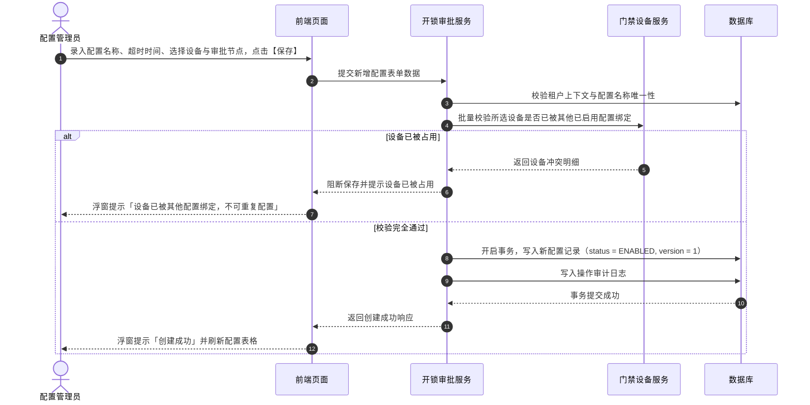
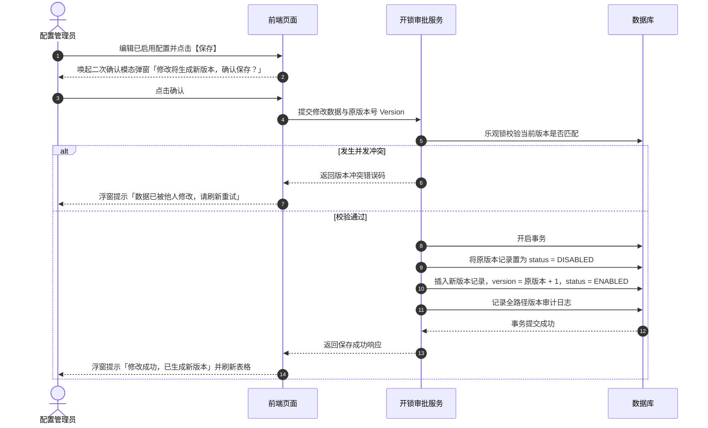

# 开锁审批配置业务规则规格

> **文档定位**：门禁开锁审批配置（22-业务流程管理-开锁审批）状态机模型、适用设备一机一配约束、审批节点与人员角色配置规则、版本递增不回写机制、已停用逻辑删除及并发乐观锁控制的唯一定义真源（SSOT）。配套文档：[开锁审批配置主PRD.md](./开锁审批配置主PRD.md)、[开锁审批配置字段清单.md](./开锁审批配置字段清单.md)。ASCII/Demo 为衍生，只引用本文件规则编号，不重复定义规则本体。  
> **模块类型**：配置策略类（有「已启用 / 已停用 / 已删除」生命周期与配置版本化，无审批流、无草稿态；已停用支持逻辑删除）。  
> **版本**：V2.0 基准版 | 更新时间：2026-09-16 | 责任人：森云科技（Senyun Technology）  
> **职责边界**：本文件**仅**定义开锁审批配置的创建、编辑、启停用、版本化与匹配写入规则。**不包含**开锁申请流转、待办审批任务、临时凭证下发与门禁硬件事务（上述流转由工作中心-审批中心与门禁设备模块承载）。

---

## 0. 统一配置模型核心约束

本文件定义的配置实体是门禁开锁审批链路的**策略唯一真源（SSOT）**：

- **配置主键与版本**：主键为全局唯一的 **配置编号**（`config_id`）；修改已启用配置时通过 **配置版本号**（`version`）递增留痕，旧版本自动流转为 **已停用**；
- **在途申请快照隔离**：下游（门禁设备模块、开锁申请模块）匹配执行时仅读取 **状态 = 已启用** 的最新配置；申请单命中后固化 **配置编号 + 配置版本** 完整快照，后续配置修改或停用绝不改写在途申请历史（C04）；
- **适用范围固定为指定设备**：每条配置绑定一组 **适用设备**（智能挂锁、人脸门禁）；同一租户内同一设备在生效配置中严格唯一，严禁重复绑定（一机一配）；
- **审批节点有序结构**：每节点审批对象二选一（**指定人员** 或 **指定角色**），同一节点不可混选；指定人员候选范围为当前租户内所有账号（启用/停用均可）；指定角色候选范围为当前租户内启用的角色（RBAC）；
- **审批方式固定**：当前版本固定为 **任一人通过**（各节点解析出的有效审批人并行待办，任一人审批通过即全单通过）；数据模型预留按顺序审批枚举，前端不展示审批方式切换控件。

---

## 一、能力与单据定位

| 项目 | 内容 |
| :--- | :--- |
| **模块层级** | 配置策略层（非申请单据层、非审批任务层） |
| **菜单路径** | `配置管理 → 业务流程管理 → 开锁审批` |
| **核心职责** | 维护按**指定设备**的开锁审批策略：适用设备、审批节点、审批超时时间；管控配置启停用、逻辑删除与多版本演进 |
| **配置来源** | 审批配置管理员或系统管理员手动新增/编辑录入 |
| **上游依赖** | **门禁设备主数据**：智能挂锁与人脸门禁主档；**组织机构与人员**：当前租户下账号与角色数据 |
| **下游影响** | **门禁设备模块**：用户点击【获取门锁密码】时匹配已启用配置，决定免审直发或弹出开锁申请； **工作中心-审批中心**：申请单提交后生成开锁待办并挂载至专网专道（「工作中心 → 审批中心 → 其他审批 → 开锁审核」） |
| **审核流特征** | **无前置审核流**——新增保存校验通过后直接进入 **已启用**，无草稿态，无多级预审 |

---

## 二、状态定义与流转模型

### 2.1 状态定义

| 状态名称 | 枚举值 (`status`) | 业务含义 | 是否终态 | 进入条件 | 离开条件 |
| :--- | :--- | :--- | :---: | :--- | :--- |
| **已启用** | `ENABLED` | 对新发起的开锁申请实时生效的有效配置版本 | 否 | 新增保存校验通过；从「已停用」手动启用成功 | 人工停用；修改生成新版本（旧版本流转为已停用） |
| **已停用** | `DISABLED` | 不再匹配新申请；历史在途申请继续沿用其快照 | 否 | 人工停用确认；被编辑产生的新版本替代 | 手动启用成功；执行逻辑删除 |
| **已删除** | `DELETED` | 逻辑删除标记；列表完全过滤不展示；历史在途单据保留存证快照 | **是** | 在停用状态下经二次确认逻辑删除 | 不可物理恢复 |

### 2.2 状态流转矩阵

| 当前状态 | 触发动作 | 前置校验条件 | 目标状态 | 二次确认与交互组件 | 后置级联影响 | 失败与阻断提示 |
| :--- | :--- | :--- | :--- | :--- | :--- | :--- |
| **未创建** | 新增保存 | 必填项完整；名称唯一；设备无重叠；节点配置合规 | `ENABLED` | 二次确认模态弹窗： 「保存后新申请将按本配置匹配，确认保存？」 | ① 生成配置编号；② 版本号初始为 1；③ 审批方式默认“任一人通过”；④ 写入审计日志 | 浮窗提示（Toast）阻断： 「保存失败：{具体原因}」 |
| **已启用** | 停用 | 具备配置写权限 | `DISABLED` | 二次确认模态弹窗： 「停用后新申请不再命中本配置，在途申请不受影响，确认停用？」 | ① 写入停用原因；② 停止匹配新申请；③ 写入审计日志 | 浮窗提示（Toast）： 「停用失败：配置状态已变更」 |
| **已启用** | 编辑保存 | 校验通过；携带版本号；不可变主键未改 | `ENABLED`（新版本） | 二次确认模态弹窗： 「修改将生成新版本，在途申请继续使用旧版本快照，确认保存？」 | ① 旧版本配置自动变为 `DISABLED`；② 新版本配置版本号递增（$V_{n+1}$）；③ 写入审计日志 | 浮窗提示（Toast）： 「数据已被他人修改，请刷新重试」 |
| **已停用** | 启用 | 校验所含设备未被其他已启用配置占用；具备写权限 | `ENABLED` | 二次确认模态弹窗： 「启用后新申请将按本配置匹配，确认启用？」 | ① 恢复对新申请生效；② 刷新最近更新时间；③ 写入审计日志 | 浮窗提示（Toast）阻断： 「启用失败：所含设备已被其他生效规则占用」 |
| **已停用** | 逻辑删除 | 具备配置删除权限 | `DELETED` | 风险警告模态弹窗： 「删除后列表将不再展示本配置，历史申请仍保留配置快照，确认删除？」 | ① 前台列表完全隐藏；② 历史申请存单保留只读快照；③ 写入审计日志 | 浮窗提示（Toast）： 「删除失败：仅已停用状态允许删除」 |

---

## 三、核心业务规则

### 【配置名称租户唯一性规则】(UNLOCK-CFG-F01)
- 开锁审批配置名称长度限制在 1~50 个字符，前后自动去除空格；
- 同一租户下配置名称严格唯一，编辑时排除当前记录自身比对；
- 数据库底层在 `(tenant_id, config_name, is_deleted)` 建立唯一索引兜底防重。

### 【审批节点结构与人员角色校验规则】(UNLOCK-CFG-F02)
- 审批流必须包含至少 1 个审批节点，最多支持配置 5 个层级节点；
- 每个审批节点内的审批对象必须明确且二选一：
  - **指定人员**：候选池为当前租户内所有账号（包含在职与停用账号，提交申请时由运行时前置校验排除不可用人员）；
  - **指定角色**：候选池为当前租户内处于启用状态的角色（RBAC）；
- 同一节点内严禁混选人员与角色；每个节点至少选择 1 名人员或 1 个角色。

### 【适用设备唯一性与一机一配规则】(UNLOCK-CFG-F03)
- 适用范围固定为**指定设备**，每条配置至少勾选 1 台物理设备（智能挂锁、人脸门禁）；
- **设备唯一性约束（一机一配）**：同一租户内，一台设备在所有处于 **已启用**（`ENABLED`）状态的开锁审批配置中，**仅允许绑定一次**；
- 若勾选的设备已被其他已启用配置占用，保存或重新启用时直接强行拦截，并以浮窗提示（Toast）告知：「设备【{设备名称}】已被配置【{配置名称}】绑定，不可重复配置」。

### 【审批超时时间范围与必填规则】(UNLOCK-CFG-F04)
- 审批超时时间为**必填项**，单位固定为**小时**；
- 取值范围限定为 $1 \le T \le 72$ 的正整数；
- 超时时间用于申请单提交后的倒计时监控，超期后系统自动关闭审批单并触发超时通知。

### 【编辑保存版本递增与不回写规则】(UNLOCK-CFG-F05)
- 对处于“已启用”状态的配置执行编辑保存时，系统**不得直接覆写**旧版本数据库记录；
- 系统后台执行版本升级流转：
  1. 将当前生效版本（版本 $V_n$）状态置为 **已停用**（`DISABLED`）；
  2. 插入新记录，版本号自增为 $V_{n+1}$，状态置为 **已启用**（`ENABLED`）；
- **不回写原则**：已提交的在途开锁审批单据及历史归档单据，严格沿用当时命中的旧版本配置快照，绝不受到新版本生效的影响。

### 【配置不可变字段与只读固化规则】(UNLOCK-CFG-F06)
- 配置主键 `config_id`、创建人 `created_by`、创建时间 `created_time` 为不可变字段，创建后全局只读；
- 编辑生成的各个新版本记录，必须继承保持相同的逻辑业务标识，确保多版本生命周期可链式追溯。

### 【并发控制乐观锁与冲突保护规则】(UNLOCK-CFG-F07)
- 配置编辑、启停用与逻辑删除接口均受基于数据版本号（`version`）的乐观锁保护；
- 若两名管理员同时编辑同一配置，后提交者请求被拒绝并提示「数据已被他人修改，请刷新重试」。

### 【租户数据隔离与机构边界规则】(UNLOCK-CFG-F08)
- 审批配置数据基于 `tenant_id` 强隔离；接口查询与写入必须携带租户上下文，严禁跨租户越权查询与操作。

### 【已停用配置两阶段逻辑删除规则】(UNLOCK-CFG-F09)
- **阶段一（状态校验）**：处于“已启用”状态的配置严禁删除，界面操作列不提供删除按钮，接口层强拦截并报错；
- **阶段二（安全确认与逻辑删除）**：仅处于“已停用”状态的配置允许执行删除；点击删除后唤起风险警告模态弹窗，二次确认后执行逻辑删除（`is_deleted = 1`），历史单据快照不受影响。

### 【开锁审批方式固定任一人通过规则】(UNLOCK-CFG-F10)
- 当前版本开锁审批方式固定为 **任一人通过**（各节点解析出的合规审批人员并行接收待办，任一人通过即视为该审批单全单通过）；
- 提交开锁申请时，系统根据配置快照自动排除申请人本人（P06/R11 自审禁止）。

### 【在途申请配置快照不可变规则】(UNLOCK-CFG-F11)
- 门禁设备在发起开锁申请时刻，系统即时将命中的配置快照（包含配置名称、版本号、超时时间、审批节点及人员角色快照）固化写入申请单数据结构中；
- 无论后续该审批配置被修改、升级版本、停用还是逻辑删除，在途申请单与其历史日志证据链均不可篡改。

---

## 四、权限与安全规范

### 【角色与数据操作权限隔离规则】(UNLOCK-CFG-P01)

| 角色代码 | 角色名称 | 查看列表/详情 | 新建配置 | 编辑配置 | 启用/停用配置 | 逻辑删除配置 | 数据范围 |
| :--- | :--- | :---: | :---: | :---: | :---: | :---: | :--- |
| `R-SYS-ADMIN` | 系统管理员 | ✅ | ✅ | ✅ | ✅ | ✅（仅已停用） | 当前租户全量 |
| `R-CFG-MGR` | 审批配置管理员 | ✅ | ✅ | ✅ | ✅ | ✅（仅已停用） | 当前租户全量 |
| `R-RISK-MGR` | 风控管理人员 | ✅ | ❌ | ❌ | ❌ | ❌ | 当前租户全量（只读） |
| `R-BUSI-OPER` | 普通业务人员 | ✅ | ❌ | ❌ | ❌ | ❌ | 当前租户全量（只读） |

- **自审禁止联动**：虽然审批配置中允许配置部门负责人或风控专员，但在后续申请运行时，审批人本人发起的申请严格禁止本人审批（自审禁止）。

---

## 五、核心业务时序图

### 1. 配置新增与保存生效时序

### 2. 配置编辑与新版本生成时序

---

## 六、修订记录

| 日期 | 版本 | 变更摘要 | 变更人 |
| :--- | :---: | :--- | :--- |
| 2026-08-28 | V1.0 | 初版门禁开锁审批配置业务规则规格。 | 产品团队 |
| 2026-09-01 | V1.2 | 同步评审：仅指定设备，审批方式固定任一人通过。 | 产品团队 |
| 2026-09-08 | V1.6 | 明确已停用配置开放逻辑删除。 | 产品团队 |
| **2026-09-16** | **V2.0 规范化升级** | 1. 核心三件套真源确立：本规则规格作为基准版唯一真源； 2. 编号语义自解释：全量升级为 `【规则业务名称】(UNLOCK-CFG-F01~11/P01)` 格式； 3. 交互术语全面汉化：Toast/Modal/Alert 全面汉化为浮窗提示、模态弹窗、风险警告模态弹窗； 4. 强化版本递增不回写与一机一配约束。 | 森云科技规范化升级工作组 |
