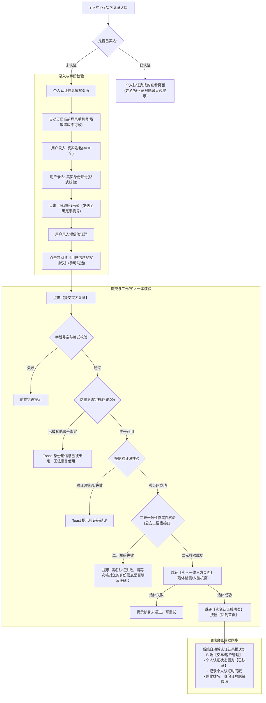

# C端H5 · 个人实名认证需求规格说明书

> **文档定位**：定义 C 端用户在移动端完成个人二元实名认证及三方实人一体核验的完整前端交互、接口校验逻辑、防重复绑定约束及与 B 端中台的同步规格。  
> **版本**：V1.0 | **更新日期**：2026-09-22 | **基准来源**：用户历史规格图与线上投产逻辑（2025/3/27 唯一性规则更新）

---

## 1. 业务流程与页面流转

---

## 2. 详细字段与控件规则

| 字段名称 | 控件类型 | 必填 | 校验规则与交互规格 | 脱敏与默认值 |
| :--- | :--- | :---: | :--- | :--- |
| **姓名** | 单行文本框 `input[text]` | 是 | 字符长度不超过 10，仅允许中文字符及少数民族生僻字/点号。 | Placeholder: `请输入真实姓名`。已认证页脱敏展示（如 `田**`）。 |
| **身份证号** | 单行文本框 `input[text]` | 是 | 前端严格执行 18 位中国大陆二代身份证号码校验算法（校验码运算 + 出生日期范围判定）。 | Placeholder: `请输入真实身份证号`。已认证页脱敏展示（如 `5109******007`）。 |
| **手机号** | 单行文本展示 | 是 | 系统自动带出当前 C 端登录账号绑定的手机号，不可手动修改，不可输入。 | 掩码脱敏展示（前 3 后 4，如 `136******694`），背景置灰只读。 |
| **验证码** | 单行输入 + 按钮 | 是 | 6 位数字验证码；点击【获取验证码】后开启 60 秒倒计时，倒计时期间按钮置灰不可点击，文案显示 `60s后重新发送`。 | Placeholder: `请输入验证码`。 |
| **用户信息授权协议** | 复选框 `checkbox` | 是 | 用户必须手动勾选同意；点击文字《用户信息授权协议》新开/跳转协议页面，从协议页返回后当前个人认证页面已录入信息完全保留不变。 | 默认不勾选。 |

---

## 3. 业务规则与异常规范

* **【R01 校验顺序】**：点击【提交实名认证】时，系统严格按照以下顺序依序校验：
  1. 真实姓名非空及长度校验（$\le 10$ 字）；
  2. 身份证号非空及有效格式校验；
  3. 经办手机号与验证码非空及正确性校验；
  4. 是否已勾选《用户信息授权协议》。
* **【R02 二元一致性核验】**：完成字段及验证码校验后，后端调用权威公安数据库进行二要素（姓名 + 身份证号）核验：
  * 若姓名与身份证号不匹配或不存在，拦截并明确提示：`实名认证失败，请再次核对您的身份信息是否填写正确；`。
* **【R03 实人一体三方活体核身】**：二元校验成功后，静默跳转实人一体三方人脸识别检测，确保操作者为证件本人。成功后引导至实名成功页。
* **【R04 唯一性防重复绑定（2025/3/27 核心约束）】**：
  * 同一个自然人身份信息（以身份证号为唯一判据）在全系统**仅能在唯一一个账号上认证通过**，严禁在多个账号间复用相同的个人身份信息。
  * 提交时若检测到该身份证号已在其他账号认证通过，系统强校验拦截并直接 Toast 报错：  
    `身份证信息已被绑定，无法重复使用！`
* **【R05 已认证查看模式】**：
  * 若当前账号已完成实名认证，进入个人认证页面后系统直接展示实名信息查看卡片；
  * 展示内容：`实名信息如下：`，包含姓名（脱敏置灰）、身份证号（脱敏置灰），不提供修改入口。
