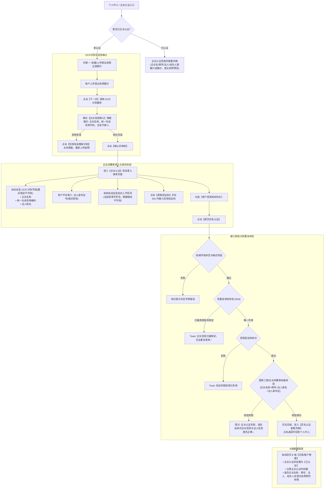

# C端H5 · 企业实名认证需求规格说明书

> **文档定位**：定义 C 端用户在移动端完成营业执照 OCR 智能识别、企业信息核验确认、企业四要素（企业名称、统一社会信用代码、法人姓名、法人身份证号）认证接口校验、防重绑定约束及向 B 端中台同步完整档案的规格。  
> **版本**：V1.0 | **更新日期**：2026-09-22 | **基准来源**：用户历史规格图与线上投产逻辑（2025/3/27 唯一性规则更新）

---

## 1. 业务流程与页面流转

---

## 2. 详细字段与表单控件规则

| 字段名称 | 界面标识 | 控件类型 | 必填 | 数据来源与可编辑性 | 交互与脱敏规格 |
| :--- | :--- | :--- | :---: | :--- | :--- |
| **营业执照** | `*请拍摄/上传营业执照正面照片` | 图片上传组件 | 是 | 本地相册选取或拍照上传。支持 JPG/PNG 格式。 | 上传后点击【下一步】触发 OCR 解析；成功后在已认证页展示缩略图，点击支持放大预览原图。 |
| **企业名称** | `*企业名称` | 单行文本框 `input[text]` | 是 | **OCR 识别结果自动反显，锁定不可修改**。 | 置灰不可编辑。在已认证页全称展示（如 `成都赚钱体育文化有限公司`）。 |
| **统一社会信用编码** | `*统一社会信用编码` | 单行文本框 `input[text]` | 是 | **OCR 识别结果自动反显，锁定不可修改**。 | 置灰不可编辑。标准 18 位大写字母与数字组合，已认证页完整展示。 |
| **法人姓名** | `*法人姓名` | 单行文本框 `input[text]` | 是 | **OCR 识别结果自动反显，锁定不可修改**。 | 置灰不可编辑。在已认证页脱敏展示（如 `吴**`、`陈**`）。 |
| **法人身份证号** | `*法人身份证号` | 单行文本框 `input[text]` | 是 | **用户手动输入**。 | 占位符 `请输入法人真实身份证号`；校验 18 位身份证算法；在已认证页脱敏展示（如 `5109******007`）。 |
| **经办人手机号** | `*经办人手机号` | 单行文本展示 | 是 | **系统自动反显当前登录手机号，锁定不可修改**。 | 掩码脱敏展示（前 3 后 4，如 `136******694`），置灰只读。 |
| **验证码** | `*验证码` | 文本输入 + 发送按钮 | 是 | 向经办人手机号发送短信验证码。 | 点击后触发 60s 倒计时，文案切换为 `60s后重新发送`，倒计时结束前禁止重复触发。 |
| **授权协议** | `已阅读并同意《用户信息授权协议》` | 单选框/复选框 | 是 | 用户必须手动勾选。 | 点击协议名称打开详情页，返回时不丢失表单状态。 |

---

## 3. 业务规则与异常规范

* **【R01 营业执照智能 OCR 与弹窗核验】**：
  * 上传营业执照正面清晰照片后，点击【下一步】调用 OCR 识别服务；
  * OCR 成功解析后，必须先呼出【企业信息确认】弹窗展示企业名称、统一社会信用代码及法定代表人；
  * 若信息解析无误，用户点击【确认并继续】进入正式信息录入步骤；若发现偏差，点击【信息有误重新识别】关闭弹窗重新上传清晰照片。
* **【R02 关键字段防篡改锁定】**：
  * 为杜绝冒用企业公章或虚构皮包公司，`企业名称`、`统一社会信用编码`、`法人姓名` 必须 100% 取自 OCR 权威解析，**前端与后端均严禁人工任意改动字符**；
  * `经办人手机号` 必须强绑定当前登录账号，防止非授权人员伪造验证。
* **【R03 校验顺序与企业四要素核验】**：
  * 点击【提交实名认证】后，严格按顺序校验：
    1. 法人身份证号非空与格式；
    2. 经办人手机号状态；
    3. 短信验证码是否有效与正确；
    4. 是否勾选授权协议。
  * 前置校验全部通过后，调用企业四要素权威数据库（国家工商业数据）比对【企业名称 + 统一社会信用代码 + 法人姓名 + 法人身份证号】；
  * **核验失败拦截**：若四要素不匹配，系统阻断提交并精准提示：  
    `企业认证失败，请在此核对企业信息与法人信息是否正确；`。
* **【R04 唯一性防重复绑定（2025/3/27 核心约束）】**：
  * 同一个企业法人主体（以统一社会信用代码为全局唯一主键判据）在全系统**仅能在唯一一个账号上进行企业认证**，严禁多个不同账号绑定同一家企业；
  * 提交时若检测到该统一社会信用代码已被其他账号认证成功，系统强制阻断并 Toast 提示：  
    `企业信息已被绑定，无法重复使用！`。
* **【R05 认证后查看模式与物证存证】**：
  * 认证成功后自动跳转认证结果页，后续从个人中心进入直接进入只读查看态；
  * 留存营业执照照片原件作为风控不可篡改物证快照，并向 B 端中台永久存证归档。
