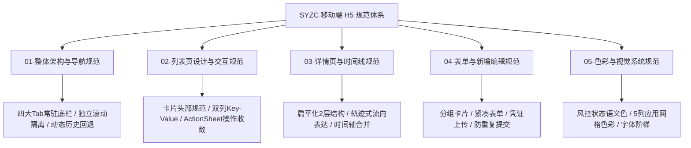

# 📱 SYZC 移动端（H5）设计与交互规范体系

> **版本**：v1.0  
> **生效时间**：2026年  
> **适用终端**：森云科技·SYZC 供应链金融存货监管系统 - 移动机构端 (H5 / 小程序)

---

## 📖 1. 规范总览

本规范基于大宗商品供应链金融与数字质押监管的真实业务场景，结合移动端人机工程学（单手触控、屏幕高宽比、视口利用率、防误触）制定。旨在彻底解决传统后台移动端**“多层卡片套娃”、“信息层级杂乱”、“操作按钮冗余”、“状态颜色混淆”**等体验痛点。

---

## 🗂️ 2. 规范文档索引

| 序号 | 规范文档 | 核心内容概要 |
| :---: | :--- | :--- |
| **01** | [01-移动端整体架构与导航规范](./01-移动端整体架构与导航规范.md) | 首页/工作台/业务办理/我的 四大Tab布局，固定底部导航架构，独立视口隔离滚动，历史路由精准回退机制。 |
| **02** | [02-移动端列表页设计与交互规范](./02-移动端列表页设计与交互规范.md) | 列表卡片三段式排版（Header/Body/Footer），单据号+状态Tag标准化，双列Key-Value指标，操作收敛至ActionSheet，顶部筛选降噪。 |
| **03** | [03-移动端详情页与时间线规范](./03-移动端详情页与时间线规范.md) | 扁平化二层结构（杜绝卡片套娃），业务轨迹流向呈现（移库/加工/转让），轻量化审批时间轴，中仓登/存证穿透机制。 |
| **04** | [04-移动端表单与新增编辑规范](./04-移动端表单与新增编辑规范.md) | 移动端表单分组原则，必填项与数字单位规范，底部吸底按钮组，二次防重复提交与弱网保护。 |
| **05** | [05-移动端色彩与视觉系统规范](./05-移动端色彩与视觉系统规范.md) | 风控状态语义色阶（正常/预警/冻结/已结清），5列应用网格图标色彩系统，字体与间距栅格标准。 |

---

## 🚀 3. 核心设计原则（Core Principles）

1. **三维权限穿透**：
   - **功能权限**：控制按钮显隐（如：查看、开立、审批、平仓、核销）；
   - **仓库权限（物理防线）**：实物作业与IoT设备严格受账号管辖仓库隔离；
   - **机构数据权限（金融防线）**：融资授信与审批流按顶级/子级机构纵向隔离。
2. **拒绝深层嵌套套娃**：
   - 严禁在移动端使用超过 2 层的卡片内嵌套；明细数据优先使用抽屉或弹窗平铺展现。
3. **关键业务流向可视化**：
   - 涉及物权与位置转移的作业（移库、转让、加工、出库），必须以 `源 ➔ 目标`、`原料 ➔ 成品` 的链路式表达。
4. **强一致性与防误触防护**：
   - 移动端严禁裸露高危按钮（如“删除设备”、“平仓处置”），必须通过更多菜单唤起并配备二次阻断确认。
