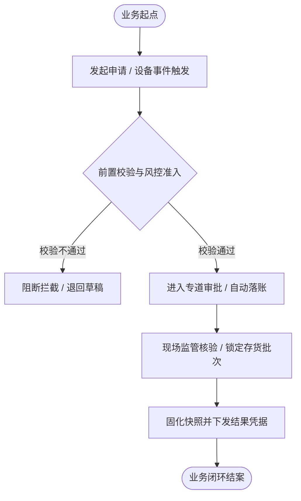
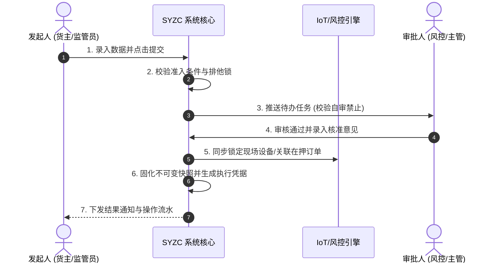

# 业务流程推演模板

> **定位**：业务流程推演文档是业务菜单与跨模块业务链路的**动态沙盘演练说明书**，帮助研发、测试和风控专家快速理解各业务环节的数据流转、货权控制、状态变化与物理/系统级联联动。  
> **适用范围**：SYZC 供应链金融存货监管系统各业务板块（仓储监管、融资监管、物联设备、实时风控等）的独立业务菜单。  
> **与 PRD 的区别**：
> - PRD 侧重“规则定义”（静态规范），流程推演侧重“运行演示”（动态协同）
> - PRD 面向“怎么做与怎么判”，流程推演面向“流转后数据与资产状态长什么样”

---

## 使用说明

### 按复杂度裁剪模板

| 复杂度 | 典型 SYZC 场景 | 保留章节 | 可省略 |
| :--- | :--- | :--- | :--- |
| **单据内流转** | 现场盘点单从创建、核实到完成过账；无跨系统联动 | 第一章（简化为状态图）、第二章、第三章、第五章、第七章 | 第四章（无跨单联动）、第六章（无跨模块一致性） |
| **两单联动闭环** | 入库单 → 仓单锁定生成；出库申请 → 提货单核验核销 | 第一至七章 全保留，重点呈现上下游状态回写 | 中间跨系统单据步骤 |
| **物联穿透链路** | IoT 设备预警触发 → 订单预警穿透生成 → 现场核销解除闭环 | 第一至七章 全保留，突出物联数据流与台账联动 | 无 |
| **金融质押闭环** | 存货入库 → 仓单质押申请 → 银行审批放款 → 动态监库预警 → 还款解押提货 | 第一至八章 全保留（最完整模式） | 无 |

---

# {流程/菜单名称} 业务流程推演

> **覆盖场景**：{主流程场景A} / {异常分支场景B} / {逆向撤销与结案流程}  
> **不展开范围**：{不在本文推演的外部系统环节，如银行内部核心账务}  
> **参考文档**：《{相关主PRD}》《{字段清单}》《AGENTS.md》  
> **版本**：V1.0 | {YYYY-MM-DD}

---

## 一、业务流程概述

### 1.1 核心业务特征说明
<!-- 提示：用 3-5 个要点概括本流程的核心特征与监管约束。用 ✅ 标注正面特征，用 ⚠️ 标注风控限制。 -->
- ✅ 特点 1：{例如：动产质押货权全程穿透，现场存货批次与系统台账 1:1 强绑定}
- ✅ 特点 2：{例如：IoT 物联告警毫秒级触发，支持自动穿透至关联在押订单}
- ⚠️ 约束 1：{例如：存在生效中质押单的库位存货，强校验拦截任何未经报备的移库或出库}
- ⚠️ 约束 2：{例如：审批流执行 P06/R11 自审禁止，申请人本人严禁参与审批}

### 1.2 本业务在全局数据链路中的位置


### 1.3 完整端到端流程图（Mermaid flowchart）



---

## 二、涉及角色与参与主体

| 参与主体 | 核心职责 | 参与节点与权限说明 | 系统角色编码 |
| :--- | :--- | :--- | :--- |
| **借款企业 / 货主** | 发起业务申请、申报存货信息、提交资质材料 | 初始申请、补充质押物、解押申请 | `R-BORROWER` |
| **仓储监管企业** | 现场验货称重、存货监库、开锁申请、设备巡检 | 现场核实、设备告警解除、开锁申请 | `R-WAREHOUSE-OP` |
| **风控审核人员** | 审核质押资质、核准预警处置、平仓决策 | 单据审批、预警解除复核、规则配置 | `R-RISK-MGR` |
| **资金方 / 银行** | 质押额度终审、放款确认、还款解押确认 | 额度审批、解押授权 | `R-BANK-AUDIT` |

---

## 三、涉及单据、记录与职责

| 单据 / 记录名称 | 业务层级 | 核心职责 | 上游来源 | 下游联动 | 实物与资产状态影响 |
| :--- | :--- | :--- | :--- | :--- | :--- |
| {单据A} | 申请层 | 记录业务意图与申报参数 | 货主录入 | 触发审批流 | 存货标记为预占用 |
| {单据B} | 审批/凭据层 | 权威审核结论与法律存证 | 风控审批 | 下发执行凭证 | 固化不可变快照，存货正式锁定 |
| {单据C} | 执行/结果层 | 现场实际交付与计量结果 | 现场称重 | 回写台账 | 实物物理状态与系统台账一致 |

---

## 四、主流程时序推演（Mermaid sequenceDiagram）



---

## 五、单据与事件级联联动规则表

| 触发动作 | 触发条件 | 级联影响对象 | 传递与继承数据 | 状态与后置变更 | 异常回滚策略 |
| :--- | :--- | :--- | :--- | :--- | :--- |
| 审核通过生效 | 满足风控与质押率要求 | 关联存货批次台账 | 继承单据号、质押单价、锁定时间 | 可用库存扣减，在押锁定库存增加 | 抛出异常并回滚事务 |
| 设备离线告警 | 离线持续时长超限 | 订单预警流水 | 继承设备ID、所在仓库库区、在押订单号 | 自动生成高危预警，推送风控员 | 保持设备侧告警 |

---

## 六、关键异常与分支处置推演

- **分支 1【质押存货重复质押拦截】**：申报存货已被其他生效单据占用时，系统提示已被占用明细并阻断提交。
- **分支 2【自审禁止拦截】**：审批人误点击本人申请时，系统强行隐藏操作并返回拦截提示。
- **分支 3【现场解除告警与订单联动回写】**：现场监管员核实设备正常后执行人工解除，系统校验通过后联动结案关联的订单预警。

---

## 七、关键架构决策与证据留痕

1. **为什么必须固化不可变快照？**
   - 保障司法存证证据效力，防止基础主数据变更篡改历史业务事实。
2. **为什么专道审批不进入通用待办池？**
   - 保证毫秒级/秒级响应速度，满足现场高频作业需求。

---

## 八、待确认问题清单

| 编号 | 待确认问题 | 影响文件 | 建议决策方 |
| :--- | :--- | :--- | :--- |
| Q01 | [待确认的具体业务疑问] | 主 PRD / 业务规则规格 | 业务风控方 / 银行方 |
```
