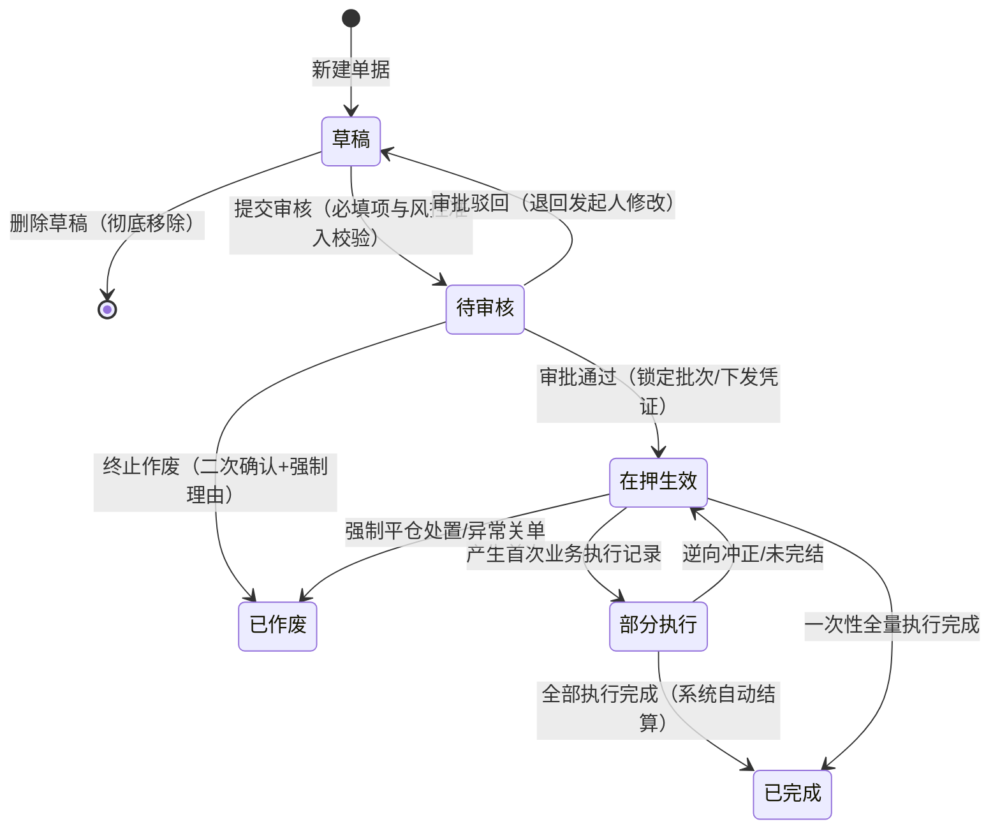

# SYZC 状态机设计模板

> **适用范围**：SYZC 系统中所有具备生命周期流转的业务对象，包括业务单据（入库/出库/移库/提货）、金融单据（质押申请/解押申请）、审批单据（开锁审核）及物联网事件。  
> **关联依据**：配套使用 `05-常用模板/需求处理/2-2 (输入)单据状态与流转设计规范.md`。规范文件定义**设计原则**，本模板定义**输出格式与标准范式**。

---

## 🛠️ 典型业务状态机范式库

在设计状态机前，首先根据本菜单业务类型匹配最适宜的状态机范式：

### 范式 1：单据事务类（如入库单、出库单、质押申请、解押申请）
`草稿` → `待审核`（如有） → `待执行/在押生效` → `部分执行`（如有） → `已完成/已解押`（终态） / `已作废`（终态）

### 范式 2：物联网与风控事件（如设备预警、订单预警）
遵循统一三态词表：
- `待处置 · 有效` (PENDING)
- `已结案 · 有效` (RESOLVED)（通过人工解除或系统自动恢复结案）
- `已作废` (INVALID)（判定为误报或无效告警）

### 范式 3：专网专道审批类（如开锁审核、特批处理）
`待审核`（提交即进入） → `已通过`（专道下发临时凭证） / `已驳回`（终态，不可再审） / `已撤回`（申请人主动撤回）

---

## 一、状态定义表

| 状态名称 | 枚举编码 | 业务含义 | 是否终态 | 进入条件 | 离开条件 |
| :--- | :--- | :--- | :---: | :--- | :--- |
| 草稿 | `DRAFT` | 创建后尚未正式提交，仅发起人可见，可自由修改与删除 | 否 | 用户新建保存草稿 | 提交审核 或 物理删除草稿 |
| 待审核 | `PENDING_AUDIT` | 已正式提交，锁定核心字段，等待审批角色确认 | 否 | 提交审核校验通过 | 审核通过 / 审核驳回 / 发起人撤回 |
| 在押生效 / 待执行 | `ACTIVE` / `PENDING_EXEC` | 审核通过，正式生效，货权或库存锁定，等待后续执行 | 否 | 审核通过确认 | 业务全量执行 / 触发预警 / 发起变更 |
| 已完成 / 已结案 | `COMPLETED` / `RESOLVED` | 业务全链路闭环，存货解押释放或台账现场核销 | **是** | 业务全量完成或正常结案 | —（终态不可逆） |
| 已作废 / 已驳回 | `VOIDED` / `REJECTED` | 单据或告警被判定无效或被拒绝终止 | **是** | 人工核实作废并录入原因 | —（终态不可逆） |

**设计准则**：
- **先少后多**：满足当前风控与业务闭环即可，不为了显复杂而生造过渡状态。
- **业务语言优先**：展示名称必须贴近业务实际（如「在押生效」优于「RUNNING」）。
- **每个状态必须回答三件事**：当前处于什么监管阶段？允许做什么？禁止做什么？

---

## 二、状态流转图（Mermaid）

---

## 三、状态流转动作表（核心交付物）

> 每行 = 一个当前状态 + 一个触发动作 = 一条可被研发与测试严格执行的代码级规则。

| 当前状态 | 触发动作 | 触发主体/角色 | 前置条件（准入拦截） | 目标状态 | 二次确认与弹窗交互 | 后置级联影响（含锁定与快照） | 异常与失败提示 |
| :--- | :--- | :--- | :--- | :--- | :--- | :--- | :--- |
| 草稿 | 提交审核 | 发起人 | 必填字段完整，质押率未超标，存货未重复抵质押 | 待审核 | 无弹窗 | 单据核心字段锁定，生成审批快照，进入待办池 | Toast：「提交失败：质押存货存在锁定批次」 |
| 草稿 | 删除 | 发起人 | 仅允许处于草稿状态 | 记录消失 | 确认弹窗：「确定删除该草稿？删除后不可恢复」 | 物理清除草稿数据 | — |
| 待审核 | 审批通过 | 审批人（拦截本人申请） | 满足风控合规校验，触发自审禁止拦截检查 | 在押生效 | 审核确认弹窗（可填审批意见） | 固化不可变快照，扣减可用库存，增加在押锁定量 | Toast：「操作失败：审批人不可审批本人申请」 |
| 待审核 | 审批驳回 | 审批人 | 强制录入驳回原因（≤200字） | 草稿 | 驳回弹窗（必填原因） | 解锁单据，回写驳回原因，通知发起人 | Toast：「请填写驳回原因」 |
| 在押生效 | 申请解押 | 货主/监管员 | 满足还款解押条件，无挂起的高危预警 | 解押处理中 | 解押确认弹窗 | 校验当前在押价值，生成解押凭据 | Toast：「当前存货存在未解除高危预警，禁止解押」 |

---

## 四、动作能力矩阵

| 业务动作 | 草稿 | 待审核 | 在押生效 | 待补仓 | 已完成 | 已作废 |
| :--- | :---: | :---: | :---: | :---: | :---: | :---: |
| 查看详情 | ✅ | ✅ | ✅ | ✅ | ✅ | ✅ |
| 编辑保存 | ✅ | ❌ | ❌ | ❌ | ❌ | ❌ |
| 删除草稿 | ✅ | ❌ | ❌ | ❌ | ❌ | ❌ |
| 提交审核 | ✅ | ❌ | ❌ | ❌ | ❌ | ❌ |
| 撤回申请 | ❌ | ✅（仅发起人） | ❌ | ❌ | ❌ | ❌ |
| 审核通过 | ❌ | ✅（非本人） | ❌ | ❌ | ❌ | ❌ |
| 审核驳回 | ❌ | ✅（非本人） | ❌ | ❌ | ❌ | ❌ |
| 补仓/处置 | ❌ | ❌ | ❌ | ✅ | ❌ | ❌ |
| 打印存证 | ❌ | ❌ | ✅ | ✅ | ✅ | ✅ |

*说明：✅ = 允许操作；❌ = 不允许（页面隐藏按钮或置灰禁用）；✅（条件）= 允许但受权限或自审禁止约束。*
