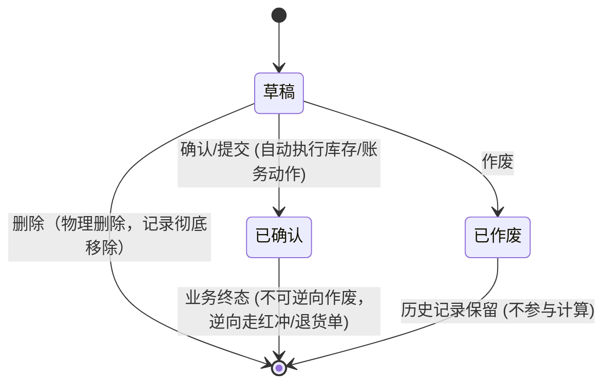

# 业务规则规格模板

> **文档定位**：本文件是业务模块（业务单据、聚合查询、流水账簿等）**状态机、动作约束、校验规则、计算公式、权限与风控规则的唯一定义来源**。
> **关联依据**：配套使用 `2-1 (输入)状态机设计模板.md` 与 `2-2 (输入)单据状态与流转设计规范.md`。
> **在 PRD 套件中的分工**：
> - 业务规则规格是**唯一规则与流程来源**：状态机、校验规则、权限矩阵，以及跨模块流程图/时序图，均写入本文件；**不再单独维护「业务流程.md」**。
> - 流程推演内容归入本文件末尾 **「## 业务流程与联动」** 章节（单据类跨模块 flowchart、配置类 sequenceDiagram、设备类操作 flowchart 等）。
> - Demo PRD 和主 PRD 仅**引用本文件的规则 ID（如 R01, C01, P01）及流程章节**，严禁重复硬编码规则本体。
> **版本**：V1.0 | 更新时间：YYYY-MM-DD | 责任人：[设计人]

---

## 🛠️ 使用说明与裁剪指南

在设计具体业务模块的规则规格时，首先判断该模块的**业务类型**，并选择对应的模板范式进行裁剪（MECE 原则：不重不漏）：

| 模块类型 | 典型场景 | 核心特征 | 模板裁减规则 |
| :--- | :--- | :--- | :--- |
| **类型 A：单据/事务类** | 采购订单、采购入库单、退货单、解押申请单 | 具备完整的状态生命周期（草稿 → 待审核/待确认 → 完成/作废） | **保留全套状态机**：使用【范式 A：单据事务类模板】（保留 第一至八章） |
| **类型 B：聚合查询/计算类** | 即时库存查询、质押额度汇总、可用资金查询 | 无状态机，涉及多维度指标实时计算、公式汇总与安全预警 | **移除状态机**：使用【范式 B：聚合指标计算类模板】（聚焦计算公式 C01+预警 W01） |
| **类型 C：流水/明细查询类** | 库存流水查询、操作审计日志、出入库记录明细 | 无状态机，只读检索大批量明细，强调权限限制与写入一致性 | **移除状态机**：使用【范式 C：流水账簿明细类模板】（聚焦权限 P01+筛选 F01+对账 W01） |

---

# 范式 A：单据事务类业务规则规格模板（含状态机）

> 适用场景：所有具有状态流转的业务单据（如订单层、通知层、执行层单据）。

```markdown
# {单据名称} 业务规则规格

> **文档定位**：{单据名称}状态机、动作约束、校验规则、权限与计算规则的唯一定义来源。
> **参考文档**：《{主PRD名称}》《{字段清单名称}》《单据状态与流转设计规范》《状态机设计模板》
> **版本**：V1.0 | {YYYY-MM-DD}

---

## 一、单据定位

| 项目 | 内容 |
| :--- | :--- |
| **单据层级** | **【第1层-计划层 / 第2层-订单层 / 第3层-执行结果层】** |
| **核心职责** | {一句话说明本单据的核心业务价值与数据影响} |
| **单据来源** | {如：手动创建 / 基于上游PO单按1:N生成 / 物联网系统触发自动生成} |
| **上游单据** | {上游单据名称，标注对应关系：如 1:1, 1:N} |
| **下游影响** | {如：生成下游入库单 / 扣减可用库存 / 生成应付记录 / 更新质押率} |
| **审核流** | **【有审核流 / 无审核流】**（执行层单据通常无审核流，由“草稿 → 确认”直接生效） |

### 数量/金额口径隔离表（如适用）

| 口径名称 | 存在于 | 业务含义与公式 | 约束条件 |
| :--- | :--- | :--- | :--- |
| 计划数量 | 订单明细 | 原始申请/计划采购数量 | 审核后强锁定，不可修改 |
| 本次实收数量 | 执行单明细 | 现场实际点收到的物理数量（含不良品） | 本次实收数量 ≥ 0 |
| 本次入库数量 | 执行单明细 | 验货通过、正式计入系统现存的数量 | 0 ≤ 本次入库数量 ≤ 本次实收数量 |

---

## 二、状态定义

| 状态名称 | 枚举值 (`Enum`) | 业务含义 | 是否终态 | 进入条件 | 离开条件 |
| :--- | :--- | :--- | :---: | :--- | :--- |
| 草稿 | `DRAFT` | 已创建或保存草稿，尚未提交或确认，可自由编辑/物理删除 | 否 | 单据创建时 | 提交审核 / 确认入库 / 作废 / 物理删除 |
| 待审核 | `PENDING_AUDIT` | 已提交，等待审批节点确认（仅订单层） | 否 | 提交审核成功 | 审核通过 / 驳回 / 作废 |
| 已确认/已生效 | `CONFIRMED` | 业务生效，库存/财务/质押动作已执行，单据全字段锁定 | **是** | 「确认/审核通过」动作成功 | — |
| 已作废 | `VOIDED` | 业务失效，单据保留历史镜像但不参与任何汇总与计算 | **是** | 「作废」动作确认 | — |

**设计说明**：
- 执行层单据不设中间审核态，统一采用“草稿 → 已确认”直接生效架构。
- 状态变更严格禁止通过表单 Dropdown 下拉框直接修改，必须通过独立动作按钮触发。

---

## 三、状态流转图



---

## 四、状态流转表（核心规则矩阵）

| 当前状态 | 触发动作 | 前置校验条件 | 结果状态 | 二次确认弹窗 | 后置级联影响 | 失败阻断提示 (Toast) |
| :--- | :--- | :--- | :--- | :--- | :--- | :--- |
| 草稿 | 提交/确认 | R01: 必填项完整<br/>R02: 数量 > 0<br/>R03: 额度/现存满足条件 | 已确认 | 「确认执行{单据名称}？确认后将更新库存/账务」 | ① 锁定单据全字段<br/>② 写入库存流水 (+N)<br/>③ 更新上游单据已执行计数器 | Toast: 「确认失败：{具体未满足的前置条件}」 |
| 草稿 | 物理删除 | R04: 仅限草稿态 | 彻底消失 | 「删除后数据不可恢复，确认删除？」 | 单据记录及暂存明细从数据库物理删除 | Toast: 「该单据已被其他人处理，无法删除」 |
| 草稿 | 作废 | R05: 无已生效执行记录 | 已作废 | 「作废后单据失效且不可恢复，确认作废？」 | 单据置为只读，保留单据号与修改轨迹 | Toast: 「作废失败：单据状态已变更」 |

---

## 五、动作能力矩阵

| 操作动作 | 草稿 (`DRAFT`) | 待审核 (`PENDING_AUDIT`) | 已确认 (`CONFIRMED`) | 已作废 (`VOIDED`) |
| :--- | :---: | :---: | :---: | :---: |
| **查看详情** | ✅ | ✅ | ✅ | ✅ |
| **编辑修改** | ✅ | ❌ | ❌ | ❌ |
| **物理删除** | ✅ | ❌ | ❌ | ❌ |
| **提交 / 确认** | ✅ | ✅ | ❌ | ❌ |
| **作废** | ✅ | ✅ | ❌ (逆向走退货/红冲) | ❌ |
| **导出数据** | ✅ | ✅ | ✅ | ✅ |
| **打印单据** | ✅ (带草稿水印) | ✅ (带审核中水印) | ✅ (正式单据) | ❌ |

---

## 六、特殊动作规则对比（作废 vs 缺量关单/退货）

| 比较维度 | 作废 (Void) | 缺量关单 (Close) / 逆向退货 (Return) |
| :--- | :--- | :--- |
| **业务含义** | 彻底撤销未生效的业务意图，作废前无物理业务发生 | 终止剩余未执行数量，保留已生效部分；或对已生效单据发起逆向冲正 |
| **适用状态** | 草稿态 (`DRAFT`)、待审核态 | 已确认/部分执行态 (`CONFIRMED` / `PARTIAL`) |
| **数据影响** | 0 影响（不写流水、不扣余额） | 保留已有流水，释放剩余未出库/未入库占用额度 |
| **弹窗提示** | 「作废后单据不可恢复」 | 「关单后剩余未执行数量将作废且不再接收」 |

---

## 七、权限与数据隔离规则

| 规则ID | 规则分类 | 具体规则定义 | 异常/无权限处理 |
| :--- | :--- | :--- | :--- |
| P01 | 菜单权限 | 用户必须具备 `[{模块功能位}·查看]` 权限方可进入列表及详情页 | 隐蔽菜单入口或提示「无访问权限」 |
| P02 | 操作子权限 | `[编辑]`、`[确认]`、`[作废]`、`[导出]` 须配置独立子权限位 | 按钮置灰或隐藏 |
| P03 | 数据隔离 | 仓管角色数据范围：`仓库 IN User.AssignedWarehouses`；财务/管理员：`租户全量` | 自动追加 SQL 过滤条件，列表静默隔离 |

---

## 八、规则索引

| 规则类型 | 规则代码范围 | 说明 |
| :--- | :--- | :--- |
| 前置校验规则 | R01 – R09 | 包含必填校验、数值校验、幂等防重校验 |
| 业务计算规则 | C01 – C09 | 包含数量口径计算、金额汇总、库存回写规则 |
| 权限与隔离规则 | P01 – P09 | 包含 RBAC 权限位与数据范围隔离 |

---

## 业务流程与联动

> 跨模块主路径、时序推演、异常回路。与上文状态流转表配合阅读；**重复的状态机定义以上文为准**。

{从原业务流程推演合并：flowchart / sequenceDiagram / 角色职责表 / 异常分支表}

---

## 修订记录

| 日期 | 变更摘要 |
| :--- | :--- |
| YYYY-MM-DD | V1.0 初版 |
```

---

# 范式 B：聚合查询与指标计算类规则规格模板（无状态机）

> 适用场景：即时库存查询、资产/货权汇总大屏、质押率与可用额度实时计算视图等。

```markdown
# {查询/指标模块名称} 业务规则规格

> **文档定位**：{模块名称}核心计算公式、数据聚合规则、预警阈值、权限隔离与筛选控制的唯一定义来源。
> **参考文档**：《{主PRD名称}》《{字段清单名称}》《资产风控指标规范》
> **版本**：V1.0 | {YYYY-MM-DD}

---

## 一、能力定位

| 项目 | 内容 |
| :--- | :--- |
| **页面类型** | 只读聚合查询视图 / 指标监控面板 |
| **核心指标** | {如：现存库存、占用库存、可用库存、货权质押率、实时货值} |
| **计算时机** | 用户发起查询时实时聚合（或基于底层流水增量表秒级维护） |
| **状态机** | **无状态机**（纯只读查询，无状态变更动作） |

---

## 二、核心指标计算规则

### 2.1 基础计算公式

| 规则ID | 指标名称 | 计算公式与维度 | 数据来源与补零逻辑 |
| :--- | :--- | :--- | :--- |
| C01 | **现存 (On Hand)** | `现存 = 期初库存 + Σ入库流水 - Σ出库流水`<br/>维度：`商品编码 + 仓库编码 (+ 批次号)` | 来源：期初初始化 + 库存流水表 (`Direction IN/OUT`)；若无记录则现存默认为 `0` |
| C02 | **占用 (Allocated)** | `占用 = Σ未完成订单明细未出库数量`<br/>条件：`订单状态 ∈ {待出库, 部分出库}` 且 `未出库数量 > 0` | 按 `商品编码 + 仓库编码` 实时汇总；取消/驳回订单实时释放占用 |
| C03 | **可用 (Available)** | `可用_raw = 现存 - 占用`<br/>展示逻辑：`可用 = max(0, 可用_raw)` | 当 `可用_raw < 0` 时，展示 `0` 并触发 C04 异常预警提示 |

### 2.2 实时性与一致性保障

| 规则ID | 规则要求 |
| :--- | :--- |
| C11 | **实时性要求**：查询时读取事务已提交后的最新数据库镜像，延迟目标 `< 3秒`。禁止直接将昨日 T+1 离线快照作为实时查询唯一源。 |
| C12 | **对账强一致性**：若底层流水写入与余额表更新发生并发冲突，必须以流水事务回滚为准，保证“现存 = Σ流水”。 |

---

## 三、风控与安全预警规则

| 规则ID | 预警类型 | 触发条件表达式 | 前端视觉展示 | 联动响应动作 |
| :--- | :--- | :--- | :--- | :--- |
| W01 | **低库存预警** | `现存 ≤ 安全库存` (且商品档案安全库存 > 0) | 列表行高亮显示橙色 `[低于安全库存]` Tag | 仅页面视觉提示，一期不自动生成补货单 |
| W02 | **超卖/透支预警** | `现存 < 占用` (即 `可用_raw < 0`) | 列表展示红色 `[占用超限]` 图标及 Banner | 阻断新增该商品的销售订单审核 |

---

## 四、筛选与排序规则

| 规则ID | 筛选项 | 匹配规则与逻辑 | 校验与边界条件 |
| :--- | :--- | :--- | :--- |
| F01 | 不显示零库存 | 默认开关状态：`ON` | `ON`: 自动追加过滤 `现存 > 0`；`OFF`: 展示全量记录（零库存行灰色显示） |
| F02 | 组合筛选 | 多条件间统一采用 **AND** 逻辑 | 支持商品编码、仓库、批次号组合查询 |
| F03 | 范围校验 | 库存数量下限/上限范围筛选 | 必须满足 `下限 ≤ 上限`，否则 Toast 提示：「库存范围设置不正确」 |
| F04 | 默认排序 | `仓库编码 ASC` → `商品编码 ASC` | 支持点击列头切换按现存量或可用量排序 |

---

## 五、权限与导出规则

| 规则ID | 规则分类 | 规则内容 |
| :--- | :--- | :--- |
| P01 | 菜单权限 | 必须具备 `[库存管理 · 即时库存查询 · 查看]` 权限 |
| P02 | 导出限制 | 导出按当前筛选条件全量导出，上限 `50,000` 条；超出时阻断导出并提示缩小范围 |
| D01 | 列不可隐藏 | 现存、占用、可用为核心三大口径，界面上严禁列隐藏 |
| D02 | 导出文件名 | 命名格式：`即时库存查询_{YYYYMMDD_HHmmss}.xlsx` |
```

---

# 范式 C：流水账簿与明细查询类规则规格模板（无状态机）

> 适用场景：库存变动流水查询、设备门禁通行日志、审计日志、资金变动明细等。

```markdown
# {流水/明细模块名称} 业务规则规格

> **文档定位**：{明细模块名称}的数据追溯规则、检索阻断条件、数据快照机制及导出规范的唯一定义来源。
> **参考文档**：《{主PRD名称}》《{字段清单名称}》
> **版本**：V1.0 | {YYYY-MM-DD}

---

## 一、能力定位

| 项目 | 内容 |
| :--- | :--- |
| **页面类型** | 只读明细账簿列表 (Audit Trail Ledger) |
| **核心职责** | 记录并追溯每一笔业务动作引发的底层数据变动历史，提供源单据跳转与对账 |
| **写入模式** | **只读模块**（数据仅由上游业务单据确认时由系统后台统一写入，本模块无新增/修改/删除能力） |
| **状态机** | **无状态机** |

---

## 二、权限与数据隔离

| 规则ID | 权限维度 | 规则定义 | 无权限响应表现 |
| :--- | :--- | :--- | :--- |
| P01 | 模块进入 | 须具备 `[{模块位} · 查看]` 权限 | 隐藏菜单 / 阻断访问 |
| P02 | 单据跳转 | 点击来源单号跳转时，须具备对应单据模块的 `[查看]` 权限 | 若无权限，来源单号渲染为普通文本，不可点击跳转 |
| P03 | 仓库/机构隔离 | 仓管角色限制为 `仓库 IN 管辖列表`；若未配置管辖仓库，等同于无数据 | 界面展示 Banner 提示：「未配置管辖仓库权限，请联系管理员」 |

---

## 三、检索与防全表扫描规则

| 规则ID | 规则类型 | 规则逻辑定义 | 触发阻断提示 |
| :--- | :--- | :--- | :--- |
| F01 | 必填条件限制 | 点击【搜索】时，必须满足**至少填选一项**条件（如商品、仓库、来源单号、日期范围） | 若全空点击搜索，Toast 提示：「请至少输入或选择一个查询条件」 |
| F02 | 默认不加载 | 进入页面时**不自动触发全表查询**，必须由用户输入条件后手动点击【搜索】 | 避免数据量过大导致数据库 Slow Query |
| F03 | 时间跨度限制 | 日期区间选择筛选 | 若 `结束日期 - 开始日期 > 366天`，阻断查询并 Toast: 「时间跨度不能超过一年」 |
| F04 | 默认排序 | `业务发生时间 DESC` → `流水ID DESC` | 保障最新变动排在首位 |

---

## 四、显示与数据快照规则

| 规则ID | 显示维度 | 规则逻辑定义 |
| :--- | :--- | :--- |
| D01 | 数值符号映射 | 变动方向为 `IN` 时显示 `+{数量}`（绿字/黑字）；变动方向为 `OUT` 时显示 `-{数量}`（红字） |
| D02 | 历史数据快照 | 流水记录中的商品名称、规格、仓库名称在写入时**强制持久化快照**，主档案后续改名不刷历史流水 |
| D03 | 导出限制 | 导出按筛选条件全量导出，上限 `50,000` 行；耗时 `>30s` 提示缩小时间范围 |

---

## 五、底层对账与一致性写入规则 (研发对账专用)

| 规则ID | 规则类型 | 约束定义 |
| :--- | :--- | :--- |
| W01 | 事务同一性 | 流水写入必须与来源单据“确认/生效”处于**同一个数据库本地事务**内 |
| W02 | 幂等键防重 | 幂等联合主键 = `来源单据号 + 来源明细行ID + 变动方向 + 仓库编码` |
| W03 | 失败强回滚 | 若流水写入失败，来源单据确认动作必须**强行回滚**，绝不允许出现“单据已生效但流水丢失” |
```

---

## ✅ 设计自检清单 (Checklist)

完成业务规则规格文档编写后，必须对照以下自检项进行走查：

- [ ] **死状态检查**：是否存在永远无法到达的状态？（检查每个状态是否有对应的进入动作与前置条件）
- [ ] **死循环/死锁检查**：是否存在进入后无法离开的非终态？（除 `COMPLETED`、`CONFIRMED`、`VOIDED` 等终态外，其他状态均需有离开路径）
- [ ] **违规下拉修改检查**：是否存在表单可以直接修改状态 Dropdown 的设计？（违反规范 2.4，必须改为动作按钮+确认弹窗）
- [ ] **物理删除与作废隔离**：是否严格区分了草稿态的“物理删除（记录消失）”与历史态的“作废（记录保留、不参与计算）”？
- [ ] **能力矩阵完整性**：动作能力矩阵是否覆盖了当前模块的所有操作动作，且无遗漏空格？
- [ ] **规则代码唯一性**：是否为所有的校验（R）、计算（C）、权限（P）、筛选（F）、展示（D）、预警（W）分配了唯一的编号代码？
- [ ] **删除主数据处理**：主数据模块是否禁用了物理删除，统一采用“启用/停用”状态机控制？
