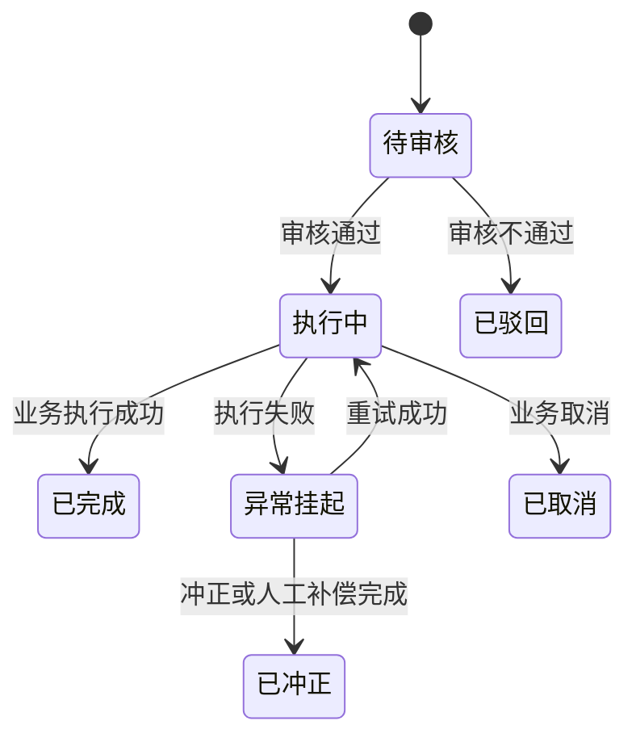

# 字段清单模板（业务对象通用版）

> **文档定位**：本文件用于定义一个业务对象的字段、页面行为、数据关系、状态动作、库存控制和审计要求。
> **适用对象**：业务单据、基础档案、库存余额、库存流水、设备主档、设备事件、合同、抵质押占用关系等。
> **使用原则**：每个业务对象单独维护字段清单；不要把不同对象的字段硬塞进同一张表。
> **状态原则**：新增保存后直接进入该业务定义的首个正式状态；状态必须按业务对象单独定义。
> **技术映射原则**：本模板面向业务和产品设计，不维护数据库字段名、接口属性名等技术映射；技术映射由接口/数据库字典单独维护。
> **版本**：V3.0 | 更新时间：YYYY-MM-DD | 责任人：[设计人]

---

## 一、文件头部（必填）

```markdown
# [业务对象名称]字段清单

> **业务场景**：[入库 / 出库 / 移库 / 盘点 / 存货调整 / 设备管理 / 合同管理 / 存货抵质押 / 其他]
> **对象类型**：[业务单据 / 基础档案 / 库存余额 / 库存流水 / 设备事件 / 合同 / 关系对象]
> **数据结构**：[主表 + 明细表 / 主表 + 关系表 / 事件表 / 流水表 / 单表]
> **业务目的**：[用一句话说明这个对象解决什么问题]
> **数据来源**：[用户填写 / 系统生成 / 基础档案 / 物联网或第三方平台 / 外部接口 / 风控规则]
> **关联对象**：[仓库、货品、货位、货主、合同、仓单、融资申请、抵质押单、设备等]
> **首个正式状态**：[待审核 / 待执行 / 待签署 / 待绑定 / 其他，按本业务实际填写]
> **状态终点**：[已完成 / 已生效 / 已解押 / 已注销 / 已冲正 / 其他，按本业务实际填写]
> **版本**：V3.0 | 更新时间：YYYY-MM-DD | 责任人：[设计人]
```

### 文件头部填写说明

| 项目 | 填写要求 |
| :--- | :--- |
| 业务场景 | 明确这份字段清单服务于哪一种业务，不要用“通用单据”代替具体场景。 |
| 对象类型 | 先判断这是单据、档案、余额、流水、事件、合同还是关系对象，再决定字段放在哪张表。 |
| 数据结构 | 明确是否包含主表、明细表、关系表、事件表或库存流水表。 |
| 关联对象 | 写清楚这个对象与哪些业务对象互相影响，尤其是库存、货权、合同、设备和抵质押占用。 |
| 首个正式状态 | 新增保存后直接进入的状态。每个业务对象自行定义，不套用其他业务的状态。 |
| 状态终点 | 业务完成后的最终状态；如支持撤销、冲正或重新处理，也要在状态动作表中写清楚。 |

---

## 二、字段定义表

> 这张表回答“字段是什么、从哪里来、能不能改、如何校验”。
> `字段名称`使用业务人员看得懂的中文名称；数据库字段名和接口属性名不在本表维护。

| 字段名称 | 所属对象 | 数据层级 | 字段分组 | 字段来源 | 数据类型 | 取值、单位与精度 | 保存方式 | 必填规则 | 字段说明 | 校验规则 | 敏感与脱敏 | 关联或备注 |
| :--- | :--- | :--- | :--- | :--- | :--- | :--- | :--- | :--- | :--- | :--- | :--- | :--- |
| [例如：入库单号] | [入库单] | 主表 | 基础识别 | 系统生成 | 文本 | 格式、长度、是否唯一 | 保存当前值 | 系统自动 | 这张入库单的唯一编号 | 自动生成，不能重复 | 否 | 与入库明细、库存流水关联 |
| [例如：入库数量] | [入库明细] | 明细表 | 数量信息 | 用户填写 | 数量 | 数值、单位、小数位 | 提交时保存 | 必填 | 本次实际入库的数量 | 必须大于 0，不得超过业务允许上限 | 否 | 计入库存增加流水 |
| | | | | | | | | | | | | |

### 字段定义表列规范

| 列名 | 填写规范 |
| :--- | :--- |
| 字段名称 | 使用业务人员和研发都能理解的中文名称。一个字段只表达一个含义，不要用“其他信息”“相关内容”等模糊名称。 |
| 所属对象 | 填写字段属于哪一个对象，例如入库单、入库明细、盘点差异、设备事件、合同版本、抵质押占用关系。 |
| 数据层级 | 从主表、明细表、关系表、库存余额、库存流水、设备事件、合同版本、审计记录中选择。 |
| 字段分组 | 从基础识别、主体信息、仓库位置、货品批次、数量金额、合同资料、设备信息、审批信息、风控信息、结果信息、审计信息等分组中选择。 |
| 字段来源 | 可选：系统生成、用户填写、系统计算、基础档案快照、物联网采集、第三方平台同步、外部接口回写、审批结果回写、库存流水计算、风控判断、批量导入。 |
| 数据类型 | 可选：文本、长文本、整数、小数、金额、比例、数量、日期、日期时间、布尔值、选项、对象引用、对象集合、附件、图片、视频、地理位置、坐标、结构化内容。 |
| 取值、单位与精度 | 写清数据格式、长度、单位、小数位、允许值和显示方式。例如“数量，单位吨，保留 4 位小数”“金额，单位元，保留 2 位小数”。金额、数量、比例不能只写“数字”。 |
| 保存方式 | 可选：保存当前值、保存历史快照、实时查询、不落库仅展示、按事件留存、前后值同时保存。基础档案带入合同、货权或抵质押单时，必须说明是否保存快照。 |
| 必填规则 | 可选：必填、选填、有条件必填、系统自动、审批后产生、执行后产生。条件必填必须写触发条件，例如“选择按金额解押时必填”。 |
| 字段说明 | 用一句话说明字段代表什么，以及它在业务流程中的作用。不要只重复字段名称。 |
| 校验规则 | 写清默认值、唯一性、上下限、格式、精度、跨字段校验、跨对象校验、状态限制、并发校验和失败处理。 |
| 敏感与脱敏 | 写明是否敏感、默认展示方式、脱敏规则、可查看完整值的角色和查看行为是否记录审计。身份证号、银行账号、合同附件、视频和 GPS 轨迹必须单独说明。 |
| 关联或备注 | 写明关联的子表、业务单据、库存流水、合同、设备、仓单或风控规则，以及特殊说明。 |

---

## 三、页面行为与权限表

> 这张表回答“字段在哪个页面出现、什么时候能填写、谁能看、什么状态下能改”。

| 字段名称 | 页面区域/使用场景 | 新增或录入 | 编辑 | 按状态可编辑 | 列表展示 | 筛选方式 | 详情展示 | 显示与联动条件 | 数据权限与操作权限 |
| :--- | :--- | :--- | :--- | :--- | :--- | :--- | :--- | :--- | :--- |
| [字段名称] | [筛选区 / 表单区 / 明细区 / 汇总区 / 详情区 / 操作结果区] | [可编辑 / 只读 / 不展示]，注明控件 | [可编辑 / 只读 / 不展示] | [待审核可编辑，审核通过后只读] | [是/否，建议列宽] | [否 / 精确 / 模糊 / 范围 / 多选] | [是/否/置底] | [触发字段、触发值、联动结果] | [可查看角色、可操作角色、机构/仓库范围] |
| | | | | | | | | | |

### 页面行为表列规范

| 列名 | 填写规范 |
| :--- | :--- |
| 页面区域/使用场景 | 明确字段属于筛选区、表单区、明细区、汇总区、详情区、操作结果区还是弹窗。一个字段出现在多个区域时分行填写。 |
| 新增或录入 | 写明是否允许录入、控件类型和录入方式。涉及批量导入、扫码、设备自动采集、选择库存或选择押品时必须注明。 |
| 编辑 | 写明可编辑、只读、不展示或只能通过业务动作修改。不能用“按情况”代替。 |
| 按状态可编辑 | 按状态逐项写明，不要只在备注中笼统说明“审核后锁定”。需要区分人工修改、系统回写、审批回写和冲正修改。 |
| 列表展示 | 填写是否展示、建议列宽、是否支持排序、是否支持合计。数量、金额和风险指标要注明单位。 |
| 筛选方式 | 填写控件和匹配方式，例如文本框精确匹配、文本框模糊匹配、日期范围、数量范围、多选下拉、仓库级联选择。 |
| 详情展示 | 填写是否展示、展示顺序、是否显示前后值、是否显示操作记录或证据入口。 |
| 显示与联动条件 | 写清触发字段、触发值、被影响字段和响应行为，例如“选择在途货权后，仓库字段变为选填并锁定”。 |
| 数据权限与操作权限 | 区分查看、编辑、审核、执行、导出、下载、解密、重试、冲正等权限，并说明机构、项目、仓库和任务范围。 |

---

## 四、子表、关系与快照表

> 业务对象之间的关系不能只写在字段备注里。涉及一对多、多对多、历史快照或占用关系时，必须单独列出。

| 子表或关系名称 | 对象类型 | 主对象 | 关联对象 | 关系数量 | 关联字段说明 | 是否保存快照 | 生命周期 | 删除、撤销与冲正规则 | 业务用途 |
| :--- | :--- | :--- | :--- | :--- | :--- | :--- | :--- | :--- | :--- |
| 商品明细 | 明细表 | 入库单/出库单/抵质押单 | 货品、批次、仓库、库位 | 一对多 | 每行代表一种货品或一批库存 | 是 | 随主单据 | 主单据完成后不得物理删除 | 记录实际业务数量和货品属性 |
| 库存变更流水 | 流水表 | 入库/出库/移库/盘点/调整 | 库存余额、仓库、库位 | 一对多 | 保存变更前、变更量和变更后 | 是 | 永久留存 | 通过冲正或新流水更正 | 追溯账实变化 |
| 抵质押占用关系 | 关系表 | 抵质押单 | 库存、仓单、融资申请 | 一对多 | 保存占用数量、价值和占用状态 | 是 | 申请至解押/平仓 | 释放占用必须有业务动作和审计 | 防止重复质押和违规出库 |
| | | | | | | | | | |

### 子表与关系表列规范

| 列名 | 填写规范 |
| :--- | :--- |
| 子表或关系名称 | 使用明确的业务名称，例如“盘点明细”“合同关联单据”“设备绑定关系”“出库交接记录”。 |
| 对象类型 | 区分明细表、关系表、流水表、事件表、附件表、操作记录表和审批记录表。 |
| 关系数量 | 写一对一、一对多、多对一或多对多。多对多必须通过关系表落地。 |
| 关联字段说明 | 不写技术字段名，写业务关联含义，例如“抵质押单中的货品行对应库存中的某一批次”。 |
| 是否保存快照 | 只要源对象变化不能影响历史业务，就必须保存快照，并说明快照范围。 |
| 生命周期 | 写明关系何时建立、何时生效、何时释放、何时失效。 |
| 删除、撤销与冲正规则 | 金融和库存相关数据不得物理删除；说明撤销、冲正、补偿和重新发起方式。 |

---

## 五、状态与动作定义表

> 每个业务对象必须独立定义状态机。状态名称、动作名称和状态终点不得直接照搬其他业务。

| 当前状态 | 可执行动作 | 执行角色 | 前置条件 | 字段限制 | 后置影响 | 失败、重试与补偿 | 下一状态 |
| :--- | :--- | :--- | :--- | :--- | :--- | :--- | :--- |
| 待审核 | 审核通过、驳回、撤回 | [角色] | 字段完整、权限有效、关联对象有效 | 业务字段只读或按规则补充 | 写入审核记录，触发后续流程 | 保留失败原因，允许有权限人员重试 | 审核通过 / 已驳回 / 已撤回 |
| 执行中 | 完成、挂起、取消 | [角色或系统] | 库存、货权、设备或合同校验通过 | 关键数量和关联对象锁定 | 写入流水、更新余额或关联关系 | 使用幂等键重试，失败进入异常挂起 | 已完成 / 异常挂起 / 已取消 |
| 异常挂起 | 重试、人工补偿、冲正、关闭 | [授权角色] | 已记录失败节点和失败原因 | 原始业务数据只读 | 写入补偿结果和审计记录 | 重试不得重复扣减或重复放行 | 执行中 / 已冲正 / 已关闭 |
| | | | | | | | |

### 状态与动作列规范

| 列名 | 填写规范 |
| :--- | :--- |
| 当前状态 | 只能填写本业务对象真实存在的状态。业务对象没有该状态时不得为了套模板而新增。 |
| 可执行动作 | 写清按钮或系统动作，例如审核、执行、提货、确认入库、重试、冲正、撤销、解押、补仓、置换。 |
| 前置条件 | 写清字段完整性、库存可用量、质押占用、合同有效期、设备在线状态、审批结果和数据版本要求。 |
| 字段限制 | 说明哪些字段锁定、哪些字段允许补充、哪些字段只能由系统回写。 |
| 后置影响 | 说明库存余额、仓单、货权、合同、设备绑定、抵质押占用、风控指标和通知任务如何变化。 |
| 失败、重试与补偿 | 必须写失败节点、错误提示、是否可重试、是否需要人工补偿、是否需要冲正，以及重复点击的处理方式。 |
| 下一状态 | 写明所有正常、驳回、取消、异常和补偿分支，不能只写主流程。 |

### 通用状态图示例



> 上图仅是结构示例。实际项目必须替换为当前业务真实状态，不得把示例状态直接当成系统枚举。

---

## 六、库存余额与库存变更流水表

> 入库、出库、移库、盘点和存货调整都必须使用统一的库存变化记录，不能只在业务单据中保存“本次数量”。

| 流水字段 | 所属层级 | 取值说明与精度 | 字段来源 | 必填规则 | 字段说明 | 校验与安全规则 |
| :--- | :--- | :--- | :--- | :--- | :--- | :--- |
| 业务动作 | 流水表 | 入库、出库、移库、盘点调整、存货调整、解押释放等 | 系统生成 | 必填 | 说明库存为什么发生变化 | 必须对应有效业务单据 |
| 来源单据 | 流水表 | 业务单据名称和业务编号 | 系统生成 | 必填 | 说明变化由哪张单据产生 | 不允许无来源扣减库存 |
| 仓库与库位 | 流水表 | 原仓库/原库位、目标仓库/目标库位 | 系统生成或用户选择 | 有条件必填 | 记录库存变化位置 | 移库必须同时记录前后位置 |
| 货主、货品、批次 | 流水表 | 货主、货品、规格、批次、质量状态 | 基础档案快照 | 必填 | 明确变化的是哪一批货 | 业务完成后保留当时快照 |
| 账面数量变更前 | 流水表 | 数量，保留计量单位规定的小数位 | 系统计算 | 必填 | 变化前系统账面数量 | 必须与当前库存版本一致 |
| 本次变更数量 | 流水表 | 数量，入库为增加，出库为减少 | 系统计算 | 必填 | 本次增加或减少的数量 | 不得超过可用数量或业务允许差异 |
| 账面数量变更后 | 流水表 | 数量，保留计量单位规定的小数位 | 系统计算 | 必填 | 变化后系统账面数量 | 必须满足前数 + 变更数 = 后数 |
| 可用、冻结、占用数量 | 库存余额/流水 | 可用数量、冻结数量、质押占用数量、监管占用数量 | 系统计算 | 按场景必填 | 区分能否继续出库或质押 | 出库必须校验可用量和占用量 |
| 事务与幂等信息 | 流水表 | 业务事务号、请求幂等标识、数据版本前后值 | 系统生成 | 必填 | 防止重复扣减和重复放行 | 重复请求必须返回原处理结果 |
| 处理结果 | 流水表 | 成功、失败、重试中、已补偿、已冲正 | 系统生成 | 必填 | 说明本次库存变化是否完成 | 失败不得伪造成功结果 |

---

## 七、八类业务场景适配要求

| 业务场景 | 必须包含的对象结构 | 必须覆盖的字段组 | 必须关联的控制对象 | 推荐状态方向 |
| :--- | :--- | :--- | :--- | :--- |
| 入库 | 入库主表 + 入库明细 + 计量/验收记录 + 资料/证据 + 库存流水 | 入库类型、来源单据、货主、仓库、库位、货品、批次、数量、单位、入库时间、制单人、验收结果 | 采购/销售合同、货权档案、仓单、库存余额、称重和现场证据 | 待审核 → 入库中 → 已入库；异常进入异常挂起 |
| 出库 | 出库主表 + 出库明细 + 审批/放行指令 + 提货交接 + 库存流水 | 出库类型、出库原因、关联单据、可出库数量、申请数量、提货人、车辆、放行依据、交接信息 | 审批中心、质押占用、仓单、提货单、库存余额、门禁/视频证据 | 待审批 → 待提货 → 提货中 → 已出库；失败进入异常挂起 |
| 移库 | 移库主表 + 移库明细 + 前后仓位 + 库存流水 | 原仓库/库位、目标仓库/库位、移库数量、移库原因、执行人、执行时间、确认人 | 库存余额、货位、质押占用、设备和现场证据 | 待审核 → 移库中 → 已完成；失败可重试或冲正 |
| 盘点 | 盘点任务 + 盘点明细 + 差异结果 + 处理记录 + 盘点报告 | 盘点类型、范围、账面数量、实际数量、差异数量、差异原因、盘点人、复核人、附件 | 库存余额、仓位、设备采集、调整单、风险预警 | 待执行 → 盘点中 → 待复核 → 已完成；差异进入差异待处理 |
| 存货调整 | 调整申请 + 调整明细 + 审批记录 + 库存流水 + 证据 | 调整类型、调整前后数量、调整原因、依据资料、审批人、执行人、冲正信息 | 库存余额、盘点差异、货权、审计日志 | 待审核 → 待调整 → 已完成；失败进入异常挂起 |
| 设备管理 | 设备主档 + 绑定关系 + 采集数据 + 设备事件 + 预警处置 | 第三方设备编号、设备类型、原始名称、系统名称、绑定仓库/位置、在线状态、最后通信、事件编号 | 第三方平台、仓库、风险预警、视频/门禁/GPS、操作审计 | 主档按启用/停用管理；事件按未处理/处理中/已处理管理 |
| 合同管理 | 合同主表 + 合同主体 + 合同版本 + 条款/费用 + 附件 + 业务关联 + 下载记录 | 合同编号、名称、类型、签约主体、签署方式、签署时间、生效/到期时间、版本、状态、附件 | 入库单、货权档案、融资申请、抵质押单、仓储项目、电子签章 | 待签署 → 已签署 → 生效中 → 已到期/已终止/已作废 |
| 存货抵质押 | 抵质押主表 + 押品明细 + 押品快照 + 占用关系 + 估值/风控 + 解押/补仓/置换记录 | 抵/质押方式、权利人、合同编号、贷款/授信、货品数量、单价、评估价值、安全线、控货线、占用状态 | 融资申请、仓单、货权档案、库存余额、合同、风控预警、出库审批 | 待审核 → 抵/质押中 → 部分解押/补仓中/平仓中 → 已解押/已平仓 |

---

## 八、设备事件与合同证据补充表

### 1. 设备事件表

| 字段名称 | 字段来源 | 数据类型 | 必填规则 | 字段说明 | 校验与审计要求 |
| :--- | :--- | :--- | :--- | :--- | :--- |
| 第三方设备编号 | 第三方平台同步 | 文本 | 必填 | 第三方平台识别设备的唯一编号 | 不允许人工覆盖；按设备编号幂等处理 |
| 事件编号 | 第三方平台同步 | 文本 | 必填 | 第三方事件的唯一编号 | 重复事件不得重复生成预警或任务 |
| 事件类型 | 第三方平台同步 | 选项 | 必填 | 离线、超阈值、门禁、GPS、视频、挂锁等 | 保存原始事件类型和中文展示名称 |
| 事件时间 | 第三方平台同步 | 日期时间 | 必填 | 事件实际发生时间 | 与接收时间分开保存 |
| 原始事件内容 | 第三方平台同步 | 结构化内容 | 必填 | 第三方上报的原始数据摘要 | 敏感数据按权限展示，不允许随意改写 |
| 处置说明 | 用户填写 | 长文本 | 处置类事件必填 | 人工说明如何处理异常 | 处理人、时间、附件和结果必须留痕 |
| 处理结果 | 系统生成/用户确认 | 选项 | 必填 | 未处理、处理中、已处理、无需处理 | 与预警和通知状态保持一致 |

### 2. 合同与证据表

| 字段名称 | 字段来源 | 数据类型 | 必填规则 | 字段说明 | 校验与审计要求 |
| :--- | :--- | :--- | :--- | :--- | :--- |
| 合同编号 | 系统生成或用户填写 | 文本 | 必填 | 合同的业务编号 | 同一合同类型和主体范围内不能重复 |
| 合同类型 | 用户填写/系统带出 | 选项 | 必填 | 仓储合同、采购合同、销售合同、融资合同、监管协议等 | 类型决定必填主体和条款 |
| 签约主体 | 用户选择 | 对象集合 | 必填 | 甲方、乙方、资金方、监管方等主体 | 保存主体名称、主体类型和当时快照 |
| 合同版本 | 系统生成 | 整数或文本 | 必填 | 合同内容的版本 | 新版本不得覆盖已生效版本 |
| 签署方式与时间 | 用户填写/电子签章回写 | 选项、日期时间 | 必填 | 线上签署、线下签署及签署时间 | 电子签章结果需保存回执 |
| 生效与到期时间 | 用户填写 | 日期时间 | 按合同类型必填 | 合同有效期 | 生效前、到期后限制关联业务 |
| 合同附件 | 用户上传/系统生成 | 附件集合 | 按合同类型必填 | 合同正文、补充协议、签章文件等 | 保存文件版本、上传人、上传时间和下载记录 |
| 关联业务对象 | 系统关联 | 对象集合 | 按场景必填 | 入库单、仓单、融资申请、抵质押单等 | 关联解除必须记录原因和操作人 |

---

## 九、抵质押占用与风控补充表

| 字段名称 | 所属对象 | 字段来源 | 数据类型 | 必填规则 | 字段说明 | 校验与后置影响 |
| :--- | :--- | :--- | :--- | :--- | :--- | :--- |
| 押品来源 | 押品明细 | 系统关联 | 对象引用 | 必填 | 说明押品来自融资申请、仓单还是库存 | 关联来源必须有效且未被其他业务重复占用 |
| 押品快照 | 押品明细 | 基础档案快照 | 对象集合 | 必填 | 保存货主、货品、批次、仓库、库位、数量等当时信息 | 原档案变化不能影响已生效业务 |
| 占用数量与价值 | 占用关系 | 系统计算 | 数量、金额 | 必填 | 当前被抵质押锁定的数量和价值 | 不得超过可用库存和有效押品价值 |
| 占用状态 | 占用关系 | 系统生成 | 选项 | 必填 | 待锁定、锁定中、已占用、部分释放、已释放、已处置 | 状态变化必须与抵质押单和库存同步 |
| 货值安全线 | 抵质押单 | 用户填写/风控配置 | 比例或金额 | 必填 | 触发风险提醒的控制阈值 | 命中后生成预警或补仓待办 |
| 控货线 | 抵质押单 | 用户填写/风控配置 | 比例或金额 | 必填 | 决定是否限制提货的控制阈值 | 命中后按配置阻断或提交审批 |
| 估值信息 | 风控估值 | 系统计算/外部行情 | 金额、比例、时间 | 执行估值后必填 | 记录参考价、评估价值、估值时间和价格来源 | 保留每次估值历史，不覆盖旧值 |
| 释放、补仓或置换记录 | 业务关系表 | 用户发起/审批回写 | 对象集合 | 按动作必填 | 记录释放了什么、补入什么、替换了什么 | 必须同步更新占用、库存和风控指标 |

---

## 十、审计、幂等与数据安全表

> 业务单据的创建时间和最后修改时间不能替代操作审计。关键操作必须单独记录前后数据、权限判断和处理结果。

| 审计字段 | 填写要求 |
| :--- | :--- |
| 操作名称 | 写清审核、入库、出库、移库、盘点确认、库存调整、设备解绑、合同下载、解押、补仓、冲正等具体动作。 |
| 操作人和所属机构 | 保存操作人、账号、所属机构、角色和任务参与关系。 |
| 操作时间 | 保存服务器时间；涉及第三方事件时同时保存事件发生时间和系统接收时间。 |
| 来源终端与 IP | 关键操作保存来源终端、IP、设备信息；敏感数据查看和文件下载也要记录。 |
| 操作前后状态 | 保存操作前状态、操作后状态和状态变更原因。 |
| 操作前后数据 | 库存、金额、数量、占用和权限等关键数据保存前后镜像或差异。 |
| 业务事务号与幂等标识 | 入库、出库、移库、质押、解押、补仓、平仓和库存调整必须支持重复请求识别。 |
| 数据版本 | 保存操作前版本、操作后版本和版本冲突结果。 |
| 第三方请求与返回 | 设备、电子签章、行情和外部登记接口保存请求摘要、结果码、重试次数和最终结果。 |
| 附件与证据 | 保存文件名称、版本、上传人、上传时间、来源、哈希或其他完整性信息。 |
| 补偿与冲正 | 记录失败原因、补偿人、补偿时间、补偿动作、冲正单据和最终结果。 |

---

## 十一、通用系统字段

> 以下字段只作为系统底座，不代表所有业务对象都必须展示在页面上。

| 字段名称 | 字段来源 | 数据类型 | 必填规则 | 字段说明 | 备注 |
| :--- | :--- | :--- | :--- | :--- | :--- |
| 所属租户/机构 | 系统生成 | 对象引用 | 系统自动 | 数据归属和权限隔离依据 | 同时受机构、项目、仓库和角色权限控制 |
| 数据版本号 | 系统生成 | 整数 | 系统自动 | 防止并发修改覆盖 | 库存、货权、押品和设备绑定必须校验 |
| 创建人/创建时间 | 系统生成 | 文本、日期时间 | 系统自动 | 记录对象首次创建信息 | 不允许用户伪造 |
| 最后修改人/最后修改时间 | 系统生成 | 文本、日期时间 | 系统自动 | 记录最近一次更新信息 | 不替代操作审计 |
| 删除或失效标识 | 系统生成 | 选项 | 系统自动 | 标记数据是否失效 | 已完成金融和库存业务不得物理删除 |
| 关联事务号 | 系统生成 | 文本 | 按跨对象写操作必填 | 关联一次业务处理事务 | 便于跨模块追踪和补偿 |
| 请求幂等标识 | 系统生成或调用方传入 | 文本 | 按写操作必填 | 防止重复提交和重复处理 | 重复请求返回原处理结果 |

---

## 十二、变更记录

| 日期 | 变更内容 | 影响范围 | 变更人 |
| :--- | :--- | :--- | :--- |
| YYYY-MM-DD | 变更说明 | 受影响的字段、子表、状态或下游文档 | [设计人] |

---
