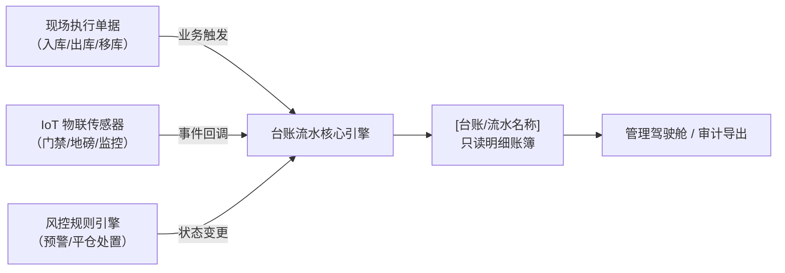

# 台账流水类 PRD 模板

> **适用范围**：SYZC 系统中用于汇总查询、流水追踪、明细对账及审计沉淀的只读台账菜单（如：库存流水、库存明细、存货管理、设备预警信息流水、门禁事务记录、货权公示等）。  
> **核心特征**：无独立单据状态机（或仅展示客观三态），数据由上游单据或物联设备事件触发自动追加写入（Append-only），强调多维组合检索、字段快照不可变性、高性能分页与审计导出。  
> **版本**：V1.0 | 责任人：产品团队
> **表达约束**：仅定义业务字段、页面行为与业务规则，不生成数据库列、接口参数、技术主键或研发实现方案；状态、枚举与页面文案中文优先；规则、场景、操作和验收均使用“【名称】(编号)”。

---

# [台账/流水名称]主PRD

> **版本**：V1.0 | YYYY-MM-DD  
> **读者**：研发工程师、测试工程师、大数据工程师、风控复核  
> **所属模块**：[如：02-仓储 / 05-风控] | **菜单路径**：[/仓储管理/库存查询/库存流水]

---

## 1. 业务背景与监控目的

### 1.1 台账定位
[一段话阐述本台账的核心监管价值。例如：实时记录大宗存货物理入库、出库、移库及质押状态变迁的全生命周期流水账簿，为监管方、金融机构和司法审计提供不可篡改的时间序列证据链。]

### 1.2 监控痛点与业务目标
- **穿透监管目标**：[如：实现从宏观总库存到具体钢卷/批次号、所在货位的秒级下钻与物理状态还原]
- **账实核验目标**：[如：解决历史出入库与现场盘点数据断链问题，支持任意历史时间点的账面还原]
- **风险防范目标**：[如：异常出库与未经报备的异动实时流水留痕，为风控预警引擎提供底层数据源]

---

## 2. 功能范围

```markdown
**In Scope（本期范围）**：
- 支持多维度条件组合筛选（仓库、货位、货主、品名、时间跨度、流水类型）
- 支持大批量明细数据的稳定分页、排序与汇总指标卡统计
- 支持查看单条流水的全量快照详情与上下游追溯链路（关联业务单据/设备事件）
- 支持受限的台账批量导出（带审计水印与操作留痕）

**Out of Scope（不在本期范围）**：
- 本台账严禁提供手动新增、编辑或物理删除流水记录的能力（所有数据必须由系统事件自动写入）
- 不在本模块进行财务利息结算（由【资金结算模块】负责）
```

---

## 3. 台账架构与数据源头

### 3.1 写入机制与生命周期
| 项目 | 机制说明 |
| :--- | :--- |
| **写入方式** | **事件驱动追加（Append-Only）**：仅支持系统事件自动写入，严禁人工手动录入 |
| **数据源头** | 入库执行完成 / 出库执行完成 / 质押锁定确认 / 设备告警触发 / 现场盘点过账 |
| **可变性** | **严格只读不可变**：流水生成后不可编辑或删除；发生冲正时，通过新增一笔对应的反冲流水表达 |
| **保存粒度** | 按最小管理物理单元（如单卷、单捆、单件存货批次）独立落账 |

### 3.2 数据流向架构图（Mermaid flowchart）



---

## 4. 组合检索与筛选规则（按【规则名称】(Fxx) 编写）

### 4.1 核心筛选条件设计
| 筛选维度 | 控件类型 | 默认值 | 联动规则与边界限制 |
| :--- | :--- | :--- | :--- |
| 时间范围 | 日期时间范围选择器 | 最近 30 天 | 必选条件；为保证查询性能，最大单次检索时间跨度不得超过 90 天 |
| 仓库 / 库区 | 级联选择器 / 下拉单选 | 全部 | 级联加载；根据用户的数据权限动态展示管辖仓库，选定仓库后动态联动库区 |
| 货主企业 | 远程搜索下拉 | 全部 | 支持企业统一信用代码或名称关键字模糊检索 |
| 大宗品类/钢号 | 下拉单选 / 文本输入 | 全部 | 支持输入特定钢卷号/批次号进行精确追溯 |
| 变动类型 / 事件类型 | 下拉多选 | 全部 | 枚举多选，如：质押入库、解押提货、监管移库、异常损益 |

### 4.2 快捷状态/分类 Tab 栏（如适用）
- **Tab 标签设计**：全部 / 质押类变动 / 实物出入库类 / 预警与异常类
- **切换规则**：切换 Tab 时自动追加类型过滤条件，页码重置为第 1 页，保留当前时间与其他筛选条件。

---

## 5. 字段快照与不可变性规则（按【规则名称】(Sxx) 编写）

- **【存量快照固化】(S01)**：流水生成时，必须固化当时的单价、货值估值、货主企业名称、经办监管员姓名等业务信息。即使后续货主更名或市场价格波动，历史流水内容也不改变。
- **【大宗计量双轨保留】(S02)**：涉及重量的流水，必须同时记录理论计重与实测检斤重量，保留 3 位小数（吨），确保账实对齐精度。
- **【关联单据追溯】(S03)**：每条流水必须展示上游来源单据编号，详情页提供跳转查看原单据凭据的入口。

---

## 6. 权限与安全审计（按【规则名称】(Pxx) 编写）

### 6.1 数据隔离规范
- **租户隔离**：多租户逻辑强隔离，严禁跨租户查询。
- **仓库与客户权限**：资金方仅可见其授信质押相关的存货流水；监管方操作员仅可见其签约管辖仓库的流水。

### 6.2 导出合规与风控
- **【导出频次与容量限制】(P01)**：单次导出最大行数限制为 50,000 条；导出文件提供加密保护。
- **【动态水印与留痕】(P02)**：导出文件展示“导出人姓名、账号、导出时间”水印；系统保留《数据导出操作记录》。

---

## 7. 大数据量使用边界

- **分页展示**：列表每页支持 20 / 50 / 100 条展示，切换分页不丢失已选筛选条件。
- **查询边界**：时间范围、精确编号与组合筛选的可用范围由产品明确约束；超出范围时页面提示用户缩小筛选条件。

---

## 8. 验收标准（按【验收名称】(Vxx) 编写）

| 验收项 | 输入与操作 | 预期结果 |
| :--- | :--- | :--- | :--- |
| 【组合检索有效性】(V01) | 选择指定仓库、90 天跨度、钢卷号精确检索 | 返回匹配记录，列表业务字段与字段清单保持一致 |
| 【只读不可变性】(V02) | 在列表和详情页尝试编辑或删除已生成流水 | 页面不提供编辑、删除入口；历史流水仍可正常追溯 |
| 【导出安全管控】(V03) | 具备导出权限的角色点击【导出】 | 生成带水印的导出文件，并留存导出操作记录 |

---

## 9. 修订记录

| 版本 | 修订日期 | 修订内容 | 修订人 |
| :--- | :--- | :--- | :--- |
| V1.0 | YYYY-MM-DD | 初稿发布 | 产品团队 |
```
