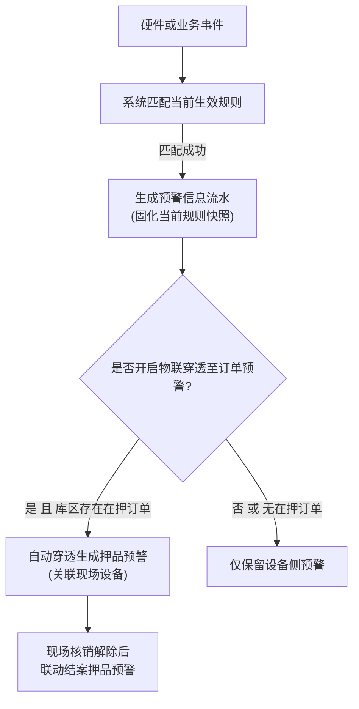

# 配置与规则类 PRD 模板

> **适用范围**：SYZC 系统中负责策略配置、阈值设定、预警规则、审批配置及风控参数的业务菜单（如：预警等级配置、设备预警配置、订单预警配置、开锁审批配置、租户风控参数等）。  
> **核心特征**：以规则卡片、多策略包、独立开关或抽屉配置呈现；规则保存后生成新版本且严格执行【历史流水不回写】(C08)；包含复杂的互斥校验、依赖约束与物联穿透闭环机制。
> **版本**：V1.0 | 责任人：产品团队
> **表达约束**：仅定义业务字段、页面行为与业务规则，不生成数据库列、接口参数、技术主键或研发实现方案；状态、枚举与页面文案中文优先，既有系统编码仅在必要时以“中文名称（既有编码）”括注；规则、场景、操作和验收均使用“【名称】(编号)”。

---

# [配置/规则名称]主PRD

> **版本**：V1.0 | YYYY-MM-DD  
> **读者**：研发工程师、测试工程师、风控架构师、硬件接入团队  
> **所属模块**：[如：05-风控 / 08-配置管理] | **菜单路径**：[/风控管理/预警配置/设备预警配置]

---

## 1. 业务背景与风控目的

### 1.1 业务定位
[一段话阐述本配置菜单的核心业务价值。例如：建立灵活、可插拔的设备离线、异常位移及安防告警判定规则，通过租户级/仓库级的差异化参数，实现物联风险秒级感知与精准推送。]

### 1.2 规则设计痛点
- **误报与告警风暴痛点**：[如：缺乏防抖或阈值过窄导致现场告警泛滥，降低监管响应效率]
- **规则生效边界模糊痛点**：[如：规则修改后错误回写历史存量告警，破坏司法存证效力]
- **配置割裂痛点**：[如：设备告警与订单质押风险脱节，无法穿透至在押货品]

---

## 2. 功能范围

```markdown
**In Scope（本期范围）**：
- 支持规则的新增、参数配置、策略卡片式独立编辑与启用/停用 Switch 控制
- 支持设置规则适用范围（全租户全局规则 / 指定仓库 / 指定设备类型）
- 支持配置告警处置策略（触发即结案 / 人工核查解除 / 恢复自动结案）
- 支持配置“物联穿透至订单预警”开关与严重度等级权重联动
- 规则生效机制：保存后生成新版本并立即应用于后续新事件，严格不回写历史流水

**Out of Scope（不在本期范围）**：
- 设备底层的硬件防抖滤波由设备厂商接入层负责，平台不再暴露复杂的持续时长微调
- 不在本模块直接展示告警处理流水（统一进入【预警信息】模块闭环）
```

---

## 3. 规则架构与版本模型

### 3.1 规则版本与生效机制
| 项目 | 机制说明 |
| :--- | :--- |
| **生效方式** | 配置保存成功后立即应用于后续新事件 |
| **版本递增** | 每次编辑并成功保存后，规则生成新的业务版本 |
| **不回写原则** | **【历史流水不回写】(C08)**：已产生的未处置告警或已结案流水保留生成时的规则版本快照，不按新规则重新计算或作废 |
| **快照固化** | 每次规则生效时，保留完整配置内容的历史快照，供事后追溯比对 |

### 3.2 规则匹配与穿透架构图（Mermaid flowchart）



---

## 4. 核心配置卡片与策略策略设计

### 4.1 规则策略分组卡片（以独立保存或一单一配为例）
- **逐条保存理念**：页面中各策略分组（如离线预警策略、位移预警策略、安防预警策略）采用独立卡片设计，支持独立保存与热同步。
- **保底策略校验**：当关闭某策略 Switch 时，系统强校验当前规则包是否保留至少 1 项有效生效策略，禁止全量关闭导致规则空置。

### 4.2 处置策略三档白名单矩阵
| 处置策略 | 业务含义 | 适用子类型白名单 | 限制条件 |
| :--- | :--- | :--- | :--- | :--- |
| 触发即结案 | 告警产生并通知后，系统立即自动置为已结案 | 仅限一次性通知类事件（如上线通知） | 安防破坏类严禁配置 |
| 人工解除结案 | 必须由现场监管员或风控员核实后手动解除结案 | 安防防拆、设备位移、异常断电等高危事件 | 强制录入说明与照片存证 |
| 恢复自动结案 | 物理指标恢复正常后，系统自动联动闭环结案 | 传感器超温、信号弱、临时遮挡等可恢复事件 | 遵循厂商能力范围 |

---

## 5. 核心业务与校验规则（按【规则名称】(Rxx) 编写）

- **【子类型独占与互斥规则】(R01)**：特殊预警子类型（如“设备上线”）必须单独成规则，严禁与其他运营或安防监控子类型混配保存。
- **【设备范围唯一性约束】(R02)**：在同一租户内，同一物理设备在同一预警子类型下，仅允许存在一条处于“启用”状态的生效规则；全局默认规则每类仅限一条。
- **【严重度等级权重联动】(R03)**：规则所绑定的严重度等级及其排序权重必须与等级字典保持一致；平仓线严重度必须大于等于补仓线。
- **【物联穿透闭环机制】(R04)**：仅在开启“物联穿透至订单预警”时，告警才允许穿透联动生成在押订单风险；穿透生成的订单预警在订单侧只读，必须由设备台账现场解除后联动回写。

---

## 6. 权限与安全控制

- **配置权限限制**：仅具备风控管理员角色的人员允许新增与修改规则配置。
- **租户隔离**：各租户仅可见并配置本租户的规则包；预警等级底座最少保留 2 档保护，已被引用的预警等级强校验拦截删除。

---

## 7. 验收标准（按【验收名称】(Vxx) 编写）

| 验收项 | 操作与输入条件 | 预期结果 |
| :--- | :--- | :--- | :--- |
| 【规则版本递增】(V01) | 修改某生效中规则的阈值并点击【保存】 | 提示保存成功，规则生成新版本并应用于后续新事件 |
| 【历史流水不回写】(V02) | 查看规则修改前生成的历史预警流水详情 | 其展示的规则阈值与版本快照保持修改前的内容，未被更新覆盖 |
| 【互斥规则拦截】(V03) | 尝试将“设备上线”与其他运营子类型勾选保存在同一规则包 | 系统阻断保存，弹出明确的互斥提示 |

---

## 8. 修订记录

| 版本 | 修订日期 | 修订内容 | 修订人 |
| :--- | :--- | :--- | :--- |
| V1.0 | YYYY-MM-DD | 初稿发布 | 产品团队 |
```
