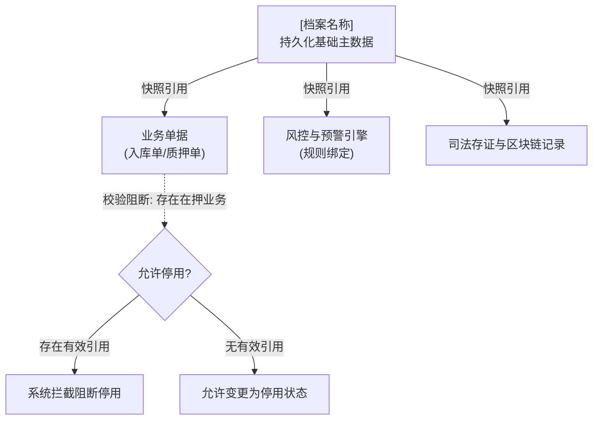

# 基础档案类 PRD 模板

> **适用范围**：SYZC 系统中用于维护长期持久化、具有强引用关系的基础主数据与业务档案（如：货权档案、仓储合同管理、监控设备主档、门禁设备主档、人脸配置、监管企业/货主主体档案等）。  
> **核心特征**：**严禁物理删除**；生命周期统一采用【启用 / 停用】机制；变更具备历史版本存证；被任何有效业务单据、质押批次或告警规则引用时具备强校验拦截阻断。  
> **版本**：V1.0 | 责任人：产品团队
> **表达约束**：仅定义业务字段、页面行为与业务规则，不生成数据库列、接口参数、技术主键或研发实现方案；状态、枚举与页面文案中文优先，既有系统编码仅在必要时以“中文名称（既有编码）”括注；规则、场景、操作和验收均使用“【名称】(编号)”。

---

# [档案名称]主PRD

> **版本**：V1.0 | YYYY-MM-DD  
> **读者**：研发工程师、测试工程师、安全合规人员、产品复核  
> **所属模块**：[如：02-仓储 / 08-配置管理] | **菜单路径**：[/仓储管理/货权管理/货权档案]

---

## 1. 业务背景与档案目的

### 1.1 档案定位
[一段话阐明本档案在供应链金融存货监管系统中的核心基石作用。例如：建立权威、防篡改的存货法律权属档案，确保存货在入库、质押、转让与解押全生命周期的权属链条清晰、证据完备、司法可追溯。]

### 1.2 核心痛点与管控目标
- **权属不清与纠纷痛点**：[如：货物权属凭证分散在线下或第三方，缺乏统一数字化档案沉淀]
- **主数据误删风险**：[如：误删仓库或设备主档导致历史存量质押单成为孤儿数据]
- **变更无法追溯痛点**：[如：设备更换或合同延期缺乏历史版本镜像，难以界定监管责任]

---

## 2. 功能范围

```markdown
**In Scope（本期范围）**：
- 支持档案的录入、批量导入、基础信息维护与资质附件上传
- 严格遵循生命周期管控：仅支持【启用】与【停用】操作，绝对不提供物理删除
- 提供下游引用强校验拦截：存在关联生效单据或在押库存时，阻断停用操作并给出指引
- 支持档案变更历史版本追溯与快照查看

**Out of Scope（不在本期范围）**：
- 不在本模块进行业务单据的实际开立（由各业务流模块通过快照引用本档案数据）
- 企业工商级实名认证与征信评级由外部服务完成，本模块仅展示并留存业务结果
```

---

## 3. 档案定位与引用模型

### 3.1 实体属性与引用关系
| 项目 | 规范定义 |
| :--- | :--- |
| **数据层级** | **系统基础主数据 / 核心业务档案层** |
| **业务唯一标识** | 统一社会信用代码 / 仓库编号 / 合同编号 / 设备编号 |
| **引用方式** | **不可变快照引用**：业务单据引用本档案时，生成当下关键信息快照，确保历史单据自包含 |
| **删除策略** | **严禁物理删除**：页面仅提供停用，保留历史档案及其关联记录 |

### 3.2 档案引用拓扑图（Mermaid flowchart）



---

## 4. 档案生命周期与状态控制

### 4.1 档案状态机
| 状态名称 | 业务含义 | 允许操作 | 限制条件 |
| :--- | :--- | :--- | :--- | :--- |
| 待生效或草稿 | 档案刚建立，缺少关键资质或审核 | 编辑、补充材料、提交激活 | 不可被新建业务单据引用 |
| 启用（生效中） | 档案处于正常存续期 | 查看、编辑非关键信息、停用 | 允许被所有合法业务单据正常引用 |
| 停用（已失效） | 档案已归档或合作终止 | 查看详情、查看历史、重新启用 | 严禁在新建业务单据中被选取 |

### 4.2 状态流转与动作约束
- **新增保存**：保存即进入【启用】或【待生效】状态，生成唯一档案编号。
- **停用操作（强校验）**：
  - 点击【停用】按钮，前端弹出二次确认弹窗，必须输入停用原因（≤200字）；
  - 系统执行前置强校验：
    1. 检查是否存在处于生效中（在押、审批中、待执行）的业务单据；
    2. 检查是否存在处于待处置状态的设备或订单告警流水；
    3. 若存在任何一项有效引用，系统强行阻断并弹窗列出关联单据清单，禁止停用！

---

## 5. 核心业务与校验规则（按【规则名称】(Rxx) 编写）

- **【业务唯一性校验】(R01)**：档案关键业务标识（如合同编号、设备编号、货位编号）在租户内必须全局唯一，重复录入系统强校验拦截。
- **【禁止物理删除原则】(R02)**：系统全平台不提供物理删除入口；列表和详情页仅允许按规则停用档案，并保留历史追溯。
- **【敏感信息脱敏展示】(R03)**：法人身份证号、银行卡号、手机号等个人敏感信息展示时必须遵循掩码脱敏规范（如 `138****1234`）；具备特定权限的角色完成身份核验后方可查看明文。
- **【资质效期自动预警】(R04)**：具备有效期的档案（如仓储保管合同、质押协议）在到期前 30、15、7 天自动触发到期预警提醒。

---

## 6. 权限与安全设计

### 6.1 权限矩阵
| 角色 | 查看列表/详情 | 新增档案 | 编辑信息 | 停用/启用 | 查看敏感明文 |
| :--- | :---: | :---: | :---: | :---: | :---: |
| 档案管理员 | ✅ | ✅ | ✅ | ✅ | ❌ |
| 安全合规官 | ✅ | ❌ | ❌ | ❌ | ✅ |
| 业务经办人 | ✅ | ❌ | ❌ | ❌ | ❌ |

---

## 7. 验收标准（按【验收名称】(Vxx) 编写）

| 验收项 | 操作与输入条件 | 预期结果 |
| :--- | :--- | :--- | :--- |
| 【停用拦截校验】(V01) | 对一个名下有在押存货的仓库档案点击【停用】 | 系统阻断操作，提示“该仓库存在在押存货批次，禁止停用”，状态保持不变 |
| 【停用后引用隔离】(V02) | 将某设备档案成功停用后，进入【新增设备预警规则】页面选择设备 | 设备选择列表自动过滤已停用设备，不可被重新绑定 |
| 【物理删除阻断】(V03) | 在列表和详情页查看已启用或已停用档案 | 页面不提供删除入口；历史档案及其关联业务记录仍可追溯 |

---

## 8. 修订记录

| 版本 | 修订日期 | 修订内容 | 修订人 |
| :--- | :--- | :--- | :--- |
| V1.0 | YYYY-MM-DD | 初稿发布 | 产品团队 |
```
