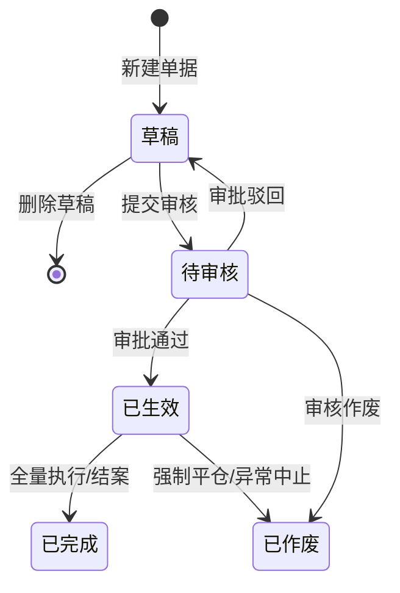

# 业务单据类 PRD 模板

> **适用范围**：SYZC 系统中具备完整生命周期流转的业务单据（如：入库记录、出库记录、移库记录、提货单、质押申请、解押申请、开锁审核等）。  
> **核心特征**：具备状态机流转（草稿 → 待审核 → 生效/执行 → 完结/作废），涉及实物库存占用/释放、货权锁定或凭据核发。  
> **版本**：V1.0 | 责任人：产品团队

---

# [单据名称]主PRD

> **版本**：V1.0 | YYYY-MM-DD  
> **读者**：研发工程师、测试工程师、风控架构师、产品复核  
> **所属模块**：[如：02-仓储 / 03-融资监管 / 01-工作中心] | **菜单路径**：[/仓储管理/入库管理/入库记录]

---

## 1. 业务背景与痛点

### 1.1 业务定位
[一段话说明本单据在供应链金融存货监管中解决的核心问题，例如：规范存货入库物理点收与数字台账的强一致性，为后续数字仓单签发与质押融资提供可信物联存证凭据。]

### 1.2 核心痛点
- **痛点 1（货权与物理脱节）**：[说明没有本单据时现场实物与系统数据割裂的具体风险]
- **痛点 2（重复抵质押风险）**：[说明缺乏锁定机制可能带来的多头融资隐患]
- **痛点 3（协同与审计断链）**：[说明资金方、监管方、仓储方信息不透明的弊端]

---

## 2. 功能范围

```markdown
**In Scope（本期范围）**：
- 支持单据的录入、暂存草稿、提交审核与审批流转
- 支持与关联仓库、库区、货位及具体大宗批次的精确绑定
- 审核通过后自动触发库存可用量扣减与在押锁定量增加
- 提供完整的操作轨迹、状态机变迁记录与司法存证快照

**Out of Scope（不在本期范围）**：
- 不在本单据中处理资金放款清算（由【资金结算模块】对接银行核心处理）
- 不在此处配置预警阈值参数（由【预警配置模块】统一管理）
```

---

## 3. 单据定位与系统链路

### 3.1 单据属性
| 项目 | 内容说明 |
| :--- | :--- |
| **单据层级** | **【第1层-意图申请单 / 第2层-审核确认单 / 第3层-现场执行单】** |
| **核心职责** | [说明本单据的核心业务职责] |
| **单据来源** | 货主自主申报 / 监管员代录入 / 银行系统 OpenAPI 推送 / 物联网告警联动 |
| **上游关联** | [上游单据名称，如：仓储合同、入库预约单、数字仓单] |
| **下游联动** | [下游单据/系统影响，如：生成质押监管台账、扣减可用额度、下发开锁凭证] |
| **数量关系** | [如：1 笔仓储合同可对应 N 张入库单（1:N）] |

### 3.2 系统链路图（Mermaid flowchart）


---

## 4. 业务场景覆盖

| 场景ID | 场景名称 | 类型 | 场景说明 |
| :--- | :--- | :---: | :--- |
| S01 | 标准正向流转 | **主流程** | 正常录入 → 准入校验通过 → 审批通过 → 现场执行完成 → 闭环结案 |
| S02 | 审批驳回与重提 | **支线** | 审批人驳回 → 退回草稿修改 → 重新提交审核 |
| S03 | 异常中止/作废 | **异常** | 审核中或执行前发现存货争议 → 强制终止作废并记录原因 |
| S04 | 并发与额度超限拦截 | **异常** | 提交时存货已被其他业务占用 → 系统阻断提示 |

---

## 5. 状态机与动作设计

### 5.1 单据状态定义
| 状态名称 | 状态编码 | 含义说明 | 是否终态 |
| :--- | :--- | :--- | :---: |
| 草稿 | `DRAFT` | 未正式提交，仅发起人可编辑，可物理删除 | 否 |
| 待审核 | `PENDING_AUDIT` | 已提交，关键字段锁定，进入审批流 | 否 |
| 已生效 / 执行中 | `ACTIVE` | 审核通过，货权/库存锁定，业务正式生效 | 否 |
| 已完成 | `COMPLETED` | 业务全量执行完毕或还款解押完毕 | **是** |
| 已作废 | `VOIDED` | 单据异常失效终止 | **是** |

### 5.2 状态流转图（Mermaid stateDiagram-v2）



### 5.3 动作能力矩阵
| 业务动作 | 草稿 | 待审核 | 已生效 | 已完成 | 已作废 |
| :--- | :---: | :---: | :---: | :---: | :---: |
| 查看详情 | ✅ | ✅ | ✅ | ✅ | ✅ |
| 编辑保存 | ✅ | ❌ | ❌ | ❌ | ❌ |
| 提交审核 | ✅ | ❌ | ❌ | ❌ | ❌ |
| 审核通过 | ❌ | ✅（非本人） | ❌ | ❌ | ❌ |
| 审核驳回 | ❌ | ✅（非本人） | ❌ | ❌ | ❌ |
| 撤回申请 | ❌ | ✅（仅本人） | ❌ | ❌ | ❌ |
| 打印存证 | ❌ | ❌ | ✅ | ✅ | ✅ |

---

## 6. 核心业务规则（Rxx）

### 6.1 准入与校验规则
- **R01【存货在库唯一性校验】**：提交时强校验所选存货批次是否处于“在库未锁定”状态；若已被其他单据质押锁定，系统阻断提交。
- **R02【大宗计量超差容忍控制】**：现场地磅检斤重量与申报重量偏差率超过规定阈值（如 ±0.3%）时，强制转入人工复核通道。

### 6.2 审批与自审禁止（P06/R11）
- **R03【自审禁止】**：系统强行校验发起人 ID 与审批人 ID。审批人打开本人提交的单据时，审批操作按钮自动隐藏，API 拦截返回错误码。

### 6.3 级联影响与不可变快照
- **R04【生效固化快照】**：单据审核通过生效瞬间，系统对当前货主名称、监管仓库、货物估值及审批人员信息进行深度快照固化，后续主数据变更不影响本单据证据效力。

---

## 7. 权限与安全设计

### 7.1 数据可见范围
- **租户隔离**：严格按用户所属租户过滤数据。
- **仓库与机构隔离**：监管员与仓库操作员仅可见管辖范围内的仓库单据。

### 7.2 操作权限分配
| 角色名称 | 新增 | 编辑草稿 | 提交审核 | 审批处理 | 作废处理 | 导出台账 |
| :--- | :---: | :---: | :---: | :---: | :---: | :---: |
| 监管企业操作员 | ✅ | ✅ | ✅ | ❌ | ❌ | ✅ |
| 监管企业主管/风控员 | ❌ | ❌ | ❌ | ✅ | ✅ | ✅ |
| 业务系统管理员 | ❌ | ❌ | ❌ | ❌ | ✅ | ✅ |

---

## 8. 边界与并发防护

- **并发排他锁**：在提交审核与审批通过的关键节点，对存货批次记录加行级排他锁，防止并发提交导致重复抵质押。
- **操作幂等性**：审批通过与凭据下发接口以单据 ID 为幂等键，防止网络重试造成重复处理。

---

## 9. 验收标准（Vxx）

| 编号 | 验收项 | 输入条件与前置状态 | 预期结果 |
| :--- | :--- | :--- | :--- |
| V01 | 正常提交与流转 | 草稿状态下必填字段完整，点击【提交审核】 | 状态变更为`待审核`，进入审批人待办池，字段锁定不可编辑 |
| V02 | 自审禁止拦截 | 审批人登录后查看本人发起的待审核单据 | 页面仅展示【详情】，无【去审批】按钮；调用审批 API 返回 403 阻断 |
| V03 | 重复质押阻断 | 选择已质押锁定的存货批次提交 | 提交失败，Toast 弹出明确的阻断原因提示 |

---

## 10. 修订记录

| 版本 | 修订日期 | 修订内容 | 修订人 |
| :--- | :--- | :--- | :--- |
| V1.0 | YYYY-MM-DD | 初稿发布 | 产品团队 |
```
